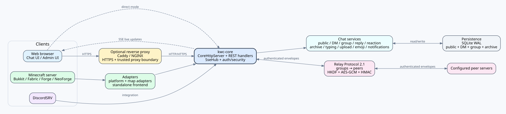

# KOKOTO WebChat




[PNG](docs/assets/architecture-5.2.0.png) · [SVG](docs/assets/architecture-5.2.0.svg)

> ビジュアル資料、アニメーションフロー、編集可能な図の source、参照規格一覧は `docs/assets/`、`docs/en/VISUAL_DOCUMENTATION.md`、`docs/en/REFERENCES.md` に含まれています。

## 5.2.1 hotfix

5.2.1 は 5.2.0 向けの frontend hotfix です。BlueMap の再読み込み時に addon `config.js` が遅れても誤った site-root `/api` を固定せず自動復旧し、通知設定の mention 表示は常に `@` 接頭辞付きになり、custom emoji の横 category scrollbar は高さ 12px を維持しつつ縦 settings scrollbar と同じ theme-aware thumb/hover 表示を使用します。config schema は 5.2.0、Relay Protocol は 2.1 のままです。

- **5.2.0 制御:** `notifications.notify-reactions` は browser notification と Web Push で共用する reaction 選択 1 個を提供し、`chat.conversation-archive.enabled: false` は既存 archive data を残したまま保存済み会話の DOM/API/DB 起動をすべて無効化し、archive の 3 つの `max-*` key でアカウント当たり snapshot 数・snapshot 当たり message 数・アカウント合計保存 message 数を調整できます。`chat.typing-indicator.open-chat.enabled`、`.dm.enabled`、`.group-chat.enabled` はサーバー共通の入力中表示ポリシーで、既定値は OFF/ON/ON、Web Admin Settings からも変更できます。`chat.typing-indicator.user-display-control`（既定 OFF）を有効にすると、ログインユーザーはアカウント単位の **入力中表示** を無効にできます。この個人設定は自分の画面の表示だけを制御し、自分の typing 送信は停止しません。`emoji.favorites.enabled`、`storage`、`max-per-account` は custom emoji Favorites の有効/無効、browser/account 保存方式、最大保持数を制御します。

## 5.2.0 リリース

5.2.0 はセキュリティ強化、プライベートチャットの使いやすさ、マルチサーバー継続性を中心に更新します。公開/DM/group メッセージ reaction、既存 Relay 2.x と互換性を保つ capability revision **Relay Protocol 2.1**、イベント駆動の public/DM/group `入力中...`、アカウント単位の **保存済み会話** snapshot とブラウザー PDF export を追加します。guest/public history のアクセス制御、trusted proxy、API leaf exact-path、公開 config projection も強化しました。公開/DM/group の latest-message auto-follow 判定は **32px** に統一し、emoji/icon/attachment panel による layout 変化では viewport を保持し、その変化だけで直ちに最下部へ強制移動しません。現在の update/download URL は KOKOTO WebChat project のみを使用し、BMWC URL は過去 migration の参照としてのみ残します。

## プロジェクト名と配布先

**BlueMapWebChat (BMWC) は 5.0.0 から KOKOTO WebChat へ名称変更されました。** 既存 BMWC 4.x data は migration input としてのみ保持します。5.2.0 以降、runtime update check と現在の配布リンクは KOKOTO WebChat の URL だけを使用します。

現在の KOKOTO WebChat 配布 URL:

- Modrinth: `https://modrinth.com/plugin/kokoto-webchat`
- CurseForge: `https://www.curseforge.com/minecraft/bukkit-plugins/kokoto-webchat`
- GitHub: `https://github.com/KOKOTO-DEV/KOKOTO-WebChat`

5.2.0 以降、updater は canonical Modrinth `kokoto-webchat` project のみを照会します。旧 BMWC project URL は実際の update source または現在の配布先として使用しません。

Bukkit/Paper/Spigot では BlueMap、squaremap、Dynmap、Pl3xMap、LiveAtlas、uNmINeD、Minecraft Overviewer、または standalone WebChat を利用できます。Fabric 1.18.2〜26.2、NeoForge 1.20.2〜26.2、Forge 1.18.2〜26.2 の exact-target build は共通 core/standalone frontend を使用し、squaremap、Dynmap、LiveAtlas、uNmINeD、Overviewer の filesystem adapter に対応します。Pl3xMap filesystem adapter は Fabric でも利用でき、BlueMapAPI 連携は対応する Fabric/NeoForge と Forge 26.1.2/26.2 target で利用できます。

## 主な機能

- ログインユーザーごとに複数の表示 UI プロファイルをアカウントへ保存（既定 5、管理者が変更可能）。KWC サーバー間移動用の厳格な JSON import/export に対応
- ログインユーザーのキーワード/通知種別をアカウント単位で同期し、ウィンドウ状態と Web Push endpoint は端末ローカルのまま保持。同じアカウントの KWC 画面のどれかが正確な DM/グループ会話を実際に閲覧中なら、その会話のブラウザー通知・ブラウザーローカル通知 inbox・Web Push をアカウント全体で抑止
- KWC が検出・mention・重複除去を担当し、Web Admin で DiscordSRV の logical channel を選択する管理者専用 Discord キーワード通知
- 公開/グループ、任意の DM に共通適用できる Unicode 対応コンテンツフィルター: block/mask/replace、N:1・1:N・N:N 置換、compact/interleave 回避検出
- UTF-8 `filter-lists/*.txt` の一括フィルター単語リスト（リストごとにブロック/フィルタリングを選択）とカスタム block/mask/replace ルール。Web Admin から TXT の取込・編集・有効/無効・削除が可能
- Web Admin の **Filter/Settings** とゲーム内 `/kchat filter` / `/kchat settings` 運用コマンド
- カスタムルールの作成方法と Block/Mask/Replace の例: [`docs/ja/CONFIGURATION.md`](docs/ja/CONFIGURATION.md#カスタムフィルターの簡単な使い方)
- セッション期間変更時、既存 USER/MODERATOR または ADMIN セッションを作成時刻基準で再計算し、`0` は無期限
- `upload.filename-mode: original` で新規アップロードの安全な Unicode 元ファイル名を保持し、同名を上書きせず番号付け
- BlueMap / squaremap / Dynmap / Pl3xMap / LiveAtlas / uNmINeD / Overviewer 内チャットパネル、または standalone Web チャットページ
- ゲーム ↔ Web チャット双方向連携
- group 単位の公開チャットとサーバー間 DM/既読 receipt を扱う Relay Protocol 2.1：Relay v2 の trust/暗号化モデルを維持しながら reaction/typing capability を拡張し、request 単位 peer 認証、HKDF-SHA256/AES-256-GCM の hop-by-hop 認証付き暗号化、replay 防御、HTTPS 専用 forwarding に対応
- 公開/DM/group の範囲を保存するアカウント単位の保存済み会話 snapshot、管理者の削除/ロック方針優先、ブラウザー PDF export
- polling/永続化なしの 5 秒 window を使うイベント駆動 public/DM/group typing indicator
- ログインユーザー向け公開/DM/group メッセージ reaction：Unicode/KWC custom emoji、空状態では `+` button の高さだけを最小限確保し実 reaction が付くと通常行へ拡張する message 下部 UI、位置を維持して外側 click で閉じる category/search picker、reactor 表示名 hover list、**Admin > Emojis > Reaction icons** の機能 ON/OFF と catalog 管理に対応。公開 reaction は origin authority で Relay 同期し、cross-server DM reaction は相手 participant server のみに送信、group reaction は local のまま
- Minecraft クリック返信(`/kchat reply`)と Web 送信者クリック KWC DM(`/kchat dm`)
- ゲーム `/w`/`/msg`/`/tell` 系 whisper の両ユーザー Web DM への任意複製
- ゲストチャット、計算 captcha、クールダウン、分間制限
- `/kchat auth <code>` によるアカウント連携、Web パスワードログイン、ローカル管理者
- Web 管理/モデレーターパネル、メッセージ非表示、ゲスト/IP ミュート、セッション revoke
- 管理者向けカスタム絵文字管理: フォルダー/ファイルの作成、複数アップロード、名前変更、移動、削除
- ImageEmojis-Bero 1.9.x の token・ゲーム返信・サーバーリレー互換
- ファイル/クリップボードアップロード、画像/動画/音声/YouTube/Shorts プレビュー、任意の TikTok / X(Twitter) 埋め込み
- DiscordSRV 連携、Discord CDN メディアキャッシュ
- 返信と元メッセージへのジャンプ、ゲーム内返信プレビュー、ピン留め、仮想スクロール、移動/リサイズ可能なウィンドウ、PIP
- UI 言語: en-US, ko-KR, ja-JP, zh-CN

## 連携プラグイン

- [**ImageEmojis-Bero**](https://github.com/KOKOTO-DEV/ImageEmojis-Bero) — Bukkit/Paper 系で `plugins/KOKOTO-WebChat/emojis` を共有し、Web/history/relay は canonical token、game は ImageEmojis glyph を利用できます。`serverIp` + `webServerPort` の resource-pack HTTP service は Minecraft client から到達可能である必要があります。詳細: [`docs/ja/IMAGEEMOJIS_BERO_1_9_0.md`](docs/ja/IMAGEEMOJIS_BERO_1_9_0.md)。一般運用は [upstream ImageEmojis](https://github.com/MrQuackDuck/ImageEmojis)。
- [**SimpleNicks-Bero**](https://github.com/KOKOTO-DEV/SimpleNicks-Bero) — `player-display.mode: "display-name"` で Bukkit display name を表示し、実 linked username/UUID identity は別に保持します。詳細: [`docs/ja/SIMPLENICKS_BERO.md`](docs/ja/SIMPLENICKS_BERO.md)。一般運用は [upstream SimpleNicks](https://github.com/Simplexity-Development/SimpleNicks)。

## ビルド

### Bukkit / Paper / Spigot

```bash
mvn clean package
```

```text
kwc-platform-bukkit/target/KOKOTO-WebChat-5.2.1-Bukkit-1.18-26.2.jar
```

### Fabric exact-target

Fabric は Minecraft version 別の 16 exact-target JAR として build します。script が target ごとに JDK 17/21/25 を選択します。

```bat
kwc-platform-fabric\build-all.bat
```

Targets: `1.18.2`, `1.19.2`, `1.19.4`, `1.20.1`, `1.20.2`, `1.20.4`, `1.20.6`, `1.21.1`, `1.21.3`, `1.21.4`, `1.21.5`, `1.21.8`, `1.21.10`, `1.21.11`, `26.1.2`, `26.2`. 生成物は `kwc-platform-fabric/targets/<Minecraft>/build/libs/KOKOTO-WebChat-5.2.1-Fabric-<Minecraft>.jar` です。

### NeoForge exact-target

NeoForge は 12 exact-target JAR として build します。1.20.2〜1.20.6 は NeoGradle userdev、1.21.1 以降は ModDevGradle を使用し、target ごとに JDK 17/21/25 を選択します。

```bat
kwc-platform-neoforge\build-all.bat
```

Targets: `1.20.2`, `1.20.4`, `1.20.6`, `1.21.1`, `1.21.3`, `1.21.4`, `1.21.5`, `1.21.8`, `1.21.10`, `1.21.11`, `26.1.2`, `26.2`. 生成物は `kwc-platform-neoforge/targets/<Minecraft>/build/libs/KOKOTO-WebChat-5.2.1-NeoForge-<Minecraft>.jar` です。

### Forge exact-target

Forge は単一の広域 JAR ではなく、16 個の Minecraft version 別 exact-target JAR を build します。

```bat
kwc-platform-forge\build-all.bat
```

script が target ごとに JDK 17/21/25 を選択し、各 target の `build/libs/` に `KOKOTO-WebChat-5.2.1-Forge-<Minecraft>.jar` を生成します。

### Windows 最終 release 検証

> **release build/validation workflow は source package に含まれています。** `validate-release-windows.bat` と、それが必要とする PowerShell helper は source に同梱されています。別の `KWC-5.2.1-validation-tools.zip` には開発専用の browser regression tool のみが含まれ、通常 build / release build には不要です。

source root で `validate-release-windows.bat` を実行すると、Bukkit、Fabric 16 target、NeoForge 12 target、Forge 16 target を連続 build します。`FINAL RELEASE BUILD PASS` が表示され、`release-5.2.1/` に配布用 JAR が正確に 45 個集まり、`SHA256SUMS.txt` が生成された場合のみ実 build まで最終検証済みと判定します。

Windows の反復 build では、同じ script で platform 選択、incremental cache、platform 並列 build、live progress を使用できます。

```bat
validate-release-windows.bat --bukkit
validate-release-windows.bat --bukkit --fast
validate-release-windows.bat --fabric --fast
validate-release-windows.bat --neoforge --fast
validate-release-windows.bat --forge --fast
validate-release-windows.bat --parallel
```

platform option は組み合わせ可能です。`--bukkit` は Bukkit/Paper artifact と必要な Maven reactor dependency だけを build します。`--fast` は `clean` を省略し、既存の Maven/Gradle 出力と dependency cache を再利用して Gradle build cache を有効化します。`--parallel` は選択した build mode を維持し、Bukkit が選択されている場合は Bukkit を先に build し、PASS 後に Fabric/NeoForge/Forge をそれぞれ別の live build window で並列実行します。そのため `validate-release-windows.bat --parallel` は clean 45-target 最終検証として扱われ、成功時は `FINAL RELEASE BUILD PASS` を表示します。main console には経過時間、全体完了 target 数、platform 別完了数と現在の Minecraft target が表示され、各 worker window には実際の build log が表示されます。詳細 log は `validation-logs/` に残ります。部分 build または `--fast` build は `build-5.2.1/` に出力され、最終 release validation にはなりません。source root の `mvn clean package` は引き続き Bukkit 専用 Maven build です。
Loader worker が Gradle cache/workspace の破損または cache lock と明確に判定できるエラー（例: `caches/<Gradle>/transforms/.../metadata.bin` の読み取り失敗）で終了した場合、検証 runner は lock されている可能性がある既存 cache を自動削除しません。代わりに `.build-cache/gradle-recovery/` 配下の新しい分離 cache を使って、その platform を 1 回だけ再試行します。ソースのコンパイルエラーや通常の dependency/build failure は自動再試行しません。復旧ビルドが成功しても元の cache は変更しないため、Explorer・antivirus・他プロセスの lock が解除された後に必要に応じて手動で整理できます。


## インストール

1. Bukkit/Paper/Spigot JAR は `plugins/`、Fabric/NeoForge/Forge JAR は `mods/` に入れます。
2. サーバーを一度起動して `<KWC data dir>/config.yml` を生成します。`<KWC data dir>` は Bukkit 系では `plugins/KOKOTO-WebChat`、Fabric/NeoForge/Forge では `config/KOKOTO-WebChat` です。
3. 新規生成された config は最上位の `enabled: false` から始まります。設定確認前は config 生成以外の機能は開始されませんが、`/kchat reload` は使用できます。
4. 保存方式、保持期間、アップロード、プレビュー、認証、公開設定を確認してから `enabled: true` に変更します。
5. BlueMap 埋め込みで使う場合は `adapters.bluemap.enabled: true` にします。Bukkit 系では BlueMap Web ファイルを手動管理しない限り `auto-install` と `auto-patch-webapp-conf` を `true` のままにします。Fabric/NeoForge と Forge 26.1.2/26.2 は BlueMap mod がある場合 BlueMapAPI で登録し、26 より前の Forge target は BlueMap 連携を提供しません。
6. squaremap は `adapters.squaremap.enabled: true`、Dynmap は `adapters.dynmap.enabled: true` にします。Dynmap では `configuration.txt` の `webpath` を読み、KWC 専用 asset と `index.html` の marker block を管理します。
7. Pl3xMap は Bukkit/Paper 系または Fabric で `adapters.pl3xmap.enabled: true` にします。KWC は Pl3xMap `config.yml` の `settings.web-directory.path` を読み、専用 asset と `index.html` marker block を管理します。現在の Pl3xMap 26.2 は NeoForge build を公開していません。
8. LiveAtlas を使う場合は Bukkit/Fabric/NeoForge/Forge で `adapters.liveatlas.enabled: true` にします。既存 LiveAtlas `index.html` のある Web root だけを更新し、外部 Web server の共有/マウント directory を使う場合は `web-root` を指定します。同じ物理 Web root で LiveAtlas adapter と backend 固有 adapter を同時に有効化しないでください。
9. uNmINeD の static Web export を使う場合は `adapters.unmined.enabled: true` にします。uNmINeD は server plugin ではないため、通常は `web-root` に export 先 directory を指定します。現在の `index.html` と旧 `unmined.index.html` は uNmINeD marker を確認した場合だけ変更します。
10. Minecraft Overviewer の static Web map を使う場合は `adapters.overviewer.enabled: true` にし、通常は `web-root` に Overviewer の生成 `outputdir` を指定します。KWC は Overviewer 固有の generator/asset marker が確認できる `index.html` だけを変更し、一般の Leaflet page は変更しません。
11. standalone のみで使う場合は `frontend.standalone.enabled: true` にし、map adapter をすべて `false` にします。
12. サーバーを再起動するか `/kchat reload` を実行します。BlueMap は `bluemap reload light` を自動要求し、squaremap/Dynmap/Pl3xMap/LiveAtlas/uNmINeD/Overviewer は KWC が Web file を直接再確認します。map/site generator が Web file を再生成した場合は `/kchat reload` を再実行します。


既存の解析済み operator 設定値は保持し、migration 時の comment/layout は `ui.language` が選ぶ bundled presentation template から再構成します。`en-US` は `config.yml`、`ko-KR`・`ja-JP`・`zh-CN` は各 localized template を使用し、未対応/custom UI 言語は英語 config 表示を使用します。`<KWC data dir>/config-reference-5.2.0.yml` は同じ built-in 言語で描画された管理者向けの現在 default であり、migration input には使用しません。固定された旧 version config は実際の version migration 前に backup します。migration 後は `config-version: "5.2.0_auto_migration"` となり、この marker がある間は startup/reload ごとに選択中の current template を再構成して既存の解析値を overlay し、新規設定と最新 comment/layout を維持します。正確な `config-version: "5.2.0"` は通常の same-version 自動設定再構成を停止しますが、`ui.language` を変更した場合は全解析値を保持したまま comment/layout の表示言語だけを再構成できます。`config-migration-5.2.0.yml` の Difference は comment・空白・quote・行位置・key 順序ではなく、解析済み YAML path/value の意味を比較します。旧 version の生成済み reference/migration/upgrade file は自動削除されます。同梱の UTF-8 starter filter list `filter-lists/ko-KR.txt`、`en-US.txt`、`ja-JP.txt`、`zh-CN.txt` は starter-list 初期化 marker がない場合に一度だけ初期化されるため、この機能より前から存在する data directory にも作成されます。既存または無効化済みの list file は上書きせず、初期化後に管理者が削除した starter list は再起動しても再作成しません。

### 5.0.0 KOKOTO WebChat の構成と名称移行

5.0.0 から正式なプロジェクト識別子を KOKOTO WebChat に移行します。Maven module は `kwc-core`、`kwc-standalone-frontend`、`kwc-adapter-bluemap`、`kwc-adapter-squaremap`、`kwc-adapter-dynmap`、`kwc-adapter-pl3xmap`、`kwc-adapter-liveatlas`、`kwc-adapter-unmined`、`kwc-adapter-overviewer`、`kwc-platform-bukkit`、Java package は `dev.kokoto.webchat` です。全 platform の正式 game command は `/kchat`（短縮 alias: `/kc`）、permission は `kwc.*`、data directory は `<KWC data dir>`、reverse proxy の例は `/chat` を使用します。

旧 BlueMapWebChat 4.x は migration input としてのみ扱います。`plugins/KOKOTO-WebChat` に既存の data file がない場合にだけ `plugins/BlueMapWebChat` の運用データを取り込み、`web-addon.*` を `adapters.bluemap.*`、`standalone-web.*` を `frontend.standalone.*` に変換します。KWC data がすでに存在する場合、`.legacy-import-complete` を手動で削除しても BMWC data を再度 merge しません。元の `plugins/BlueMapWebChat` directory がなくなると、一時的な `.legacy-import-complete` marker も自動削除されます。`/bmchat`、`/bluemapchat`、`/bmc`、`/kwc` の command alias は提供しません。旧 `bluemapwebchat.*` permission は permission compatibility layer で処理される場合がありますが、新規設定と文書は `kwc.*` を使用します。

> **BMWC HTTPS migration:** BMWC の標準 `/bmwc/api`、`/bmwc/chat` 公開構成は KWC の `/chat` 構成へ移行します。標準 BMWC API URL 設定は空の自動値へ正規化されますが、Caddy/nginx file は自動変更されないため `/chat` prefix stripping 構成へ手動変更してください。


KOKOTO WebChat 5.2.0 は明示的な `groups -> peers`、group 単位 shared secret、handshake 前提なしの request 単位 peer 認証、HKDF-SHA256 directional key、AES-256-GCM hop-by-hop payload protection を使用する Relay Protocol v2 に移行しました。Relay v1/BMWC endpoint は相互運用せず HTTP 426 を返します。詳細は `docs/ja/SERVER_RELAY.md` を参照してください。

## 4.7.0 絵文字の複数アップロードと互換範囲

4.7.0 では設定可能な `:token:` メッセージ置換も追加します。既定 alias は英語のみで、管理者は任意の言語へ変更・追加できます。newline / blank-line / indentation と印字可能な custom 置換をサポートし、未知のトークンは絵文字互換のためそのまま残します。

4.7.0 では管理者の絵文字アップロードも通常のチャットファイルアップロードと同じ picker フローを使います。画面の Upload ボタンで非表示の multiple file input を開き、ファイルを選択すると選択内容をすぐ通常配列へコピーして native input をクリアし、そのまま順次アップロードを開始します。選択後の追加確認 Upload はありません。進捗表示と実転送中のキャンセルは維持され、ファイル上限、総容量制限、重複名処理、監査ログ、PNG sidecar 生成は既存のサーバーアップロード経路をそのまま使用します。

Bukkit/Spigot API baseline を 1.21 から 1.18 に下げ、Java 17 は維持します。このリリースの保守的な Minecraft 対応範囲は **1.18 ～ 26.2** です。Paper 固有の `AsyncChatEvent` は引き続き reflection で検出し、Bukkit の legacy chat event を fallback として使用します。

## 4.6.3 管理者グループチャット監査

4.6.3 ではグループチャット本文を確認できる任意の read-only 管理者監査を追加しました。5.2.0 でも DM と group-chat の本文監査を独立して制御します。DM は `direct-message.admin-audit.enabled`、group は `group-chat.admin-audit.enabled` を使い、どちらも `private-chat-super-admins` に明示した account だけが利用できます。監査 view は read-only で、送信、Reply、hide、既読更新や room 参加は行わず、各 page read は audit log に記録されます。

```yaml
private-chat-super-admins:
  - "ExactMinecraftNameOrUUID"

group-chat:
  admin-audit:
    enabled: true
```

4.6.3 では DM / グループチャットのライブ更新中に動画・音声が先頭から再生される問題も修正します。プライベートチャットのメッセージ一覧は通常チャットと同様に stable key で既存メッセージを維持し、新規メッセージと配信/既読メタデータだけを更新するため、読み込み済みメディア DOM が保持されます。

詳細は `docs/ja/UPGRADE.md` を参照してください。

### 4.6.2 DM / グループチャットの配信状態と再試行

他サーバーへの DM は、宛先サーバーが実際に保存したことを確認するまで `pending` のままです。保存確認後に `delivered` となり、経路・通信・タイムアウトなどの失敗時は `failed` となって同じ relay ID で再試行できます。これにより応答だけが失われた場合でも受信側に同じメッセージを重複保存しません。Web DM とグループチャットも client message ID を使い、不確実な HTTP 応答後の再送を重複なく処理します。サーバー指定のない DM 名は現在サーバーのプレイヤーだけを解決します。DM と group chat のすべての message は時刻の横に既読状態を表示します。1 対 1 DM は受信者が読む前は `未読`、読んだ後は `✓`、group chat は未読受信者数を数字で表示し 0 人になると `✓` になります。送信状態も短く `送信中`、失敗時は `失敗 · 再試行` のみ表示します。

サーバー間 DM を交換するすべてのサーバーでは KOKOTO WebChat 4.6.2 以降を推奨します。詳細は `docs/ja/UPGRADE.md` を参照してください。

## standalone の URL

```text
http://<server-host>:8899/
```

## HTTPS / Caddy 推奨構成

公開サーバーでは、BlueMap と KOKOTO WebChat を内部 HTTP サービスにし、HTTPS リバースプロキシの後ろに置くことを推奨します。

```yaml
http:
  host: "127.0.0.1"
  port: 8899
  path-prefix: "/api"
  public-prefix: "/chat"
  cors-origin: "https://map.example.com"

frontend:
  standalone:
    enabled: true
    path: "/"
    api-base-url: ""

adapters:
  bluemap:
    enabled: true
    api-base-url: ""

upload:
  # 推奨は空です。アップロード URL は自動的に /chat/api に従います。
  # 別の公開 URL override 例: "/chat/api/uploads"
  public-base-url: ""
  # 0 = 無制限。正の値で upload.directory 全体のファイル容量を制限します。
  max-total-size-mb: 0

emoji:
  # 推奨は空です。絵文字 URL は自動的に /chat/api に従います。
  # 別の公開 URL override 例: "/chat/api/emojis"
  public-base-url: ""
  max-total-size-mb: 64
  show-storage-usage: true
  show-storage-limit: true
```

詳細は `docs/ja/CADDY_HTTPS.md` を参照してください。

## よく使う設定

- `ui.language`: `en-US`, `ko-KR`, `ja-JP`, `zh-CN`
- `ui.theme`: `system`, `dark`, `light`, `high-contrast`
- `player-display.mode`: `name`, `display-name`, `custom-name`
- `player-display.strip-colors`: `false` の場合、実際のチャット送信者名に Minecraft legacy 色コードをレンダリングします。system/event 行は常に色コードを削除します。
- `commands.enabled`: Web コマンドパネル
- `commands.allow-all`: 任意のコンソールコマンドを許可
- `commands.run-from-chat-input`: 通常入力欄から `/command` を実行
- `ui.picture-in-picture.enabled`: PIP ボタンと PIP 実行を制御

## チャット履歴の保持期間

新規生成された config は最上位の `enabled: false` から始まるため、保持期間とクリーンアップ関連の値を確認して `enabled: true` にするまで自動整理は実行されません。サーバー方針に合わせてチャット履歴、アップロード、外部メディアキャッシュの保持期間を確認してから有効化してください。

## 1:1 ダイレクトメッセージスレッド

`direct-message.enabled` を有効にすると、1:1 会話スレッド型のメッセージボックスを使用できます。送信先には、UUID/名前が保存済みの連携済み・参加履歴プレイヤーに加えて、リレーメッセージに player UUID が含まれる別サーバーの送信者も含まれます。受信した表示名と実 Minecraft 名は Web DM の新規宛先検索に反映されるため、専用 DM ボタンなしで通常の検索から会話を開始できます。UUID のない guest/Discord 送信者は対象外です。A→B と B→A は同じスレッドを使い、保存は UUID 基準、UI 表示は可能な場合 `表示名 (実アカウント名)` 形式になります。

DM は公開チャット履歴とは別の専用ストアを使います。`direct-message.storage: auto` は、公開チャットが `jsonl` 保存方式のとき DM も JSONL を使い、それ以外では SQLite を使います。必要に応じて `direct-message.storage` を `sqlite` または `jsonl` に固定し、`direct-message.sqlite-file` または `direct-message.jsonl-file` を指定できます。`direct-message.retention-days: 0` は保持期限なしです。それ以外の値は DM 画面のタイトル横に保持期間として表示され、その日数を過ぎた DM 本文は物理削除されます。`direct-message.max-messages-per-thread: 0` はスレッドごとの件数削除なしです。`direct-message.confirm-hide` は Web UI で自分の表示から DM を隠す前に確認するかを制御します。個人メッセージがサーバーに保存されるため既定では無効です。サーバーポリシーに合わせて保持期間を決めてから有効化してください。


`direct-message.capture-game-whispers` でゲームの `/w`, `/msg`, `/tell` 系を同じ Web DM に複製できます。同じサーバーのゲーム送信者名は `/w <実名> `、Web 送信者は `/kchat dm <実名> `、別サーバーのゲーム送信者名は `/kchat dm <実名>@<server-id> ` が候補になります。また `/w`, `/msg`, `/tell`, `/whisper`, `/m`, `/pm`, `/message`, `/t` で `名前@server-id` を指定すると、同じ cross-server KWC DM relay で送信されます。

## カスタム絵文字とゲーム側絵文字プラグイン

KOKOTO WebChat はカスタム絵文字を `<KWC data dir>/emojis` 以下に保存します。サブフォルダーは絵文字パックとして扱われます。5.1.0 以降、pack directory 名と emoji filename stem は同じ token-safe 正規化規則を使用します。空白/使用不可文字は削除され、既存の不正な名前は起動時に一括 rename され、衝突時は数値 suffix が付きます。最終的なディスクパスは `:pack/name:` token と一致します。

カスタム絵文字 picker では、ブラウザーごとの直近 24 件を表示する **最近** pseudo-folder が常に先頭に表示され、その次にブラウザーごとの **お気に入り** pseudo-folder が表示されます。絵文字 tile にマウスを重ねると小さな `☆`/`★` ボタンが現れ、絵文字を入力せずにお気に入りへ追加/解除できます。最近/お気に入りは public・DM・group・検索結果で共通です。最近の左にある虫眼鏡ボタンを押すと、現在の public/DM/group メッセージ入力欄を覆う floating 絵文字検索欄が開き、ID・名前・表示名・pack・すべての public alias を検索します。検索欄の外側をクリックするか `Esc` を押すと検索を閉じ、選択中の folder 表示へ戻ります。メッセージへ挿入する token は常に元の `:pack/name:` のままで、`:recent/...:` のような可変 alias は使用しません。

既定では、Web→ゲームチャットは `:default/wave:` や `:emoji:default/wave:` のようなカスタム絵文字トークンをそのまま保持します。ImageEmojis などのゲーム側絵文字プラグインが Minecraft チャット内で同じトークン文字列を描画する場合は、この既定値を使用してください。

`emoji.game-link.enabled` を有効にした場合、`emoji.game-link.mode` は `preserve`、`link`、`label` をサポートします。

- `preserve`: 元のトークン文字列を変更しません。
- `link`: 設定されたトークン文字列と短い KOKOTO WebChat 画像リンクを送信します。
- `label`: 設定されたトークン文字列のみを送信します。

`emoji.game-link.*` は Web→Minecraft チャットのみに影響します。Discord の画像プレビューリンクは別設定です。`discordsrv.append-web-emoji-links` は Web→Discord 用で、`discordsrv.append-game-emoji-links` は可能な場合 DiscordSRV の通常の Minecraft→Discord リレー本文を編集して Game→Discord トークン URL を追加します。複数サーバーが同じ Discord チャンネルを共有する場合、実際のローカルゲームチャットを検知した発信元サーバーだけがその DiscordSRV メッセージを編集し、他サーバーはサーバー名や絵文字リンクを重ねません。受信 relay peer はそのメッセージを Discord へ再送しません。DiscordSRV が通常の Minecraft チャットを中継する場合は `discordsrv.game-relay-mode` を `discordsrv` にします。KWC から直接送信する場合は `kwc` を選び、DiscordSRV 側の通常ゲームチャット中継を無効にして重複投稿を防ぎます。

KOKOTO WebChat は Web 履歴とサーバーリレー payload に正規の絵文字 token をそのまま保持します。ImageEmojis または ImageEmojis-Bero が有効な場合は、公開されている runtime 絵文字 repository を reflection で読み取り、クリック可能な Minecraft component を作成するときに受信サーバーの現在の token→glyph mapping を使用します。hard dependency や resource pack の解析は不要で、解決できない token は従来のゲーム側レンダリング経路へ fallback します。

GIF/JPG/JPEG/WEBP 絵文字をアップロードすると、PNG のみを読むゲーム側絵文字プラグインとの互換性のため、同じフォルダーに PNG sidecar も作成します。

```text
<KWC data dir>/emojis/default/wave.gif
<KWC data dir>/emojis/default/wave.png
```

Web UI は元ファイルを使い続けるため、GIF アニメーションは維持されます。同じ絵文字ディレクトリを監視するゲーム側絵文字プラグインは PNG sidecar を利用できます。絵文字の追加や変更後は、そのプラグインの reload コマンドを実行してください。

ImageEmojis-Bero 1.9.x の共有フォルダー、権限、command 変換、relay、troubleshooting は [`docs/ja/IMAGEEMOJIS_BERO_1_9_0.md`](docs/ja/IMAGEEMOJIS_BERO_1_9_0.md) を参照してください。

## YouTube Shorts、TikTok、X/Twitter プレビュー

YouTube Shorts の URL は通常の YouTube プレビューとして処理され、縦型プレイヤーとループ再生を使い、既定で有効です。TikTok と X/Twitter は任意の social embed として提供され、ユーザーのブラウザーから外部コンテンツを読み込むため、既定では無効です。TikTok はチャット内で長い説明文や音楽情報による内部スクロールバーを避けるため、公式 `player/v1` iframe を使い、説明文/音楽情報を非表示にします。完全な情報は元の TikTok リンクから開けます。

```yaml
preview:
  youtube-embed-enabled: true
  social-embeds:
    enabled: true
    click-to-load: true
    max-embeds-per-message: 2
    tiktok:
      enabled: false
    x:
      enabled: false
```

TikTok または X/Twitter は、外部 embed リクエストを許可できるサーバーでのみ有効にすることを推奨します。公開サーバーでは `click-to-load: true` を維持し、ユーザーがプレビューを開いたときだけ外部コンテンツを読み込む設定が安全です。

## コマンド

```text
/kchat dm <player> <message>
/kchat reply <messageId> <message>
/kchat auth <code>
/kchat password <newPassword>
/kchat reload
/kchat admin create <id>
/kchat admin password <id> <password>
/kchat admin role <id> <user|moderator|admin>
/kchat guest mute <guest|ip> <value> [minutes] [reason]
/kchat guest unmute <guest|ip> <value>
/kchat guest list
/kchat sessions
/kchat revoke <username>
```

## 権限

```text
kwc.auth
kwc.webchat
kwc.dm
kwc.reply
kwc.group
kwc.admin
kwc.update.notify
```

## ドキュメント

- `docs/ja/USER_MANUAL.md` - 全機能のユーザー・運用総合マニュアル
- `docs/ja/CONFIGURATION.md`
- `docs/ja/SERVER_RELAY.md` - Relay Protocol v2 公開チャット・サーバー間 DM/既読 receipt・trust/forwarding 規則
- `docs/ja/UPGRADE.md` - 5.2.0 までの統合アップグレード / 移行ガイド
- `docs/ja/CADDY_HTTPS.md`
- `docs/ja/I18N.md`
- `docs/ja/INSTALL_TROUBLESHOOTING.md`
- `docs/ja/UPLOAD_SECURITY.md`
- `docs/ja/RELEASE_CHECKLIST.md`
- `docs/ja/STANDALONE_REVIEW.md`
- `docs/ja/OPERATIONS_SECURITY.md`

フォント補足: インストール済みフォントは CSS の font-family 名で入力する必要があります。チャット設定の確認ボタンで、権限要求なしに現在のブラウザーで利用できそうか推定できます。


URL 設定メモ: `http.path-prefix` は KWC 内部 API 経路、`http.public-prefix` は外部リバースプロキシ prefix です。既定では外部 `/chat` を内部 `/`、外部 `/chat/api` を内部 `/api` に転送します。adapter/standalone の `api-base-url` は別の公開 API URL が必要な場合だけ設定します。

## SQLite 履歴検索

SQLite 履歴ストレージを使用している場合、チャットパネル右上のフローティング領域の虫眼鏡ボタンからメッセージ本文と送信者を検索できます。検索オプションでは日付/時刻範囲、送信者、ソース、システム/イベントの含有も指定できます。検索結果はスクロール可能な一覧で表示され、チャットのテーマとフォント設定に従います。検索結果をクリックすると、既存の周辺履歴読み込みで該当メッセージへ移動します。i18n キー付きのシステム／イベントメッセージは、可能な場合は選択中の Web UI 言語で検索・表示されます。`search.result-limit` だけで Web UI の結果数と `/history/search` API の上限を制御し、別の内部最大値はありません。10000 や 100000 のような非常に大きい値も受け付けますが、検索速度の低下、応答サイズの増加、CPU・メモリ・DB 負荷の増加につながる可能性があります。

## グループチャットルーム

`group-chat.enabled` を有効にするとグループチャットルームを利用できます。ユーザーはルーム作成、公開/非公開の選択、任意のルームパスワード、保存済みプレイヤーの招待、招待の承諾/拒否、退出、自分の一覧からの非表示/再表示、ルーム設定変更、メンバーのキック/ban/ban解除、所有者移譲を行え、Web UI とゲーム側の `/kchat group` コマンドの両方からメッセージを送受信できます。公開ルームは一覧に表示され、非公開ルームは招待制です。ルームパスワードは平文ではなく PBKDF2 ハッシュとして保存されます。

各ルームにはメンバー入退室通知のオプションがあります。有効時は実際の参加/招待承諾を join event、自発的な退出/キック/ban によるメンバー削除を leave event として保存し、Web/履歴/オンラインのゲームメンバーへ表示します。ウィンドウを閉じる、別ルームへ切り替える、ルームを非表示にする操作は退出扱いにならず、membership event は Reply 対象になりません。

グループチャットは専用 SQLite ストアを使用します（`group-chat.sqlite-file`、既定値 `group-messages.db`）。`group-chat.retention-days: 0` は期限なし、正の値はグループチャットタイトル横に保存期間として表示され、その日数を過ぎたメッセージは物理削除されます。`group-chat.max-messages-per-room: 0` は件数による整理なしです。既存 SQLite DB は 5.1.0 で必要な optional column がない場合にその場で拡張されます。

### 非公開チャットメタデータのスーパー管理者

`config.yml` の `private-chat-super-admins` に exact UUID または Minecraft name を指定すると、管理/容量確認用 DM/group metadata を表示できます。default view は title/participant、message count、storage size、retention state、cleanup preview、lock/exclusion を表示します。`direct-message.admin-audit.enabled: true` を併用すると同じ明示 account が DM body を read-only で開け、`group-chat.admin-audit.enabled: true` は group-chat body の監査を独立して制御します。通常 ADMIN/MODERATOR role だけでは監査権限は得られず、すべての audit page read は audit log に記録されます。

管理上影響のある操作は、既定で `<KWC data dir>/audit` 配下の日付別テキストログに追記されます。audit ログはサーバー運用者向けで、Web UI には表示されません。


注: `frontend.standalone.app-name` / `frontend.standalone.app-short-name` でモバイルのホーム画面 Web アプリ名を変更でき、`web-push.notification-title` で既定の Push 通知タイトルを変更できます。`web-push.notification-title` が空の場合は `frontend.standalone.app-name` が使われます。Android/デスクトップブラウザーでは HTTPS と Push API が利用できれば BlueMap addon と standalone ページのどちらからでも Push を有効化できます。iOS/iPadOS では通常のブラウザータブではなく、ホーム画面に追加して Web アプリとして開いたページを使用してください。


- Pl3xMap integration: `docs/en/PL3XMAP_INTEGRATION.md`

- uNmINeD integration: `docs/en/UNMINED_INTEGRATION.md`

## Overviewer

- Overviewer integration: `docs/en/OVERVIEWER_INTEGRATION.md`

## Forge

Forge は Minecraft 1.18.2〜26.2 を単一の広域 JAR ではなく、Minecraft バージョン別の exact-target サーバー JAR として提供します。ソースは `src/common` と `compat118` / `compatClassic` / `compatModern` / `compat26` に分離されています。詳細は `kwc-platform-forge/README.md` を参照してください。BlueMapAPI の直接統合は Forge 26.1.2/26.2 のみです。 全ターゲットのビルドには `kwc-platform-forge/build-all.bat`（Windows）または `build-all.sh` を使用し、スクリプトが各 exact target に必要な JDK 17/21/25 を選択します。

## 生成AI利用の開示

本プロジェクトでは、コードレビュー、実装およびパッチ作成の補助、ドキュメント作成、多言語翻訳に生成AIを補助ツールとして使用しています。要件定義、アーキテクチャおよび設計判断、ソース統合、テスト、互換性検証、リリース検証、最終承認は人間のメンテナーが主導・確認します。AI支援による出力は、レビューと検証を経たものだけを採用します。詳細は `AI_USAGE.md` を参照してください。
