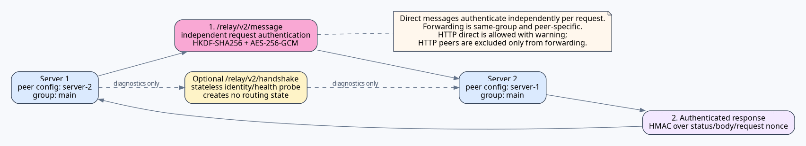

# Server Relay — Protocol v2




> **Security boundary:** Relay v2 is hop-by-hop authenticated encryption, not end-to-end encryption. A forwarding KWC server is a trusted participant.

KOKOTO WebChat 5.1.0 replaces the 5.0.0 flat relay trust model with **Relay Protocol v2**. Public chat and cross-server 1:1 DM/read receipts use the same group-scoped authenticated transport. Group-chat rooms remain local and are not server-relayed.

## Trust model

A relay **group is the security boundary**. Each group contains:

- one group `id`;
- one `shared-secret` used by every member relationship in that group;
- a group-local `forwarding.enabled` switch;
- a list of peers containing only `id`, `url`, and `enabled`.

There is no `peers[].secret` in protocol v2. This deliberately prevents a peer entry from being paired with a secret belonging to the wrong group.

The same peer ID may not be registered in multiple local groups. If KWC detects that configuration, every registration for that duplicated peer ID is disabled and a diagnostic is logged.

`shared-secret` must ultimately be at least **32 characters**, but operators do not need to invent one manually. For first setup, set `shared-secret: ""` on **one** server and start/reload KWC. KWC generates a cryptographically secure 32-byte URL-safe value, writes it back to that server's `config.yml`, and never prints the secret itself to the log. Copy that generated value to every other server in the same group. Do **not** leave the secret empty independently on every server, because each server would generate a different value and request authentication would fail. Existing non-empty secrets are never regenerated automatically; a non-empty manual value shorter than 32 characters remains invalid and the group fails closed. If a group secret is exposed, rotate it on every member server.

## Configuration

```yaml
server-relay:
  enabled: true
  server-id: "server-1"
  server-name: "Server 1"
  connect-timeout-seconds: 5
  request-timeout-seconds: 10
  max-clock-skew-seconds: 60
  dedupe-seconds: 300
  max-hops: 8

  sources:
    game: true
    web: true
    guest: true
    discord: false
    system: false

  delivery:
    web: true
    game: true

  game-format: "&8[&b{server}&8] &f{sender}&7: &f{message}"

  groups:
    - id: "main"
      shared-secret: ""
      forwarding:
        enabled: false
      peers:
        - id: "server-2"
          url: "https://server2.example.com/api"
          enabled: true
```

Start/reload `server-1` once with the blank value, reopen its `config.yml`, then copy the generated secret into `server-2`:

```yaml
server-relay:
  enabled: true
  server-id: "server-2"
  server-name: "Server 2"
  groups:
    - id: "main"
      shared-secret: "<copy-the-generated-secret-from-server-1>"
      forwarding:
        enabled: false
      peers:
        - id: "server-1"
          url: "https://server1.example.com/api"
          enabled: true
```

## Request authentication and optional identity probe

Direct relay follows the 5.0.0 operating model: every `/relay/v2/message` request authenticates itself independently. The receiving server must still list the sender in the same group with the same shared secret, because that group membership and secret are required to authenticate/decrypt the request. The reverse direction is independent. `/relay/v2/handshake` is a stateless diagnostic identity/health probe only; it does not create, retain, enable, or disable a direct relay route. The optional probe request binds:

- protocol `2` and product version `5.1.0`;
- `group-id`;
- sender server ID;
- target server ID;
- timestamp;
- nonce;
- the sender's actual configured outbound transport (`http` or `https`).

The receiver verifies that the group exists, the sender is a peer in that group, the target ID is itself, the timestamp is fresh, the nonce is not replayed, and the HMAC matches the group's shared secret. One-sided peer configuration therefore cannot become usable in either direction.

Endpoints:

```text
/relay/v2/handshake
/relay/v2/message
```

Legacy v1 endpoints (`/relay/handshake`, `/relay/receive`, `/relay/dm/receive`, `/relay/dm/read`) return **HTTP 426** and advertise protocol `2` / version `5.1.0`.

## Message encryption and authentication

Relay v2 derives a **directional 256-bit key** with HKDF-SHA256 from the group secret, group ID, sender ID, and receiver ID. Each request uses AES-256-GCM with a random 12-byte IV and a 128-bit authentication tag.

The following values are GCM Additional Authenticated Data (AAD):

```text
group-id
from-server-id
to-server-id
timestamp
nonce
IV
```

Changing any of those values causes authentication to fail. The encrypted payload contains the message kind (`public`, `dm`, or `read`) and the corresponding relay envelope.

Successful and error responses from a known peer are also authenticated with HMAC-SHA256. The response signature binds the group, responder, requester, response timestamp, request nonce, HTTP status, and response body. This prevents an unauthenticated intermediary from forging a successful HTTP response.

## Replay and loop defenses

Relay v2 enforces:

- timestamp skew limits (`max-clock-skew-seconds`);
- per-request nonce replay rejection;
- relay ID / receipt ID deduplication;
- origin-server loop detection;
- `max-hops` for forwarded traffic.

## HTTP versus HTTPS

Direct one-hop HTTP peers remain permitted. **The relay payload itself is still AES-256-GCM encrypted and authenticated**, so it is not sent as plaintext as in relay v1. KWC nevertheless logs a localized warning because HTTPS still provides transport-layer confidentiality for metadata, standard server identity validation, and defense in depth.

HTTP is never allowed as a forwarding hop.

For forwarding to occur:

1. the source group must have `forwarding.enabled: true`;
2. the incoming peer entry configured on this server must use HTTPS;
3. the selected next-peer entry must use HTTPS;
4. the next peer must belong to the same group.

HTTP filtering is **per peer**, not per group. An `http://` peer can still exchange direct relay traffic, but traffic from that peer is not forwarded onward and that peer is not selected as a forwarding next hop. Other `https://` peers in the same group remain eligible.

## Group isolation

A message received in one group is never forwarded into another group. Forwarding candidates are selected only from the **same incoming group**. This applies equally to public chat, DMs, and DM read receipts.

Local messages may be published to each group that the local server explicitly belongs to; that is an operator-defined bridge at the originating server, not cross-group forwarding of a received message.

## Hop-by-hop, not end-to-end encryption

Relay v2 is **hop-by-hop authenticated encryption**, not end-to-end encryption. A forwarding KWC server decrypts the incoming payload, validates and processes the relay envelope, then encrypts it again for the next peer using the directional key for that next hop.

A forwarding server is therefore a trusted participant and can see the relayed payload. Do not describe Relay v2 as E2EE.

## Upgrade from 5.0.0 / relay v1

5.1.0 intentionally does **not** infer v2 groups from old flat relay configuration. During the first 5.0.0 → 5.1.0 migration:

- `server-relay.shared-secret` is retired;
- flat `server-relay.peers` is retired;
- `server-relay.forward-received-public-chat` is retired;
- the old top-level forwarding setting is not carried into a guessed group;
- `server-relay.enabled` is reset to `false`;
- the operator must define explicit v2 groups and then enable relay again.

This avoids silently assigning the wrong peer to the wrong trust group.

## Operational diagnostics

At startup/reload, check for:

- `Server relay protocol v2 enabled`;
- optional identity/health probe results (diagnostic only);
- duplicate peer ID diagnostics;
- group secret length diagnostics;
- HTTP peer warnings;
- forwarding HTTPS-block warnings.

If the optional identity/health probe fails, confirm the group ID, both server IDs, reciprocal peer entries, group secret, API base URL, clock synchronization, and network reachability. Direct message delivery is independent of probe state.

## References and standards

See [REFERENCES.md](REFERENCES.md) for the primary standards and official third-party documentation cited by this manual.

- [RFC 2104 — HMAC](https://www.rfc-editor.org/rfc/rfc2104.html)
- [RFC 5869 — HKDF](https://www.rfc-editor.org/info/rfc5869/)
- [NIST SP 800-38D — GCM](https://csrc.nist.gov/pubs/sp/800/38/d/final)
- [RFC 9110 — HTTP Semantics](https://www.rfc-editor.org/rfc/rfc9110.html)
