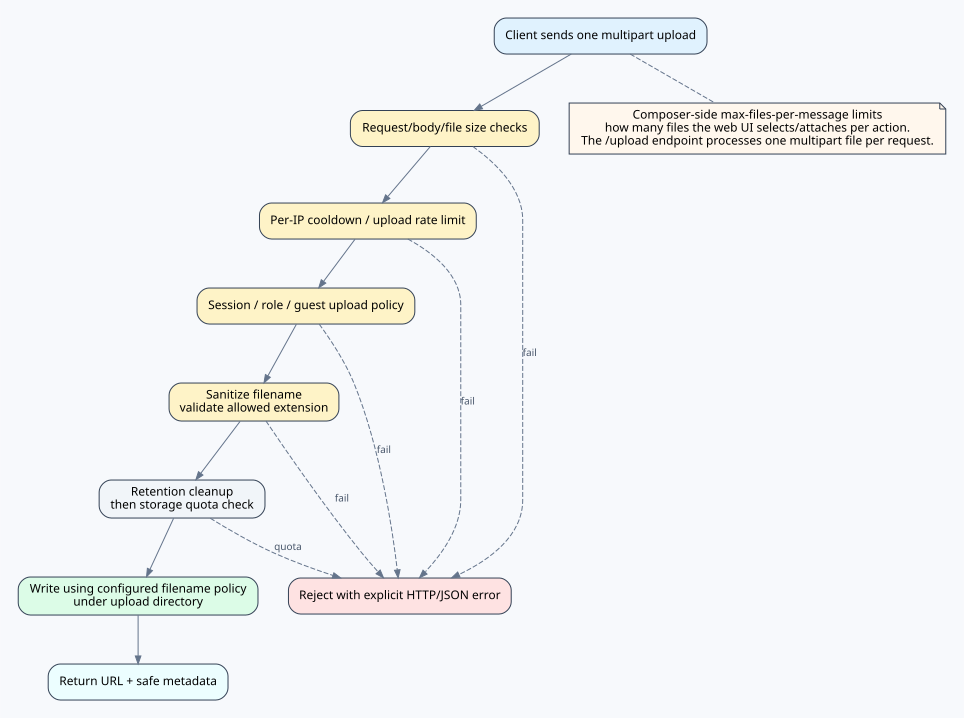

# KOKOTO WebChat 업로드 보안 참고




파일 업로드는 편리하지만 공개 서버에서는 악용될 수 있습니다. 기본 설정은 게스트 업로드를 비활성화합니다.

## 권장 기본값

```yaml
upload:
  enabled: true
  allow-guest-upload: false
  allow-user-upload: true
  allow-moderator-upload: true
  allow-admin-upload: true
  max-file-size-mb: 20
  max-files-per-message: 3
  cooldown-seconds: 5
  max-uploads-per-minute: 4
  retention-days: 5
```

## 공개 서버

별도 모더레이션 체계가 없다면 게스트 업로드는 끄세요. 게스트 업로드를 켜야 한다면 파일 크기 제한을 낮추고 보관 기간을 짧게 잡으세요.

## 공개 URL

직접 HTTP 예시:

```yaml
upload:
  public-base-url: ""
```

같은 도메인 HTTPS 프록시 예시:

```yaml
http:
  path-prefix: "/api"
  public-prefix: "/chat"

upload:
  # 권장값은 빈 값입니다. 업로드 URL은 자동으로 /chat/api를 따라갑니다.
  public-base-url: ""

emoji:
  # 권장값은 빈 값입니다. 이모지 URL은 자동으로 /chat/api를 따라갑니다.
  public-base-url: ""
```

별도 공개 URL이 필요할 때의 명시 override 예시:

```yaml
upload:
  public-base-url: "/chat/api"        # 플러그인이 /uploads를 붙임
  # 또는: "/chat/api/uploads"

emoji:
  public-base-url: "/chat/api"        # 플러그인이 /emojis를 붙임
  # 또는: "/chat/api/emojis"
```

앞에 `/`가 붙은 값은 같은 origin의 브라우저 경로로 처리됩니다. 같은 도메인 프록시에서는 전체 FQDN을 쓸 필요가 없습니다.

업로드가 BlueMap 내장 채팅과 같은 리버스 프록시 API 경로를 쓰는 경우 `upload.public-base-url`은 비워두거나 `/chat/api` 같은 공유 API base로 설정할 수 있습니다. 기존 전체 리소스 경로인 `/chat/api/uploads`도 계속 허용됩니다.

커스텀 이모지 파일도 같은 규칙입니다. `emoji.public-base-url`은 보통 비워두고, 기존/커스텀 배포에서는 `/chat/api` 또는 `/chat/api/emojis`를 사용할 수 있습니다.


## 허용 확장자


```yaml
upload:
  allowed-extensions:
    - png
    - jpg
    - jpeg
    - gif
    - webp
    - mp4
    - webm
    - mp3
    - m4a
    - ogg
    - wav
    - flac
```

채팅에서 실제로 표시하거나 공유할 파일 형식만 허용하세요. KOKOTO WebChat은 확장자와 크기로 제한하지만, 공개 배포에서는 제한된 디렉터리에서 제공하고 HTTPS를 사용하는 것을 권장합니다. `upload.max-total-size-mb`로 `upload.directory` 바로 아래 일반 파일의 총 저장 용량도 제한할 수 있습니다. `0`은 무제한이며, 제한을 켜면 서버가 오래된 미참조 업로드부터 삭제하고 그래도 부족하면 새 업로드를 거부합니다.

### URL 설정 해석 규칙

`http.public-prefix + http.path-prefix`가 HTTPS 공개 API의 기준이며 기본값은 `/chat/api`입니다. adapter/standalone API override는 서로 독립적이며 보통 비워둡니다. upload/emoji를 비워두면 공통 API base에 각각 `/uploads`, `/emojis`를 붙입니다.


관리자 커스텀 이모지 참고: 이모지 파일명이나 폴더명을 변경하면 `:emoji:pack/name:` 토큰도 바뀝니다. 기존 토큰을 사용한 과거 채팅은 기존 파일/폴더명을 유지하지 않는 한 더 이상 렌더링되지 않을 수 있습니다.

커스텀 이모지 업로드도 `emoji.max-total-size-mb` 전체 용량 제한을 따릅니다. 제한을 초과하면 관리자 UI에 경고가 표시됩니다. `emoji.show-storage-usage`, `emoji.show-storage-limit`로 현재/최대 이모지 용량 표시 여부를 조정할 수 있습니다.
