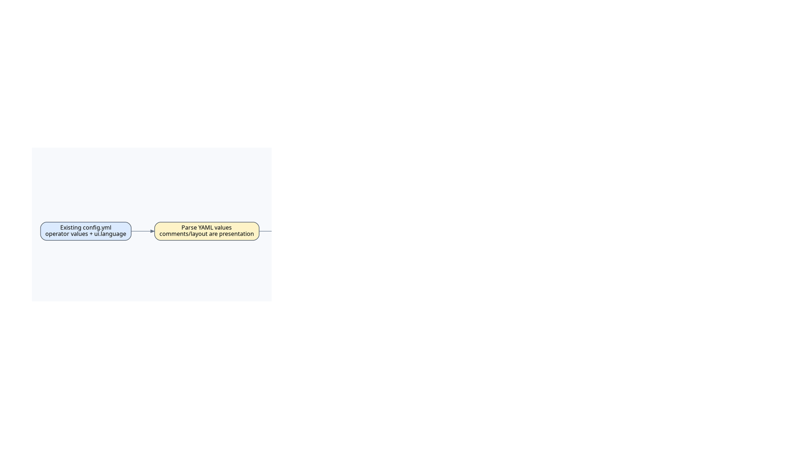

# KOKOTO WebChat 5.1.0 통합 사용·운영 매뉴얼

> **5.1.0 운영 기능:** Web Admin **Filter**에서 공개/그룹/선택형 DM의 차단·마스킹·치환 규칙과 전송 없는 테스트를 관리하고, **Settings**에서는 지원되는 실시간 안전 설정인 게스트/CAPTCHA, 세션, 사용자 프로필, 관리자 알림, 업로드, 콘텐츠 필터 값만 관리합니다. moderation 정책 5종은 `config.yml` 전용이며 Web Admin에 노출하지 않습니다. 게임에서는 `/kchat filter`, `/kchat settings`를 사용합니다. 세션 기간 변경은 이미 만료된 세션을 부활시키지 않고 기존 대상 세션을 생성 시각 기준으로 재계산합니다. `upload.filename-mode: original`은 새 업로드의 안전한 Unicode 원본명을 보존하고 중복 접미사를 붙입니다.


이 문서는 KOKOTO WebChat 5.1.0의 전체 기능을 사용자와 서버 운영자 관점에서 설명합니다. 단순 설정 키 목록은 `CONFIGURATION_KO.md`, 서버 간 릴레이의 상세 프로토콜은 `SERVER_RELAY_KO.md`, HTTPS 구성은 `CADDY_HTTPS_KO.md`와 `NGINX_HTTPS_KO.md`를 함께 참고하세요.

## 1. 플러그인 개요

KOKOTO WebChat은 Minecraft 서버의 게임 채팅을 웹 브라우저에 연결하는 서버측 웹 채팅입니다. 5.1.0은 Bukkit/Paper/Spigot과 Fabric 1.18.2~26.2, NeoForge 1.20.2~26.2, Forge 1.18.2~26.2 exact-target 빌드를 제공합니다.

지원 형태:

- BlueMap 지도 안에 포함되는 채팅 애드온
- BlueMap 없이 사용하는 standalone 채팅 페이지
- BlueMap 애드온과 standalone 페이지 동시 운영
- 게임 ↔ 웹 공개 채팅
- 저장형 1:1 DM과 그룹 채팅
- DiscordSRV 연동
- 여러 Minecraft 서버 사이의 공개 채팅 릴레이

기본 HTTP 포트는 `8899`, API 기본 경로는 `/api`, standalone 내부 기본 경로는 `/`이며 기본 리버스 프록시에서는 `/chat`으로 공개됩니다.

## 2. 요구사항과 권장 환경

필수:

- 지원 서버 플랫폼: Bukkit/Paper/Spigot **1.18~26.2**, Fabric exact-target **1.18.2~26.2**, NeoForge exact-target **1.20.2~26.2**, 또는 Forge exact-target **1.18.2~26.2**
- 해당 Minecraft/서버 버전이 요구하는 Java. Bukkit 산출물은 Java 17 대상입니다. Fabric/NeoForge/Forge exact-target 빌드 스크립트는 대상 Minecraft 버전에 맞춰 JDK 17/21/25를 선택하며, 26.x는 Java 25를 사용합니다.
- Bukkit 계열은 `plugins/`, Fabric/NeoForge/Forge는 `mods/`에 플랫폼 JAR을 넣을 수 있는 서버 관리 권한

선택:

- BlueMap: 지도 안에 채팅 패널을 표시할 때
- DiscordSRV: Discord 채널과 채팅을 연동할 때
- ImageEmojis-Bero 1.9.x: 게임에서 KWC 이모지 토큰을 실제 이모지 glyph로 표시할 때
- Caddy 또는 Nginx: 공개 HTTPS 운영 시

공개 서버에서는 플러그인의 HTTP 포트 `8899`를 인터넷에 직접 공개하지 말고 `127.0.0.1:8899`로 제한한 뒤 HTTPS 리버스 프록시를 사용하는 구성을 권장합니다.

## 3. 설치와 최초 활성화

1. Bukkit/Paper/Spigot은 해당 JAR을 `plugins/`에, Fabric/NeoForge/Forge는 해당 플랫폼 JAR을 `mods/`에 넣습니다.
2. 서버를 한 번 시작합니다.
3. `<KWC data dir>/config.yml`을 확인합니다. `<KWC data dir>`는 Bukkit 계열에서 `plugins/KOKOTO-WebChat`, Fabric/NeoForge/Forge에서 `config/KOKOTO-WebChat`입니다.
4. 새 설정의 `enabled` 기본값은 `false`입니다.
5. URL, 저장 방식, 보관 기간, 인증, 업로드 제한을 확인합니다.
6. 사용할 기능을 설정한 뒤 `enabled: true`로 변경합니다.
7. 서버를 재시작하거나 `/kchat reload`를 실행합니다.

기본 안전 설정:

```yaml
config-version: "5.1.0"
enabled: false
```

`enabled: false`일 때는 웹 서버, 채팅 전달, 정리 작업이 시작되지 않습니다. 설정을 다시 읽기 위한 `/kchat reload`는 관리자에게 계속 허용됩니다.

## 4. 설정 업그레이드와 마이그레이션 파일



기존 설정값은 보존하지만 기존 설정 파일의 주석/레이아웃을 이어 붙이는 방식은 사용하지 않습니다. migration이 활성화되면 실행 중 플러그인의 최신 번들 `config.yml`을 새 뼈대로 만들고 기존 사용자 설정값만 그 위에 덮어씁니다. 따라서 이전 주석·순서·공백·들여쓰기는 버리고 최신 번들 주석과 레이아웃으로 통일합니다.

현재 버전의 전체 기준 파일은 항상 다음 위치에 생성됩니다.

```text
<KWC data dir>/config-reference-5.1.0.yml
```

이 파일은 `ui.language`가 선택한 내장 언어(`en-US`, `ko-KR`, `ja-JP`, `zh-CN`)와 같은 언어로 렌더링한 현재 기본 설정의 관리자 확인용 사본입니다. 지원하지 않는 사용자 정의 UI 언어는 영어 설정 표현을 사용합니다. reference 파일은 migration 입력으로 사용하지 않습니다. `/kchat reload`는 실제 서비스를 중지하기 전에 YAML을 검증하므로 잘못된 YAML이면 기존 실행 설정을 유지합니다.

`config-version`이 없거나 실행 버전과 다르면 KWC가 실제 `config.yml`에 대해 한 번의 마이그레이션을 수행합니다.

- 최신 번들 `config.yml`을 새 파일의 뼈대로 사용합니다.
- 기존 사용자 설정값을 그 위에 덮어씁니다.
- 구버전 주석·순서·공백·들여쓰기는 가져오지 않습니다.
- 이전 `config-version`에 `_auto_migration`이 없었다면 실제 버전 업그레이드 전에 기존 `config.yml`을 통째로 백업합니다.
- 이미 존재하는 설정의 기본값이 새 버전에서 바뀐 경우에는 자동 덮어쓰지 않고 검토 대상으로 남깁니다.
- 실제 파일의 표식을 `config-version: "5.1.0_auto_migration"`로 바꿉니다.

그 다음 다음 파일을 생성합니다.

```text
<KWC data dir>/config-migration-5.1.0.yml
```

이 파일은 더 이상 누락 설정을 복사해 넣는 fragment가 아니라 **검토 보고서**입니다. 이전 버전의 생성된 `config-reference-*`, `config-migration-*`, `config-upgrade-*` 파일은 자동 정리하고 현재 버전 파일만 유지합니다. 자동 삽입된 설정 수, 사용자가 판단해야 하는 기본값 변경, 최종 확인용 정확한 버전 표식, current-vs-reference **설정값 의미 diff**를 기록합니다. Difference는 파싱된 YAML path/value만 비교하며 주석, 빈 줄, 들여쓰기, 따옴표 스타일, 줄 위치, 키 순서는 무시합니다. 각 Difference 블록은 설명 주석을 반복 복사하지 않고 해당 설정의 실제 YAML 값 블록만 표시하며, list/map은 여러 줄 구조를 유지합니다. 누락 설정과 주석은 이미 실제 config의 적절한 위치에 들어가므로 diff 최상단에 거대한 reference-only 블록으로 몰리지 않습니다.

판정 기준:

| 실제 `config.yml` 상태 | 동작 |
|---|---|
| `config-version` 없음 또는 이전/다른 버전 | migration을 수행하고 `5.1.0_auto_migration`으로 표시한 뒤 migration/검토 보고서 생성 |
| `config-version: "5.1.0_auto_migration"` | 자동 migration 사용. startup/reload마다 최신 같은 버전 번들 `config.yml`을 새 뼈대로 만들고 현재 값을 덮어쓴 뒤 migration report/diff 갱신 |
| `config-version: "5.1.0"` | 현재 버전의 자동 migration 중지. 같은 버전 migration/backfill을 건너뛰고 오래된 migration 안내 제거 |

이 표식은 **검토 여부가 아니라 자동 migration 사용 여부**를 뜻합니다.

```yaml
# 설정을 이미 확인했더라도 자동 migration을 계속 사용
config-version: "5.1.0_auto_migration"

# 같은 버전 자동 migration 중지
config-version: "5.1.0"
```

이후 실제 플러그인 버전 업그레이드가 발생하면 새 버전의 `_auto_migration` 상태로 다시 들어갑니다.
## 5. 운영 방식 선택


### 5.1 BlueMap 애드온

```yaml
adapters:
  bluemap:
    auto-install: true
    auto-patch-webapp-conf: true

frontend:
  standalone:
    enabled: false
```

Bukkit에서는 KWC가 BlueMap 웹 디렉터리에 자산을 설치하고 `plugins/BlueMap/webapp.conf`를 수정합니다. Fabric/NeoForge 26.1.2/26.2 및 Forge 26.1.2/26.2에서 BlueMap 5.21+ 모드를 사용할 때는 BlueMapAPI 2.8.0으로 설정된 web root를 얻고 script/style을 등록하므로 `webapp.conf`를 수정하지 않습니다. BlueMap 연동이 활성 상태라면 `/kchat reload`가 `bluemap reload light`를 자동 요청하고, 다음 BlueMap API `onEnable`에서 새 KWC 설정으로 다시 등록합니다.

### 5.2 Pl3xMap 지도 내장 모드

Pl3xMap이 설치된 Bukkit/Paper 계열 또는 Fabric 서버에서는 다음처럼 켭니다.

```yaml
adapters:
  pl3xmap:
    enabled: true
    api-base-url: ""
```

KWC는 현재 Pl3xMap `config.yml`의 `settings.web-directory.path`를 읽고(`settings.yml`은 구형/포크용 fallback), Pl3xMap 웹루트 안에 KWC 전용 `kokoto-web-chat` 자산과 `index.html`의 KWC 마커 블록만 관리합니다. Pl3xMap이 웹 파일을 다시 생성한 경우 `/kchat reload`로 다시 삽입할 수 있습니다. 현재 Pl3xMap 26.2 배포 대상은 Bukkit/Paper 계열과 Fabric/Quilt이며 NeoForge는 아닙니다. 직접 HTTP에서는 `api-base-url: ""`이면 KWC `:8899/api`를 자동 사용하며, 공유기 NAT가 외부 KWC 포트를 바꾸면 실제 공개 API URL을 직접 지정합니다.


### 5.3 LiveAtlas 지도 내장 모드

LiveAtlas는 Dynmap, squaremap, Pl3xMap, Overviewer 또는 여러 서버를 표시할 수 있는 정적 프론트엔드입니다. Bukkit/Fabric/NeoForge/Forge에서 다음처럼 켭니다.

```yaml
adapters:
  liveatlas:
    enabled: true
    api-base-url: ""
    web-root: ""
```

`web-root`를 비우면 `window.liveAtlasConfig` 같은 LiveAtlas 표식이 있는 `index.html`만 자동 인식합니다. Caddy/nginx가 별도 디렉터리의 LiveAtlas를 서비스하면 서버에서 볼 수 있는 공유/마운트 경로를 `web-root`에 지정합니다. KWC는 `kokoto-web-chat/`과 표시된 index 블록만 관리하며, LiveAtlas 파일을 교체한 뒤 `/kchat reload`로 다시 삽입할 수 있습니다. 같은 실제 웹루트에 LiveAtlas adapter와 backend 전용 adapter를 동시에 지정하지 않습니다.

### 5.4 uNmINeD 정적 웹 내보내기

uNmINeD는 Minecraft 서버 안에서 동작하는 플러그인이 아니라 자체 완결된 정적 웹 지도를 생성합니다. 먼저 지도를 내보낸 뒤 KWC가 그 디렉터리를 보게 합니다.

```yaml
adapters:
  unmined:
    enabled: true
    api-base-url: ""
    web-root: "/srv/www/unmined"
```

현재 uNmINeD 내보내기는 `index.html`을 사용하고 구형 내보내기는 `unmined.index.html`일 수 있습니다. KWC는 어느 파일이든 uNmINeD 표식을 확인한 경우에만 수정하고, `kokoto-web-chat/`과 표시된 블록만 관리하며 지도 타일/라이브러리 파일은 건드리지 않습니다. uNmINeD로 다시 내보내면 HTML 또는 KWC 전용 디렉터리가 교체될 수 있으므로 이후 `/kchat reload`를 실행합니다. 다른 호스트에서 서비스한다면 Minecraft 서버가 수정할 수 있도록 내보내기 디렉터리를 공유/마운트해야 합니다.

### 5.5 Minecraft Overviewer 정적 웹 지도

Minecraft Overviewer는 설정된 `outputdir`에 Leaflet 기반 정적 웹 지도를 렌더링합니다. 먼저 지도를 생성한 뒤 KWC가 그 디렉터리를 보게 합니다.

```yaml
adapters:
  overviewer:
    enabled: true
    api-base-url: ""
    web-root: "/srv/www/overviewer"
```

KWC는 Overviewer 전용 생성 표식/파일을 확인한 `index.html`만 수정하고, 자체 `kokoto-web-chat/` 디렉터리와 마커 블록만 관리하며 Overviewer 타일/설정/Leaflet 파일은 건드리지 않습니다. 이후 Overviewer 렌더 또는 `--update-web-assets`가 HTML을 다시 만들 수 있으므로 `/kchat reload`를 실행합니다. 다른 호스트에서 렌더/서비스한다면 Minecraft 서버가 수정할 수 있도록 출력 디렉터리를 공유/마운트해야 합니다. 자체 지속형 템플릿을 관리한다면 Overviewer의 `customwebassets` 옵션을 별도로 사용할 수 있습니다.

### 5.6 standalone 전용

```yaml
adapters:
  bluemap:
    auto-install: false
    auto-patch-webapp-conf: false

frontend:
  standalone:
    enabled: true
    path: "/"
```

직접 HTTP 예시:

```text
http://server.example.com:8899/
```

### 5.7 두 형태 동시 사용

BlueMap 안의 패널과 standalone 페이지는 같은 계정, 기록, 알림 및 설정을 공유합니다.

```yaml
adapters:
  bluemap:
    auto-install: true
    auto-patch-webapp-conf: true

frontend:
  standalone:
    enabled: true
```

## 6. HTTP, HTTPS와 공개 URL

### 6.1 직접 HTTP

테스트 또는 개인망에서만 권장합니다.

```yaml
http:
  host: "0.0.0.0"
  port: 8899
  path-prefix: "/api"
  cors-origin: "*"

adapters:
  bluemap:
    api-base-url: ""
```

### 6.2 같은 도메인의 HTTPS 리버스 프록시

```yaml
http:
  host: "127.0.0.1"
  port: 8899
  path-prefix: "/api"
  public-prefix: "/chat"
  cors-origin: "https://map.example.com"
  trusted-proxies:
    - "127.0.0.1"
    - "::1"

frontend:
  standalone:
    enabled: true
    path: "/"
    api-base-url: ""

adapters:
  bluemap:
    enabled: true
    api-base-url: ""
```

공개 경로 예시:

```text
https://map.example.com/          BlueMap
https://map.example.com/chat/api  KWC API
https://map.example.com/chat standalone 페이지
```

`frontend.standalone.api-base-url`, `upload.public-base-url`, `emoji.public-base-url`은 보통 비워둡니다. 비어 있으면 활성 API 기본 주소를 자동으로 사용합니다.

#### 반대 배치: standalone은 `/`, BlueMap은 `/chat/`

기본 배치와 반대로 사용할 수도 있습니다. 내부 standalone 경로는 계속 `/`로 두고 `http.public-prefix: ""`로 설정한 뒤, `/chat/`만 prefix를 제거해서 BlueMap으로 보내고 나머지 경로는 KWC로 보냅니다.

```yaml
http:
  host: "127.0.0.1"
  port: 8899
  path-prefix: "/api"
  public-prefix: ""

frontend:
  standalone:
    enabled: true
    path: "/"
    api-base-url: ""

adapters:
  bluemap:
    enabled: true
    api-base-url: ""
```

공개 경로는 다음과 같습니다.

```text
https://map.example.com/       KWC standalone
https://map.example.com/api    KWC API
https://map.example.com/chat/  BlueMap
```

`frontend.standalone.path`를 `/chat`으로 바꾸지 않습니다. 외부 배치는 리버스 프록시와 `http.public-prefix`가 결정합니다.


### 6.3 프록시 IP 신뢰

`X-Forwarded-For`는 `http.trusted-proxies`에 등록된 직접 접속 프록시에서 온 경우만 신뢰합니다. 직접 HTTP 구성에서는 목록을 비워두세요.

문제 확인용:

```yaml
http:
  log-client-ip-resolution: true
```

이 옵션은 실제 클라이언트 IP 확인이 끝나면 다시 꺼야 합니다.

## 7. 웹 UI 기본 사용법

채팅 패널의 주요 영역:

- 메시지 목록
- 메시지 입력창
- 로그인·로그아웃
- DM 및 그룹 채팅 메뉴
- 검색
- 고정 메시지
- 이모지 선택기
- 파일 업로드
- 알림 설정
- 관리자 패널

5.0.0부터 로그인 사용자의 시각 UI 설정은 여러 개의 KWC 계정 프로필로 저장할 수 있고, 게스트만 브라우저 로컬 프리셋을 사용합니다. 창 위치·크기·최소화 상태, 마지막 선택 프로필 ID, Web Push 등록은 localStorage/기기 상태로 남습니다. 로그인 사용자의 알림 종류와 키워드 알림은 브라우저별이 아니라 계정 공통입니다. 브라우저 로컬 알림함에서는 최근 알림 대상 이벤트를 다시 확인할 수 있습니다.

기본 UI 설정:

```yaml
ui:
  language: "en-US"
  language-fallback: "en-US"
  time-zone: "local"
  theme: "system"
  opacity: 0.92
  resizable: true
  remember-window-size: true
```

지원 언어:

- `en-US`
- `ko-KR`
- `ja-JP`
- `zh-CN`

지원 테마:

- `system`
- `dark`
- `light`
- `high-contrast`

## 8. 공개 채팅

### 8.1 게임→웹

```yaml
chat:
  broadcast-ingame-chat-to-web: true
```

게임 플레이어의 일반 채팅을 웹 공개 채팅에 전달합니다. 플레이어 이름은 `player-display.mode`에 따라 결정됩니다.

### 8.2 웹→게임

```yaml
chat:
  send-web-chat-to-game: true
  web-user-to-game-format: "[Web] {player}: {message}"
  web-guest-to-game-format: "[Web Guest] {guest}: {message}"
  web-admin-to-game-format: "[Web Admin] {player}: {message}"
```

설정 템플릿의 `&` 색상 코드는 Minecraft 색상으로 변환되지만 사용자가 입력한 메시지 안의 색상 코드는 임의 변환하지 않습니다.

### 8.3 웹→웹

```yaml
chat:
  broadcast-web-chat-to-web: true
```

웹에서 보낸 공개 메시지를 현재 연결된 다른 웹 사용자에게 SSE로 전달합니다.

### 8.4 메시지 길이

```yaml
chat:
  max-message-length: 120
  max-url-message-length: 2048
```

일반 메시지와 URL 중심 메시지를 별도로 제한할 수 있습니다. `0`은 제한 없음입니다.

### 8.5 메시지 토큰

KOKOTO WebChat 5.1.0은 메시지를 저장하거나 릴레이하기 전에 관리자가 설정한 `:alias:` 토큰을 치환할 수 있습니다. 기본 alias는 영어만 제공하며 관리자가 원하는 언어의 alias로 바꾸거나 추가할 수 있습니다.

- `:enter:`, `:newline:`, `:nextline:`, `:linebreak:`, `:br:` → 다음 줄
- `:blankline:`, `:emptyline:`, `:paragraphbreak:` → 빈 줄 1개
- `:tab:`, `:indent:` → 설정된 수의 공백(기본 4칸)

알 수 없는 토큰은 그대로 유지하므로 ImageEmojis/커스텀 이모지 토큰과 충돌하지 않습니다. `:\n:` 같은 백슬래시 escape는 해석하지 않습니다. `custom`에는 출력 가능한 일반 문자 치환을 추가할 수 있습니다. Minecraft에서는 일반 CR/LF 입력은 기존처럼 한 줄로 평탄화하고, `newline`/`blank-line` alias가 만든 줄바꿈만 최종 게임 출력에서 명시적인 여러 채팅 줄로 보냅니다. 서버간 릴레이의 게임 출력도 같은 4.7.0 token-line 처리가 수신 서버에 있어야 합니다.

YAML 리스트 설정은 inline(`aliases: [bullet, arrow]`)과 block(`aliases:` 다음 줄의 `- bullet`) 형식을 모두 사용할 수 있습니다. 들여쓰기는 일반 ASCII 공백만 사용해야 하며 tab과 전각 공백은 사용할 수 없습니다. 잘못된 설정은 `/kchat reload`가 서비스를 중지하기 전에 거부하므로 기존 실행 설정과 UI 언어가 그대로 유지됩니다.

```yaml
message-tokens:
  enabled: true
  max-replacements-per-message: 24
  newline:
    aliases: [enter, newline, nextline, linebreak, br]
  blank-line:
    aliases: [blankline, emptyline, paragraphbreak]
  tab:
    aliases: [tab, indent]
    spaces: 4
  custom: {}
```

## 9. 채팅 기록과 검색

권장 저장 방식은 SQLite입니다.

```yaml
chat:
  history-storage: "sqlite"
  history-sqlite-file: "history.db"
  history-retention-days: 5
  history-size: 0
  history-page-size: 80
```

저장 방식:

- `sqlite`: 검색과 장기 운영에 권장
- `jsonl`: 단일 JSONL 파일을 사용하는 레거시 방식
- `memory`: 서버 재시작 시 기록이 사라짐

`history-retention-days: 0`은 기간 제한 없음, `history-size: 0`은 개수 제한 없음입니다.

JSONL에서 SQLite로 최초 이전:

```yaml
chat:
  history-sqlite-migrate-jsonl: true
```

검색:

```yaml
search:
  enabled: true
  result-limit: 50
```

검색할 수 있는 조건:

- 메시지 본문
- 작성자
- 날짜 및 시간 범위
- 메시지 출처
- 시스템·이벤트 메시지 포함 여부

검색 결과를 클릭하면 해당 메시지 주변 기록으로 이동합니다. 결과 제한을 지나치게 크게 설정하면 DB, 메모리와 응답 크기 부하가 증가합니다.

## 10. 계정 연동과 로그인

### 10.1 게임 계정 연동

웹 UI에서 연동 코드를 발급한 뒤 게임에서 실행합니다.

```text
/kchat auth <code>
```

필요 권한:

```text
kwc.auth
```

관련 설정:

```yaml
auth:
  enabled: true
  link-code-length: 6
  link-code-expire-seconds: 180
  link-code-cooldown-seconds: 3
  link-code-max-per-minute: 10
```

### 10.2 비밀번호 로그인

게임에서 웹 로그인 비밀번호를 설정합니다.

```text
/kchat password <newPassword>
/kchat status
```

```yaml
auth:
  password-login: true
  remember-session-days: 30
```

비밀번호는 해시로 저장되지만 HTTP 전송은 암호화되지 않으므로 공개 운영에서는 HTTPS가 필요합니다.

### 10.3 역할

역할:

- `USER`
- `MODERATOR`
- `ADMIN`
- 로그인하지 않은 게스트 역할

권한 기반 자동 관리자:

```yaml
auth:
  auto-admin-from-permission: true
  admin-permission: "kwc.admin"
```

### 10.4 로컬 관리자 계정

Minecraft UUID와 연결되지 않은 웹 관리자 계정을 만들 수 있습니다.

```yaml
admin:
  allow-local-admin-accounts: true
```

명령어:

```text
/kchat admin create <id>
/kchat admin password <id> <password>
/kchat admin role <id> <user|moderator|admin>
```

### 10.5 세션 관리

```text
/kchat sessions
/kchat revoke <username>
```

`revoke`는 해당 사용자의 활성 웹 세션을 폐기하고 연결된 브라우저에 인증 만료를 알립니다.

## 11. 로그인 보안

```yaml
security:
  login-fail-limit: 5
  login-fail-window-seconds: 300
  login-lock-seconds: 600
  max-sse-connections-per-ip: 10
  max-sse-connections-total: 500
```

- 반복 로그인 실패 시 IP 기준 임시 잠금
- IP별 SSE 연결 수 제한
- 서버 전체 SSE 연결 수 제한

각 제한값의 `0`은 해당 제한 비활성화입니다.

관리자 로그인 IP 제한:

```yaml
admin:
  allow-admin-login-from: []
```

빈 목록은 IP 제한 없음입니다. 공개 관리자 계정은 HTTPS와 강한 비밀번호를 사용하세요.

## 12. 게스트 채팅과 캡차

```yaml
guest:
  enabled: true
  allow-custom-name: true
  name-prefix: "Guest-"
  cooldown-seconds: 6
  max-messages-per-minute: 50
  block-player-name-spoofing: true
```

`block-player-name-spoofing`은 게스트가 실제 플레이어 이름을 사칭하는 것을 제한합니다. `blocked-names`에는 관리자·서버를 사칭하기 쉬운 이름을 추가할 수 있습니다.

캡차:

```yaml
captcha:
  mode: "math"
  expire-seconds: 120
  require-on-each-message: false
  pass-valid-minutes: 120
```

`require-on-each-message: false`이면 한 번 통과한 뒤 설정 시간 동안 재사용할 수 있습니다.

게스트/IP 뮤트:

```text
/kchat guest mute guest <name> [minutes] [reason]
/kchat guest mute ip <address> [minutes] [reason]
/kchat guest unmute guest <name>
/kchat guest unmute ip <address>
/kchat guest list
```

## 13. 플레이어 이름 표시, hover와 클릭

```yaml
player-display:
  mode: "name"
  strip-colors: true
```

모드:

- `name`: 실제 Minecraft 계정명
- `display-name`: 서버 표시명
- `custom-name`: 플러그인이 보관한 사용자 지정 표시명

웹 발신자의 게임 내 이름 hover:

```yaml
chat:
  game-name-hover:
    enabled: false
    text: "&f{real}"
```

지원 placeholder:

- `{display}`
- `{real}`
- `{uuid}`
- `{source}`

이름 클릭:

- 같은 서버 게임 플레이어: `/w <실제이름> `
- 웹 사용자: `/kchat dm <실제이름> `
- 다른 서버 게임 플레이어: `/kchat dm <실제이름>@<server-id> `

## 14. 공개 메시지 댓글

```yaml
reply:
  game-click:
    enabled: true
    local-game-chat: true
  game-command-format: "&8[&dReply&8] &f{player}&7: &f{message}"
  game-preview:
    enabled: true
    format: "&7{sender}: {preview}"
    max-length: 120
  game-prefix:
    enabled: true
    text: "↪ [Reply] "
```

메시지의 URL이 아닌 본문을 클릭하면 다음 명령이 자동완성됩니다.

```text
/kchat reply <messageId> 
```

전송:

```text
/kchat reply <messageId> <message>
```

필요 권한:

```text
kwc.reply
```

`local-game-chat: true`는 일반 로컬 게임 채팅도 클릭 가능한 컴포넌트로 다시 출력합니다. 채팅 포맷 플러그인과 충돌하면 `false`로 변경하세요. 이 값을 꺼도 웹→게임과 서버 릴레이 메시지의 댓글 기능은 유지됩니다.

URL 조각은 링크 열기 동작이 우선하며 나머지 본문만 댓글 명령을 제안합니다.

## 15. 1:1 DM 메시지함


게임 내 DM 알림/기록은 클릭할 수 있습니다. DM 이름을 누르면 기존 `/kchat dm <player> ` 명령이 입력창에 올라오고, 메시지 본문을 누르면 `/kchat reply dm-<내부ID> `가 올라옵니다. 내부 ID는 사용자 권한을 대신하지 않으며 서버가 실제 DM 참여 여부를 다시 확인한 뒤 전송합니다. URL 부분은 기존 URL 열기 동작이 우선합니다. 저장된 DM이 Reply라면 실시간 수신/송신 echo와 과거내역 모두 공개채팅과 같은 `reply.game-preview` / `reply.game-prefix` 설정을 사용합니다. 웹에서 보낸 DM도 연동된 발신 플레이어가 게임에 접속 중이면 자기 Minecraft 채팅에 함께 표시됩니다.

웹에서도 DM 메시지의 Reply를 선택하면 원문과의 실제 관계를 저장합니다. 서버가 같은 thread의 메시지인지 검증하고 저장된 원문에서 canonical sender/preview를 만들어 표시하며, local 원문이 남아 있으면 클릭해 이동할 수 있습니다. metadata는 재시작 후에도 유지됩니다. 타 서버 Reply는 상대 서버의 숫자형 local DB ID 대신 stable relay message ID를 사용합니다.


기본값은 비활성화입니다.

```yaml
direct-message:
  enabled: true
  storage: "auto"
  retention-days: 0
  max-messages-per-thread: 0
  max-message-length: 500
  allow-web-send: true
  allow-game-send: true
  capture-game-whispers: true
  notify-on-login: true
  notify-on-message: true
  web-unread-badge: true
  confirm-hide: true
```

대상은 서버가 UUID를 알고 있는 플레이어입니다. 로컬 접속·계정 연동 기록뿐 아니라 서버 릴레이로 받은 게임/연동 웹 메시지에 `playerUuid`가 있으면 해당 발신자의 표시 이름과 실제 Minecraft 이름을 DM의 새 대화 대상 검색에 등록합니다. 따라서 타 서버 메시지에서 본 이름을 DM 검색창에 입력해 기존 전송 경로로 대화를 시작할 수 있습니다. 최근 이름은 `known-display-names.yml`에 보존되며 재시작 후에도 검색됩니다. UUID가 없는 게스트·Discord 메시지는 DM 대상에 등록하지 않습니다. `storage: auto`는 공개 채팅 저장방식이 `jsonl`일 때 DM도 JSONL을 사용하고, 그 외에는 SQLite를 사용합니다. 필요하면 `sqlite` 또는 `jsonl`을 직접 지정할 수 있습니다.

게임 명령어:

```text
/kchat dm
/kchat dm list [pageSize]
/kchat dm unread [pageSize]
/kchat dm list next
/kchat dm list prev
/kchat dm <player> <message>
/kchat dm read <player> [pageSize]
/kchat dm next
/kchat dm prev
/kchat dm hide <messageId>
```

필요 권한:

```text
kwc.dm
```

### 15.1 게임 귓속말 복제

`capture-game-whispers: true`이면 다음 명령의 내용을 같은 KWC DM 스레드에도 저장합니다.

```text
/w /msg /tell /whisper /m /pm /message /t
```

같은 서버의 일반 Minecraft 귓속말은 대체하지 않고 기록만 복제합니다. 송신자와 수신자 모두 웹 DM에서 볼 수 있습니다. 타 서버 대상은 `이름@server-id`로 지정하며, 위 별칭들은 `/kchat dm 이름@server-id <메시지>`로 변환되어 서명된 서버 간 DM 릴레이로 전송됩니다. 서버를 지정하지 않은 `/kchat dm <이름>`은 현재 서버 사용자만 대상으로 합니다. 대상이 없는 `/r`, `/reply`는 기존 귓속말 플러그인의 최근 상대 상태와 충돌할 수 있으므로 가로채지 않습니다.

### 15.2 전송 및 읽음 상태

정상 전송 완료는 별도 문구를 표시하지 않습니다. 로컬 전송 요청을 처리 중일 때만 `전송중`, 전달을 확인할 수 없을 때만 `실패 · 재시도`가 시간 표시 옆에 짧게 표시됩니다. 읽음 상태는 DM의 모든 메시지에서 시간 표시 옆에 표시하며, 1:1 DM은 상대가 아직 읽지 않았으면 `미확인`, 읽으면 `✓`를 표시합니다. 그룹채팅은 기존처럼 미확인 수신자 수를 숫자로 표시합니다. 타 서버 DM은 수신 서버의 읽음 정보를 인증된 서버 릴레이로 돌려보내 원본 메시지 쪽에도 같은 상태를 반영합니다. 대화방을 다시 열 때 최신 읽음 ACK를 안전하게 재전송하므로 일시적인 릴레이 또는 HTTP 실패가 있었어도 이후 열람 시 체크표시를 복구할 수 있습니다.

## 16. 그룹 채팅

게임 내 그룹 메시지도 클릭할 수 있습니다. 그룹/이름 영역을 누르면 기존 `/kchat group <room> ` 명령이 입력창에 올라오고, 본문을 누르면 해당 그룹 메시지에 대한 reply 입력이 준비됩니다. 서버가 현재 그룹 멤버십을 다시 확인하며 URL 부분은 기존 URL 열기 동작이 우선합니다. Reply가 붙은 그룹 메시지는 실시간 수신/송신 echo와 과거내역 모두 공개채팅과 같은 `reply.game-preview` / `reply.game-prefix` 표시 형식을 사용합니다.

웹 그룹 Reply도 metadata로 저장합니다. 서버는 같은 room의 메시지인지와 현재 멤버십을 검증하고 저장된 원문에서 sender/preview를 만들며, 재시작 후에도 유지합니다. local 원문이 남아 있으면 Reply 표시를 눌러 해당 메시지로 이동할 수 있습니다.

각 방의 방 설정에는 **멤버 입장/퇴장 알림 표시** 옵션이 있습니다. 켜면 실제 멤버십 변화가 `member_join` / `member_leave` 이벤트로 저장되어 그룹 기록과 온라인 멤버의 게임 알림에 표시됩니다. 직접 참가하거나 초대를 수락하면 입장 이벤트가, 직접 나가기·강퇴·차단으로 멤버십이 제거되면 퇴장 이벤트가 생성됩니다. **그룹채팅 창을 닫거나 다른 방으로 이동하거나 방을 숨기는 것은 퇴장이 아니며 퇴장 이벤트를 만들지 않습니다.** 멤버십 이벤트는 안내용이며 Reply 대상으로 선택할 수 없습니다.


```yaml
group-chat:
  enabled: true
  allow-web-send: true
  allow-public-rooms: true
  allow-room-passwords: true
  retention-days: 30
  max-messages-per-room: 1000
  max-message-length: 500
  max-rooms-per-user: 20
  max-members-per-room: 50
  max-room-name-length: 32
  invite-expire-hours: 72
  sqlite-file: "group-messages.db"
```

웹 기능:

- 공개·비공개 방 생성
- 비밀번호는 평문이 아니라 PBKDF2 해시로 저장
- 선택적 비밀번호
- 플레이어 초대
- 초대 수락·거절
- 방 나가기
- 내 목록에서 숨김·복원
- 방 설정 변경
- 멤버 강퇴·차단·차단 해제
- 방장 이전
- 안 읽음 수 추적

게임 명령어:

그룹채팅의 모든 메시지에는 해당 메시지의 수신자 읽음 상태를 표시합니다. 숫자는 **메시지 전송 시점에 이미 방에 있었고 현재도 멤버인 수신자 중 아직 읽지 않은 사람 수**이며, 메시지를 보낸 사람은 수신자가 아니므로 계산 대상에 포함되지 않습니다. 미확인 수신자가 0명이면 숫자 대신 `✓`를 표시합니다. 정상 전송 완료 자체는 별도 문구로 표시하지 않습니다.

```text
/kchat group
/kchat group list
/kchat group rooms
/kchat group <room|id> <message>
/kchat group send <room|id> <message>
/kchat group read <room|id> [pageSize]
/kchat group next
/kchat group prev
```

별칭:

```text
/kchat gc ...
```

필요 권한:

```text
kwc.group
```

## 17. 시스템·이벤트 알림

```yaml
announcements:
  broadcast-to-web-chat: true
```

개별 이벤트를 켜거나 끌 수 있습니다.

기본 활성:

- 플레이어 입장
- 플레이어 퇴장
- 최초 입장
- 사망
- 발전 과제
- 서버 시작
- 서버 종료

기본 비활성:

- 월드 이동
- 게임 모드 변경
- 레벨 변경
- 침대 사용
- 웹 로그인
- 웹 로그아웃

메시지 템플릿은 설정에 적힌 fallback 문구이며 해당 i18n 키가 있으면 웹 사용자의 선택 언어로 번역됩니다.

## 18. 고정 메시지

```yaml
pinned:
  enabled: true
  max-pins: 20
  show-to-logged-out: true
  preserve-uploads: true
```

- 고정 메시지는 일반 기록과 별도로 저장됩니다.
- 상단의 축약 바에서 열 수 있습니다.
- `preserve-uploads: true`이면 고정 메시지가 참조하는 업로드 파일은 보관 정리에서 제외됩니다.
- 관리자·모더레이터의 고정/삭제 버튼은 실수 방지를 위해 관리 패널 토글을 켰을 때만 표시됩니다.

## 19. 파일과 클립보드 업로드

```yaml
upload:
  enabled: true
  allow-guest-upload: false
  allow-user-upload: true
  allow-moderator-upload: true
  allow-admin-upload: true
  cooldown-seconds: 5
  max-uploads-per-minute: 4
  max-file-size-mb: 20
  max-total-size-mb: 0
  max-files-per-message: 3
  directory: "uploads"
  retention-days: 5
  clipboard-upload-enabled: true
  clipboard-upload-send-mode: "insert"
```

지원 기본 확장자:

- 이미지: PNG, JPG, JPEG, GIF, WEBP
- 영상: MP4, WEBM
- 오디오: MP3, M4A, OGG, WAV, FLAC

`max-total-size-mb: 0`은 전체 제한 없음입니다. 제한을 사용하면 오래된 미참조 업로드를 먼저 정리하고, 그래도 부족하면 새 업로드를 거부합니다.

클립보드 모드:

- `insert`: URL을 입력창에 삽입
- `send`: 업로드 후 즉시 전송

`filename-mode: original`에서도 클립보드 업로드는 `clipboardData.files`에서 얻은 긴 파일명을 우선합니다. Windows/Chromium이 다른 클립보드 항목에서 `202608~1.JPG` 같은 DOS 8.3 별칭을 주더라도 긴 이름을 얻을 수 있으면 원래 긴 이름을 사용합니다. 브라우저가 8.3 별칭만 제공하는 경우에는 그 잘못된 별칭을 원본명으로 보존하지 않고 `clipboard-...` 형식의 이름으로 대체합니다.

자세한 보안 기준은 `UPLOAD_SECURITY_KO.md`를 참고하세요.

## 20. 미디어와 링크 미리보기

기본 업로드 미리보기:

```yaml
upload:
  preview-images: true
  preview-videos: true
  preview-audio: true
```

YouTube:

```yaml
preview:
  youtube-embed-enabled: true
  youtube-click-to-load: true
  youtube-nocookie: true
  youtube-max-embeds-per-message: 1
```

YouTube Shorts도 일반 YouTube 경로로 처리하며 세로 비율을 사용합니다. `ui.image-preview-max-per-message`와 `ui.image-preview-max-height`로 메시지별 미리보기 수와 최대 높이를 제한할 수 있습니다.

Google Drive 이미지 미리보기는 `ui.google-drive-image-preview`와 `ui.google-drive-preview-mode`로 선택적으로 켤 수 있습니다.

TikTok/X:

```yaml
preview:
  social-embeds:
    enabled: true
    click-to-load: true
    max-embeds-per-message: 2
    tiktok:
      enabled: false
    x:
      enabled: false
      theme: "auto"
      dnt: true
```

외부 임베드는 사용자 브라우저가 제3자 서비스에 요청하므로 공개 서버에서는 `click-to-load: true`를 권장합니다.

Discord CDN 캐시:

```yaml
preview:
  external-media-cache-enabled: true
  cache-discord-cdn: true
  external-media-cache-retention-days: 5
```

만료되는 Discord 첨부 URL을 서버에 임시 보관해 미리보기를 유지합니다.

## 21. 커스텀 이모지

```yaml
emoji:
  enabled: true
  show-button: true
  directory: "emojis"
  max-file-size-kb: 512
  max-total-size-mb: 64
  render-size-px: 32
  picker-size-px: 44
  message-token-limit: 12
  token-format: "short"
```

폴더 예시:

```text
<KWC data dir>/emojis/default/wave.png
<KWC data dir>/emojis/reaction/happy.gif
```

토큰:

```text
:default/wave:
:reaction/happy:
:emoji:default/wave:
```

`token-format: short`는 선택기에서 `:pack/name:`을 삽입하고 `legacy`는 `:emoji:pack/name:`을 삽입합니다. 두 형식 모두 읽을 수 있습니다.

관리자는 웹 이모지 관리 화면에서 폴더 생성, 파일 업로드, 이름 변경과 삭제를 할 수 있습니다. 이름을 바꾸면 과거 메시지 토큰이 더 이상 파일을 찾지 못할 수 있습니다.

### 21.1 게임 측 이모지 처리

기본값:

```yaml
emoji:
  game-link:
    enabled: false
```

`false`는 웹→게임 토큰을 그대로 보존합니다. ImageEmojis-Bero 같은 게임 플러그인을 사용할 때 권장됩니다.

KWC 자체 변환을 사용할 때:

```yaml
emoji:
  game-link:
    enabled: true
    mode: "link"
    label-format: ":{id}:"
    max-links-per-message: 4
```

모드:

- `preserve`: 토큰 그대로
- `label`: 라벨만 출력
- `link`: 라벨과 짧은 이미지 URL 출력

## 22. ImageEmojis-Bero 1.9.x 연동

권장 ImageEmojis-Bero 설정:

```yaml
emojisFolder: "/KOKOTO-WebChat/emojis"
templateFormat: ":<emoji>:"
replaceInCommands: true
```

플레이어 권한:

```text
imageemojis.use
```

`replaceInCommands: true`는 `/kchat reply`, `/kchat dm`, `/kchat group` 안의 토큰을 게임 glyph로 변환하는 데 필요합니다.

서버 릴레이 환경에서는 각 서버에 동일한 팩 이름과 파일 이름을 배치해야 합니다. KWC은 웹 기록과 릴레이에는 원본 토큰을 보존하고 게임 출력 시 수신 서버의 runtime token→glyph 매핑을 사용합니다.

이모지 변경 후 권장 순서:

```text
/emojis reload
/emojis update
```

필요하면 재접속하여 리소스 팩을 갱신합니다. 상세 내용은 `IMAGEEMOJIS_BERO_1_9_0_KO.md`를 참고하세요.

## 23. 브라우저 알림과 Web Push

로그인 사용자의 키워드/알림 종류 설정은 5.0.0부터 계정 데이터에 저장되어 다른 브라우저와 기기에서도 공유됩니다. Windows/모바일처럼 시각 설정이 다른 경우에는 사용자별 UI 프로필을 여러 개 저장할 수 있으며, 창 위치·크기·최소화 상태와 Web Push endpoint는 기기 로컬 상태로 유지됩니다. 프로필 최대 개수와 JSON import/export 허용 여부는 Web Admin에서 관리합니다. 동일 기기에 Web Push 구독이 활성화되어 있으면 라이브 페이지의 OS Notification을 한 번 더 띄우지 않아 중복 알림을 막습니다.


서버측 시각 프로필은 다음 설정으로 제어합니다.

```yaml
ui:
  user-profiles:
    enabled: true
    max-profiles: 5
    allow-import-export: true
```

`max-profiles`는 0-20입니다. 프로필 가져오기/내보내기는 시각 설정만 대상으로 하며 세션/신원/Push/기기 창 데이터는 포함하지 않습니다.


```yaml
notifications:
  enabled: true
  only-when-hidden: true
  notify-normal-chat: true
  notify-dm: true
  notify-group-chat: true
  notify-mentions: true
  notify-replies: true
  notify-system: true
  notify-keywords: true
  show-message-preview: true
```

사용자는 브라우저별 설정에서 허용된 종류를 다시 켜고 끌 수 있습니다. 서버 설정이 `false`인 종류는 사용자가 활성화할 수 없습니다. 브라우저 로컬 알림함은 최근 알림 대상 이벤트를 보관하고, 알림 클릭은 가능한 경우 공개 메시지·댓글·DM 스레드·그룹방으로 이동합니다.

Web Push:

```yaml
web-push:
  vapid-public-key: ""
  vapid-private-key: ""
  subject: "mailto:admin@example.com"
  notification-title: ""
  ttl-seconds: 300
```

VAPID 키가 비어 있으면 플러그인이 지속 키 파일을 생성합니다. 공개 운영에서는 실제 관리자 메일 또는 사이트 URL을 `subject`로 사용하세요.

플랫폼 주의:

- Android·데스크톱: HTTPS 및 Push API 지원 브라우저에서 가능
- iOS/iPadOS: 홈 화면에 추가한 웹앱으로 열었을 때만 지원되는 경우가 많음

## 24. PWA와 PIP

standalone 앱 이름:

```yaml
frontend:
  standalone:
    app-name: "Web Chat"
    app-short-name: "Web Chat"
```

홈 화면 설치 후 이름을 변경했다면 웹앱을 다시 설치해야 반영될 수 있습니다.

Picture-in-Picture:

```yaml
ui:
  picture-in-picture:
    enabled: false
```

브라우저가 PIP를 지원해야 하며 창의 외부 제어는 브라우저와 운영체제가 담당합니다.

## 25. DiscordSRV 연동

5.0.0의 관리자 Discord 키워드 알림은 DiscordSRV에 감지/포맷 정책을 맡기지 않습니다. KWC가 키워드·대상 소스·멘션·중복 제거·알림 내용을 결정하고 DiscordSRV의 인증된 JDA 연결과 Channels 매핑만 재사용합니다. Web Admin의 `Discord 알림 채널`은 DiscordSRV에 등록된 논리 채널명만 선택 항목으로 표시하며, 논리명이 없는 ID-only 구성에서만 채널 ID를 fallback으로 사용합니다. Discord에서 들어온 메시지는 관리자 키워드 알림 대상으로 다시 검사하지 않습니다.

관리자 알림 정책 예시는 다음과 같습니다.

```yaml
admin-alerts:
  discord:
    enabled: false
    channel: ""
    sources:
      public-chat: true
      relay-chat: false
      dm: false
      group-chat: false
    mention: "none"
    case-sensitive: false
    keywords: ""
```

`channel: ""`은 `discordsrv.channel`을 재사용하며 Web Admin에서는 보통 DiscordSRV 논리 채널명을 선택/저장합니다.


```yaml
discordsrv:
  enabled: true
  channel: "global"
  web-to-discord: true
  game-relay-mode: "discordsrv"
  discord-to-web: true
  ignore-bot-messages: true
  suppress-game-echo: true
  suppress-game-echo-seconds: 5
  send-web-user-chat-to-discord: true
  send-web-guest-chat-to-discord: false
  send-web-admin-chat-to-discord: true
  append-web-emoji-links: true
  append-game-emoji-links: true
  max-emoji-links-per-message: 4
  web-to-discord-format: "[{server}] [Web] {sender}: {message}"
  game-relay-format: "[{server}] {sender}: {message}"
  discord-to-web-sender-format: "Discord:{sender}"
  discord-to-web-message-format: "{message}"
```

DiscordSRV가 일반 게임 채팅을 이미 Discord로 전달한다면 KWC의 `game-relay-mode`는 `discordsrv`로 유지해 중복을 막습니다.

공용 Discord 채널을 여러 서버가 사용할 때:

- 실제 원본 게임 채팅을 본 서버만 DiscordSRV 메시지를 가공
- 수신 릴레이 서버는 Discord로 다시 전송하지 않음
- `[Server]`, `[Web]` 접두사를 다른 서버가 반복해서 붙이지 않음

선택적 댓글 미리보기:

```yaml
discordsrv:
  reply-relay:
    enabled: false
    prefix-enabled: true
    preview-enabled: true
    preview-max-length: 120
```

## 26. 여러 서버 릴레이

KOKOTO WebChat 5.1.0은 public chat과 cross-server 1:1 DM/read receipt에 **Relay Protocol v2**를 사용합니다. group chat room은 서버 로컬 기능입니다.

Relay v2 설정은 `groups -> peers` 구조입니다. 각 group은 shared secret 하나를 가지며 peer에는 server ID, API URL, enabled 상태만 둡니다. 최초 설정은 한 서버에서 `shared-secret: ""`로 시작/리로드한 뒤 그 서버의 `config.yml`에 생성된 값을 같은 group의 다른 서버에 복사합니다. 기존 비어 있지 않은 secret은 자동 재생성하지 않고, 수동 secret이 32자 미만이면 invalid 상태로 남습니다. 양쪽 서버는 같은 group에서 서로를 peer로 등록해야 하며 같은 peer ID를 여러 local group에 중복 등록할 수 없습니다.

```yaml
server-relay:
  enabled: true
  server-id: "server1"
  groups:
    - id: "main"
      shared-secret: ""
      forwarding:
        enabled: false
      peers:
        - id: "server2"
          url: "https://server2.example.com/chat/api"
          enabled: true
```

direct relay는 5.0.0 방식처럼 요청별로 동작합니다. `/relay/v2/message`가 HKDF-SHA256 방향별 key와 AES-256-GCM으로 암호화·인증한 payload를 독립적으로 전달합니다. `/relay/v2/handshake`는 상태를 저장하지 않는 진단용 identity/health probe이며 routing을 제어하지 않습니다. direct HTTP는 경고와 함께 허용됩니다. forwarding은 같은 group 안에서 peer 단위로 판단하며, http:// peer는 그 peer를 통한 forwarding만 제외되고 다른 https:// peer는 계속 사용할 수 있습니다.

Relay v2는 E2EE가 아니라 hop-by-hop authenticated encryption입니다. 중계 서버는 다음 hop으로 재암호화하기 위해 payload를 복호화하는 trusted participant입니다. group secret이 유출되면 해당 group 전체 서버에서 secret을 교체해야 합니다.

5.0.0 → 5.1.0 최초 migration에서는 기존 flat topology에서 group을 추측하지 않고 relay를 비활성화합니다. v2 group을 직접 정의한 뒤 `server-relay.enabled: true`로 바꾸고 `/kchat reload`를 실행하세요.

전체 protocol 및 운영 기준은 `docs/SERVER_RELAY_KO.md`를 참고하세요.

## 27. 웹 콘솔 명령어 패널

기본값은 비활성화입니다.

```yaml
commands:
  enabled: false
  allow-all: false
  min-role: "ADMIN"
  show-button: true
  run-from-chat-input: false
  show-when-input-starts-with-slash: true
  require-confirm: true
  max-length: 0
  broadcast-result-to-web-chat: false
```

`broadcast-result-to-web-chat: true`이면 웹 명령 실행 안내를 공개 웹 채팅과 현재 온라인 게임 플레이어에게 함께 표시합니다. 기존 콘솔/감사 로그는 그대로 유지하며 게임 표시 때문에 별도 로그를 추가하지 않습니다.

`allow-all: true`는 웹 계정에서 임의 서버 콘솔 명령을 실행할 수 있으므로 매우 위험합니다. HTTPS, 관리자 IP 제한, 강한 비밀번호와 최소 역할 설정 없이 사용하지 마세요.

`presets`로 허용할 명령을 제한하는 구성이 권장됩니다.

```yaml
commands:
  presets:
    - id: "day"
      label: "낮으로 변경"
      description: "현재 월드 시간을 낮으로 설정합니다."
      command: "time set day"
      confirm: true
```

## 28. 관리자와 모더레이터 기능

웹 관리 기능은 설정과 역할에 따라 다음을 제공합니다.

- 메시지 숨김·삭제 표시
- 고정 메시지 관리
- 게스트 및 IP 뮤트
- 활성 세션 확인 및 폐기
- 커스텀 이모지 폴더·파일 관리
- 업로드와 저장 사용량 확인
- 비공개 채팅 메타데이터 확인
- 서버 콘솔 명령 패널

```yaml
moderation:
  enabled: true
  allow-web-admin-panel: true
  allow-moderator-message-delete: true
  allow-moderator-guest-mute: true
  default-mute-minutes: 60
```

위 5개 `moderation.*` 정책 키는 **config.yml 전용 설정**입니다. Web Admin 설정 화면에는 의도적으로 편집 항목으로 노출하지 않으며, 변경하려면 `config.yml`을 수정한 뒤 KWC를 reload해야 합니다. 이 값들은 웹 moderation 기능 자체의 사용 가능 여부와 모더레이터 권한 범위를 제어합니다.

### 28.1 비공개 채팅 메타데이터 최고관리자

```yaml
private-chat-super-admins:
  - "ExactMinecraftName"
  - "00000000-0000-0000-0000-000000000000"
```

메타데이터 화면에서는 DM/그룹방 제목·참여자, 메시지 수, 대략적인 저장 용량, 보관 정책 상태, 정리 미리보기, 잠금/자동삭제 제외 등 메타데이터 관리 기능을 확인할 수 있습니다.

`direct-message.admin-audit.enabled`는 기본 OFF 읽기 전용 DM 본문 감사 스위치입니다. `private-chat-super-admins`에 정확히 지정된 계정만 접근할 수 있으며 감사 화면에서는 전송, 답글, 숨김, 읽음 처리를 할 수 없습니다. 각 페이지 열람은 `admin.dm-audit-read`로 기록됩니다. `group-chat.admin-audit.enabled`는 별도의 읽기 전용 그룹 본문 감사 스위치입니다.

### 28.2 감사 로그

```yaml
audit:
  enabled: true
  directory: "audit"
```

관리 동작은 기본적으로 `<KWC data dir>/audit` 아래 날짜별 로그에 추가됩니다. 웹 UI에는 표시되지 않습니다.

## 29. 웹 폰트와 표시 조정

```yaml
web-fonts:
  enabled: false
  directory: "fonts"
  items: []
```

예시:

```yaml
web-fonts:
  enabled: true
  items:
    - family: "Pretendard"
      file: "Pretendard.woff2"
      weight: 400
      style: "normal"
```

지원 확장자:

- WOFF2
- WOFF
- TTF
- OTF

UI 시각 설정:

```yaml
ui:
  font-size: 13
  message-font-size: 13
  input-font-size: 13
  text-color: ""
  ui-text-color: ""
  input-background-color: ""
  text-shadow-mode: "auto"
```

비어 있는 색상은 테마 기본값을 사용합니다.

## 30. 가상 스크롤과 성능

```yaml
ui:
  virtual-scroll:
    enabled: true
    overscan-screens: 0.75
    min-rendered-messages: 30
  history-preload:
    screens: 0.7
    min-px: 200
```

긴 채팅 기록에서는 가상 스크롤이 브라우저 렌더링 부하를 줄입니다. 현재 메시지 범위와 작은 화면 보호 범위만 DOM에 유지하며, 이미지·영상·iframe 같은 하위 콘텐츠에 별도 보존 범위를 두지 않습니다.

복귀 새로고침:

```yaml
ui:
  resume-refresh:
    enabled: true
    min-interval-seconds: 5
    skip-unchanged: true
```

모바일/백그라운드 상태에서 돌아왔을 때 누락 메시지를 갱신합니다. 공개 채팅 가상 스크롤은 콘텐츠 종류를 구분하지 않으며 이미지, 영상, 오디오, 링크 미리보기, YouTube/기타 iframe 모두 같은 메시지 범위/높이 추적 규칙을 사용합니다.

## 31. 주요 명령어 전체 목록

사용자:

```text
/kchat auth <code>
/kchat password <newPassword>
/kchat status
/kchat dm
/kchat dm list [pageSize]
/kchat dm unread [pageSize]
/kchat dm <player> <message>
/kchat dm read <player> [pageSize]
/kchat dm next
/kchat dm prev
/kchat dm hide <messageId>
/kchat reply <messageId> <message>
/kchat group list
/kchat group <room> <message>
/kchat group send <room> <message>
/kchat group read <room> [pageSize]
/kchat group next
/kchat group prev
```

관리자:

```text
/kchat reload
/kchat admin create <id>
/kchat admin password <id> <password>
/kchat admin role <id> <user|moderator|admin>
/kchat guest mute <guest|ip> <value> [minutes] [reason]
/kchat guest unmute <guest|ip> <value>
/kchat guest list
/kchat sessions
/kchat revoke <username>
```

명령 별칭:

```text
/kc
```

그룹 별칭:

```text
/kchat gc
```

## 32. 권한 전체 목록

```text
kwc.auth      웹 계정 연동
kwc.webchat   인증된 웹 채팅 사용
kwc.dm        DM 송수신 및 조회
kwc.reply     게임에서 공개 댓글 작성
kwc.group     그룹 채팅 사용
kwc.admin     플러그인 관리
kwc.update.notify  업데이트 알림 수신(OP 기본)
```

기본값:

- 사용자 기능 권한은 기본 허용
- `kwc.admin`, `kwc.update.notify`는 OP 기본

## 33. 데이터 파일과 백업

주요 파일:

```text
<KWC data dir>/config.yml
<KWC data dir>/history.db
<KWC data dir>/direct-messages.db
<KWC data dir>/group-messages.db
<KWC data dir>/web-push-subscriptions.jsonl
<KWC data dir>/emojis/
<KWC data dir>/uploads/
<KWC data dir>/audit/
```

설정에 따라 이름은 달라질 수 있습니다.

권장 백업 대상:

- `config.yml`
- SQLite/JSONL 기록 파일
- `emojis/`
- 보존해야 하는 `uploads/`
- Web Push 구독과 VAPID 키 파일

SQLite 파일은 서버를 정상 종료한 뒤 복사하는 것이 가장 안전합니다.

## 34. reload와 재시작 구분

`/kchat reload`로 적용 가능한 것:

- 대부분의 `config.yml` 변경
- HTTP 서비스와 서버 릴레이 재생성
- UI 기본 설정 갱신

서버 재시작이 필요한 것:

- JAR 교체
- Java 클래스 변경
- 다른 플러그인의 로드 순서 변경
- 환경에 따라 포트 점유나 웹 서버 자원 잠금이 남은 경우

`/kchat reload`가 `bluemap reload light`를 자동 요청합니다. 그래도 자산이 갱신되지 않거나 자동 실행에 실패한 경우 `/bluemap reload light`를 수동으로 실행합니다.

## 35. 문제 해결 빠른 표

### 웹 페이지가 열리지 않음

- `enabled: true` 확인
- `http.host`, `http.port` 확인
- 포트 충돌 확인
- 프록시 upstream이 `127.0.0.1:8899`인지 확인
- standalone이 필요하면 `frontend.standalone.enabled: true` 확인

### BlueMap 안에 버튼이 없음

- `adapters.bluemap.auto-install: true`
- `adapters.bluemap.auto-patch-webapp-conf: true`
- BlueMap 경로 설정 확인
- 서버 로그의 설치/패치 메시지 확인
- `/kchat reload`은 보통 `bluemap reload light`를 자동 실행하며, 필요한 경우에만 `/bluemap reload light`를 수동 실행
- 브라우저 캐시 새로고침

### 로그인 실패

- HTTPS/도메인 cookie 경로 확인
- 링크 코드 만료 여부 확인
- 로그인 잠금 로그 확인
- `auth.password-login` 확인
- 관리자 IP 제한 확인

### 웹 채팅은 보이지만 게임으로 안 감

- `chat.send-web-chat-to-game: true`
- 플레이어가 온라인인지 확인
- 다른 채팅 포맷 플러그인 충돌 확인
- 릴레이 메시지라면 `server-relay.delivery.game: true`

### 게임 채팅이 웹에 안 보임

- `chat.broadcast-ingame-chat-to-web: true`
- 플레이어 권한과 채팅 이벤트 취소 여부 확인
- 채팅 플러그인이 이벤트를 독점하는지 확인

### 댓글 클릭이 안 됨

- `reply.game-click.enabled: true`
- 로컬 게임 메시지면 `local-game-chat: true`
- 다른 채팅 포맷 플러그인과 충돌 여부 확인
- URL 부분은 댓글이 아니라 링크 열기가 정상

### 이모지 토큰이 그대로 보임

- KWC 이모지 파일 존재 확인
- ImageEmojis-Bero의 공용 폴더와 권한 확인
- `replaceInCommands: true`
- `/emojis reload`, `/emojis update`
- 릴레이 서버마다 동일한 이모지 파일 확인

### 서버 릴레이 403

- 받는 서버의 `peers[].id`와 보내는 서버의 `server-id` 비교
- 받는 서버에서도 `/kchat reload`
- 활성 피어 로그 확인

### 서버 릴레이 401

- 양쪽 실제 적용 비밀키 확인
- 프록시가 본문이나 HMAC 헤더를 변경하지 않는지 확인
- 서버 시간 동기화 확인

### Discord 서버명이 중복됨

- 모든 서버가 같은 수정 버전인지 확인
- 릴레이 수신 메시지를 별도 Discord 플러그인이 다시 보내는지 확인
- DiscordSRV가 게임 채팅을 전달하면 `game-relay-mode: "discordsrv"`

### Web Push가 안 됨

- HTTPS 확인
- 브라우저 알림 권한 확인
- Service Worker/Push API 지원 확인
- iOS는 홈 화면 웹앱인지 확인
- VAPID subject와 키 파일 확인

## 36. 관련 문서

- `CONFIGURATION_KO.md`: 설정별 상세 설명
- `SERVER_RELAY_KO.md`: 릴레이 토폴로지, 인증과 오류
- `UPGRADE_5_0_0_KO.md`: 4.7.0→5.0.0 코어 분리/reload 안전 업그레이드
- `UPGRADE_4_7_0_KO.md`: 4.6.3→4.7.0 기능 업그레이드
- `UPGRADE_4_6_3_KO.md`: 4.6.2→4.6.3 업그레이드
- `UPGRADE_4_6_2_KO.md`: 4.6.1→4.6.2 업그레이드
- `UPGRADE_4_6_1_KO.md`: 4.6.0→4.6.1 업그레이드
- `UPGRADE_4_6_0_KO.md`: 4.5.5→4.6.0 업그레이드
- `CADDY_HTTPS_KO.md`: Caddy HTTPS 구성
- `NGINX_HTTPS_KO.md`: Nginx HTTPS 구성
- `IMAGEEMOJIS_BERO_1_9_0_KO.md`: ImageEmojis-Bero 연동
- `INSTALL_TROUBLESHOOTING_KO.md`: 설치 문제 해결
- `UPLOAD_SECURITY_KO.md`: 업로드 보안
- `OPERATIONS_SECURITY_KO.md`: 공개 운영 보안
- `I18N_KO.md`: 다국어 파일 관리
- `RELEASE_CHECKLIST_KO.md`: 배포 전 검사

### 관리자 그룹채팅 본문 감사 (4.6.3)

`group-chat.admin-audit.enabled: true`를 설정하고 정확한 마인크래프트 이름 또는 UUID를 `private-chat-super-admins`에 등록해야 하며 두 조건이 모두 필요합니다. 조건을 만족한 관리자는 해당 방의 멤버가 아니어도 관리자 그룹 메타데이터 목록에서 본문을 읽기 전용으로 열 수 있습니다. 감사 화면은 방에 참여하지 않고 읽음/미확인 수를 변경하지 않으며 메시지 전송·업로드·숨김·멤버 변경도 제공하지 않습니다. 각 페이지 열람은 `admin.group-audit-read`로 기록되고 메시지 본문은 감사 로그에 복사하지 않습니다.


## SimpleNicks-Bero 연동

Bukkit/Paper 계열에서는 `player-display.mode: "display-name"`으로 [SimpleNicks-Bero](https://github.com/KOKOTO-DEV/SimpleNicks-Bero)가 Bukkit display name에 적용한 닉네임을 표시할 수 있습니다. 실제 연결 username/UUID는 KWC identity로 별도 유지됩니다. `SIMPLENICKS_BERO_KO.md`를 참고하고, 일반 설치·운영은 [원본 SimpleNicks](https://github.com/Simplexity-Development/SimpleNicks)를 따르세요.

## 참조 문서

프로토콜 표준과 공식 연동 문서는 [REFERENCES_KO.md](REFERENCES_KO.md)를 참고하세요.
