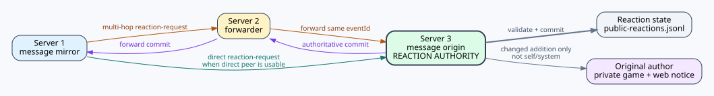
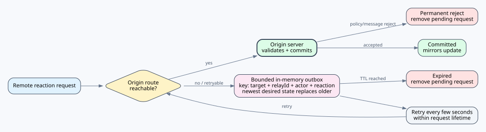
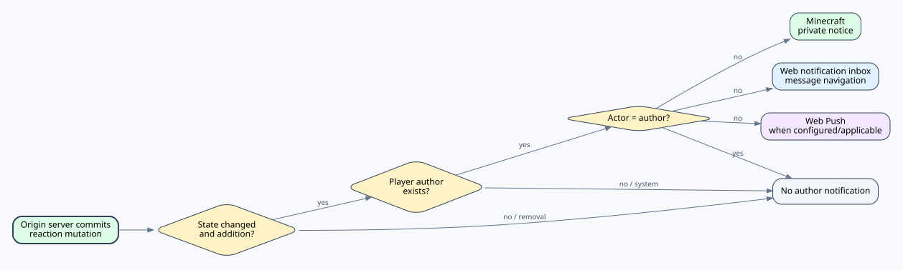
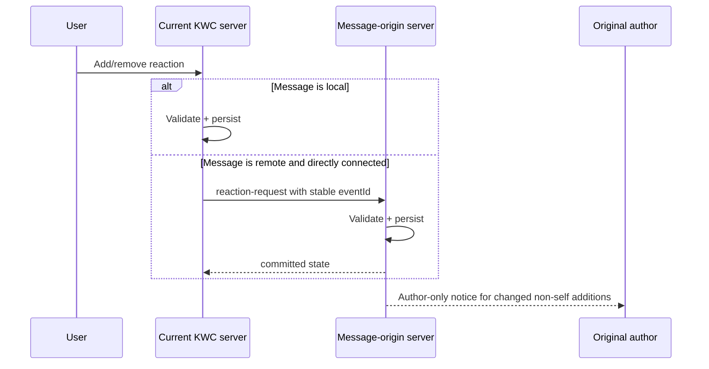
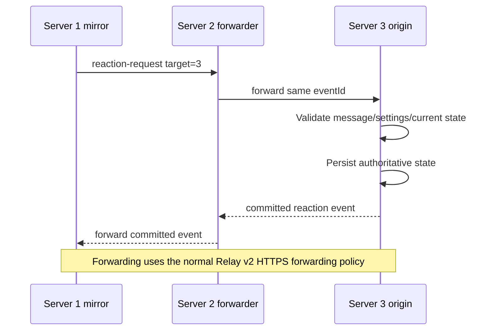
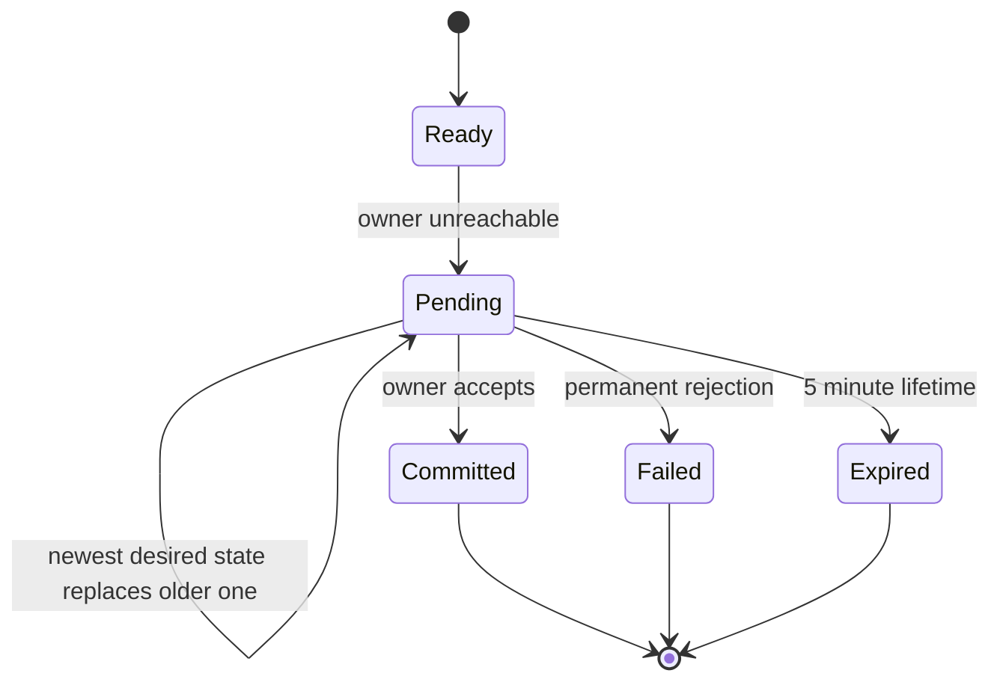
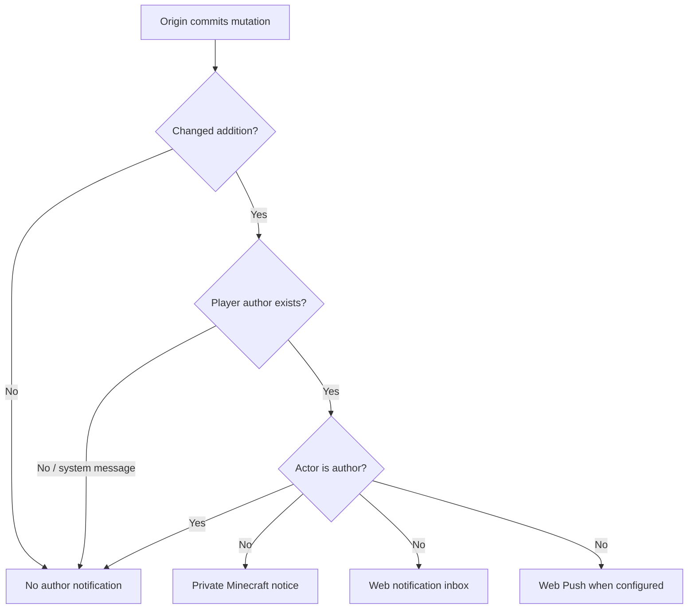

# KOKOTO WebChat 5.3.0 — Message Reactions

Reactions are persistent message state for public chat, 1:1 DM, and normal group-chat messages. The server that originally created a relayed public message remains the **authoritative owner** for that public reaction state. Cross-server DM reactions are sent only to the other participant server and are never broadcast to unrelated Relay peers. Group-chat rooms remain local, and membership join/leave events are not reaction targets.

## Visual overview

The static figures give the topology at a glance; the Mermaid diagrams below show protocol order and state transitions.

## Local and direct remote flow

A remote mirror never pre-commits the count. A direct configured peer is used directly; unrelated servers are not involved.

## Multi-hop flow

## Origin unavailable

If an administrator turns the reaction feature off, queued local mutation requests are discarded instead of being replayed later.

The outbox is bounded. Requests for the same target server + message relay ID + actor + reaction are coalesced, so an offline add followed by an offline remove does not later create a stale addition.

## Notification rules

Reaction removal never creates an author alert. System messages can hold reactions but have no player author to notify.

The Chat-settings **Reactions** checkbox is the single web-notification preference for reaction additions: it gates both live browser notifications and background/mobile Web Push. Each browser/device uses only the delivery path it supports. The in-game Minecraft author notice is a separate server-side notice and is not controlled by this web-notification checkbox.

## Browser layout and administration

The normal inter-message gap is 8 px. When reactions are enabled and a signed-in user may add one, the empty reaction affordance uses a 10 px spacer in addition to that normal margin. The `+` button is 32 × 16 px, starts 1 px below the message content, and leaves 1 px before the next message, so it no longer overlaps either message while still avoiding a full 22 px reaction row. When reactions are disabled, the empty affordance is omitted and the original 8 px spacing remains unchanged. Real reactions use the normal in-flow reaction row.

The picker remains anchored across category/search rerenders and outside-click dismissal remains active. Unicode entries are stored as emoji characters. Search uses the character itself, server-generated Unicode names, and administrator-editable aliases. **Admin > Emojis > Reaction icons** includes a Search aliases editor using `emoji = search words` lines; the runtime list is stored in `reaction-search-aliases.txt`, while packaged defaults seed the initial list. This lets a newly added Unicode icon receive Korean/English/Japanese/Chinese or other search words without frontend code changes. KWC custom emoji continue to search by ID/name/pack. The reaction settings use the same rounded Admin form/row structure as the other settings pages, including the checkbox inside each themed row.

See also [SERVER_RELAY.md](SERVER_RELAY.md), [USER_GUIDE.md](USER_GUIDE.md), and [TECHNICAL_REFERENCE.md](TECHNICAL_REFERENCE.md).

The administrator reaction option **Show who reacted** defaults to on. When disabled, reaction counts and the current viewer's participation state remain available, but the server omits reactor identity names from Web responses and the tooltip is not rendered. When enabled, reactor names follow the same display-name/original-name switch used by chat senders: clicking a reactor name toggles the identity view globally, while actor UUIDs remain server-side only. Existing reaction chips are normal toggles: clicking a reaction started by someone else joins it, while clicking a reaction you already joined removes only your reaction. In-game author notifications use two lines: the original-message preview first, then the reaction notice.
