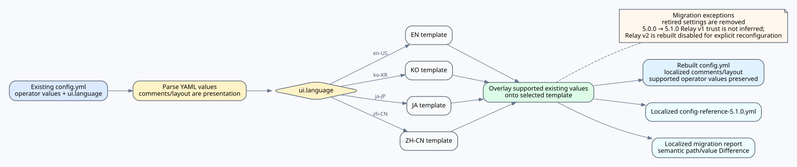

# KOKOTO WebChat Upgrade Guide

This document consolidates the supported upgrade notes from 4.5.5 through 5.3.1. Follow the sections in version order when skipping multiple releases.

## Upgrade from 4.5.5 to 4.6.0

### Back up first

Stop the server and back up `plugins/KOKOTO-WebChat`, especially `config.yml`, SQLite databases and their `-wal`/`-shm` files, DM/group databases, uploads, emojis, custom language files, audit logs, and Web Push key/subscription files.

### Generated configuration migration fragment

KOKOTO WebChat never overwrites or automatically merges an existing `config.yml`. On server start and `/kchat reload`, it reads the physical file and checks `config-version`.

- If `config-version` matches the running plugin version, the configuration is treated as already reviewed and comparison is skipped. A stale migration fragment for that version is removed.
- If the marker is missing or different, the plugin compares the physical config with the bundled current defaults and creates or refreshes:

Exact decision table:

| Installed configuration state | Migration file |
|---|---|
| Version marker missing | Created even when no other differences exist |
| Version marker differs from the running plugin | Created or refreshed |
| Version marker matches the running plugin | Not created; stale same-version guidance is removed |

```text
plugins/KOKOTO-WebChat/config-migration-4.6.0.yml
```

The generated file is a copy-ready YAML fragment, not a structured report. It contains:

- settings missing from the physical `config.yml`, using the current bundled default;
- settings whose bundled default changed and whose configured value still equals the previous default;
- the target `config-version` review marker.

All version information, counts, and previous/new default details are written only as `#` comments. There are no `migration:`, `summary:`, `settings-to-add:`, `preserved-custom-values:`, `obsolete-settings-to-review:`, or `finalize-after-review:` metadata sections. Custom values and obsolete-setting notes are intentionally omitted.

Merge only the settings you want into the matching locations in the real `config.yml`. The real file is never modified automatically.

If no missing settings or changed bundled defaults are found, the migration file is still created and contains the target `config-version` marker. This ensures that an unversioned configuration can always be explicitly marked as reviewed.

4.6.0 bundles the 4.5.5 default configuration as its comparison baseline. A config without a version marker is treated as 4.5.5-or-older. For an explicit unknown version, the plugin lists missing keys but does not guess which defaults changed.

After review, set this in the real config:

```yaml
config-version: "4.6.0"
```

Future starts and reloads skip comparison while that marker matches the plugin version.

### Main 4.6.0 additions

- top-level `server-relay:` section
- `direct-message.capture-game-whispers`
- `reply.game-click.enabled`
- `reply.game-click.local-game-chat`
- `reply.game-command-format`
- Discord `{server}` and `{server_id}` placeholders

While the versions do not match, privacy-sensitive capture and local-chat replacement options that are absent from the physical file use safe disabled runtime fallbacks.

### Database migration

Relay metadata columns are added to public SQLite history with additive `ALTER TABLE` migrations. Existing rows remain, but old rows cannot be assigned an origin server retroactively. Back up the database before the first 4.6.0 start.

### Recommended checks

1. Start with the old config and verify that `config-migration-4.6.0.yml` is created without changing `config.yml`.
2. Review and merge missing settings and changed defaults.
3. Add `config-version: "4.6.0"`, run `/kchat reload`, and confirm that comparison is skipped.
4. Test relay, game replies, whisper DM capture, Discord server labels, URLs, and ImageEmojis handling.

---

## Upgrade from 4.6.0 to 4.6.1

**5.1.0 note:** This administrator DM-body audit behavior is still supported in 5.1.0. It requires both `direct-message.admin-audit.enabled` and `private-chat-super-admins`, and the audit view is read-only.


### Main changes

- Remote-server players observed in relayed game or linked-web messages are available in the existing web DM recipient search when the relay payload contains a player UUID.
- Optional read-only administrator access to DM message bodies is available through the existing private-chat metadata list.
- Added the compact Modrinth update checker with administrator join notices.
- Plugin and configuration version are now `4.6.1`.

### Configuration migration

When an existing config contains `config-version: "4.6.0"`, starting 4.6.1 creates:

```text
plugins/KOKOTO-WebChat/config-migration-4.6.1.yml
```

The fragment contains the new settings and the target review marker:

```yaml
update-check:
  enabled: true

direct-message:
  admin-audit:
    enabled: false

config-version: "4.6.1"
```

The real `config.yml` is not modified. Keep audit disabled unless private-message content review is explicitly required.

### Enabling DM content audit

Both conditions are required:

```yaml
private-chat-super-admins:
  - "ExactMinecraftNameOrUUID"

direct-message:
  admin-audit:
    enabled: true
```

- Normal ADMIN or MODERATOR roles are insufficient by themselves.
- The audit view is read-only.
- Each page read is written to the configured audit log without copying message bodies into that log.
- Restart or run `/kchat reload` after changing configuration. A JAR replacement still requires a server restart.

### Cross-server DM version requirement

Every server that exchanges cross-server DMs must run KOKOTO WebChat 4.6.1 or later. Clicking `server · source` now passes the clicked message's UUID and origin server directly, remote search keeps the server ID, and existing remote threads send both destination server ID and player UUID.

---

## Upgrade from 4.6.1 to 4.6.2

KOKOTO WebChat 4.6.2 improves private-message delivery reliability, fixes same-name DM routing, and adds per-message read status. No new administrator-facing configuration option is required.

### What changes

- A DM name without a server qualifier resolves only to a player on the current server. Cross-server targets use explicit server-scoped identity (`server-id + UUID`).
- A cross-server DM is not considered delivered until the destination server confirms that the message was stored. Routing, HTTP, timeout, or destination failures remain retryable.
- DM retries reuse persistent relay IDs, and web sends use client message IDs, preventing duplicate messages when a request or response is uncertain. Pending remote deliveries interrupted by a restart recover as retryable failures.
- Group-chat web sends use the same client-message-id duplicate protection. Normal successful delivery has no label; the compact localized state beside the timestamp is `Sending` while pending and `Failed · Retry` when delivery cannot be confirmed.
- Read status is calculated for **every DM and group-chat message** and is shown beside the timestamp. A 1:1 DM uses a short localized unread label (`Unread` in English) until its recipient reads it, then shows `✓`. Group chat keeps the unread-recipient count as a number and shows `✓` when that count reaches zero.
- Cross-server DM read acknowledgements are returned through the authenticated private relay, including hub/chain topologies. The latest acknowledgement is safely re-sent when the conversation is viewed, so a temporary relay or HTTP failure does not permanently lose the read mark.
- Multi-hop DM delivery reports success upstream only after the final destination confirms storage.
- Fixed update notifications. Eligible administrator logins now trigger a rate-limited Modrinth refresh instead of relying only on the previous scheduled result; OPs are explicitly eligible, failed checks are logged as warnings, and reloads unregister the previous update listener.

### Configuration migration

The bundled 4.6.2 configuration adds no administrator-facing keys and changes no existing defaults compared with 4.6.1. Only the review marker changes:

```yaml
config-version: "4.6.2"
```

With a reviewed 4.6.1 config, KOKOTO WebChat creates `plugins/KOKOTO-WebChat/config-migration-4.6.2.yml`. If there are no unrelated missing settings or local/default differences, the fragment contains only the new `config-version` marker. The real `config.yml` is never overwritten automatically.

### Cross-server deployment

All servers exchanging cross-server DMs should run KOKOTO WebChat 4.6.2 or later. Restart each server after replacing the JAR so the new relay handling and additive database migration are active. Existing DM and group-chat messages are preserved.

---

## Upgrade to KOKOTO WebChat 4.6.3

4.6.3 adds optional read-only administrator access to group-chat message bodies. It does not change DM audit behavior.

### New configuration

```yaml
group-chat:
  admin-audit:
    enabled: false

config-version: "4.6.3"
```

For a config already marked `4.6.2`, the migration fragment contains this new switch plus the 4.6.3 review marker unless other settings are actually missing. Existing `config.yml` is not overwritten.

### Access requirements

Both are required:

```yaml
private-chat-super-admins:
  - "ExactMinecraftNameOrUUID"

group-chat:
  admin-audit:
    enabled: true
```

Ordinary ADMIN/MODERATOR roles are not sufficient. The audit view is read-only, does not require or create room membership, does not mark messages read or change unread counts, and cannot send/upload/delete messages or modify membership. Each page read is logged as `admin.group-audit-read` without copying message bodies into the audit log.

### Configuration comments

4.6.3 refreshes the bundled `config.yml` comments so they describe the current update checker, cross-server DM relay/read acknowledgements, group read status, and both administrator audit switches. On startup or `/kchat reload`, an existing config may have comment text refreshed **only when that comment block still exactly matches an older bundled KOKOTO WebChat comment**. Setting values are never changed by this comment refresh, custom comments are preserved, and `config-version` is still changed only by the administrator after reviewing the migration fragment.
### Private-chat media playback

DM and group-chat message/status refreshes now reuse the existing native video/audio element instead of destroying and recreating it. Active playback therefore continues from the same position without a second `play()` call or media reload. Leaving or switching a private conversation now destroys that conversation's message/media DOM and clears its private media-open state. Re-entering starts from the unopened click-to-load card again (or a newly created non-playing media element when click-to-load is disabled); no previous media DOM is reused and no automatic `play()` occurs.

---

## KOKOTO WebChat 4.7.0 upgrade

4.7.0 expands the conservative Bukkit/Spigot compatibility baseline to Minecraft 1.18, adds administrator custom-emoji multi-file upload, and adds configurable colon-delimited message tokens.

### Compatibility

- Conservative supported Minecraft range: **1.18 through 26.2**
- Java requirement: **Java 17**
- `plugin.yml`: `api-version: '1.18'`
- Maven compile API: `spigot-api:1.18.2-R0.1-SNAPSHOT`
- Paper `AsyncChatEvent` remains reflection-detected; Bukkit `AsyncPlayerChatEvent` remains the hard-linked fallback.
- Minecraft 1.17 and older are not claimed by this release.

### Custom emoji multi-upload

Emoji upload now follows the same picker flow as normal chat file upload. The visible Upload button opens a hidden multi-file input. As soon as the picker returns a selection, KOKOTO WebChat copies the selected files, clears the native input, and immediately starts sequential uploads. There is no second Upload confirmation step and no file-picker focus/visibility workaround. Progress and active-transfer cancel remain available. The existing server endpoint still performs per-file validation, storage accounting, unique-name allocation, audit logging, and PNG-sidecar generation.

### Message tokens

The default aliases are English-only and can be replaced or extended in any language. `:enter:`, `:newline:`, `:nextline:`, `:linebreak:`, and `:br:` insert a newline; `:blankline:`, `:emptyline:`, and `:paragraphbreak:` insert an empty line; `:tab:` and `:indent:` insert configurable spaces. Printable custom substitutions such as `:separator:` are also configurable. Unknown tokens are left unchanged so custom/image emoji tokens continue to work.

### Configuration

4.7.0 adds the `message-tokens` section. Existing setting defaults outside this new section are unchanged. The review marker changes to:

```yaml
config-version: "4.7.0"
```

On startup/reload, known top-level `config.yml` blocks are also reordered to the bundled 4.7.0 layout while each block's current text, values, and custom comments are preserved; unknown top-level blocks remain last in their original order.

A reviewed 4.6.3 configuration therefore receives the new `message-tokens` section plus the 4.7.0 review marker in `config-migration-4.7.0.yml`. The migration comparison is not limited to 4.6.3: older or unversioned configs are also checked for missing current settings. In addition, `config-reference-4.7.0.yml` is always written as the complete bundled 4.7.0 default configuration with all comments, so operators can compare any old config against one authoritative full file. Empty maps such as `message-tokens.custom: {}` are retained in migration output when missing. The migration file also ends with a comment-only line diff against the full reference. Unchanged lines are omitted; each difference shows the file name, then `Line` or `Lines` on a separate line, followed by only the differing text. Differing source lines are prefixed directly with `#` so original YAML indentation is preserved, with an insertion position for reference-only blocks.

#### Game line-break behavior

Configured `newline` / `blank-line` tokens are preserved through Minecraft single-line sanitization and emitted as explicit Minecraft chat lines at final delivery. Ordinary CR/LF input is still flattened exactly as before. For server-relayed chat/DM output, the receiving KOKOTO WebChat server must also run the 4.7.0 token-line delivery support; an older receiver flattens the normal relayed LF before it reaches the client.

---

## KOKOTO WebChat 5.0.0 Upgrade

5.0.0 is the major release that completes the **BlueMapWebChat (BMWC) → KOKOTO WebChat (KWC)** identity change and consolidates the development work after the previously released 4.7.0.

### Distribution transition

The safest rollout is to publish **5.0.0 on the existing BlueMapWebChat project listings first**. BlueMapWebChat 4.7.0 update checkers know the legacy Modrinth project, so publishing the bridge release there lets existing installations discover 5.0.0 normally.

Legacy/current transition entry points:

- Modrinth: `https://modrinth.com/plugin/bluemapwebchat`
- CurseForge: `https://www.curseforge.com/minecraft/bukkit-plugins/bluemapwebchat`
- GitHub: `https://github.com/KOKOTO-DEV/BlueMapWebChat`

Target canonical KOKOTO WebChat addresses after activation:

- Modrinth: `https://modrinth.com/plugin/kokoto-webchat`
- CurseForge: `https://www.curseforge.com/minecraft/bukkit-plugins/kokoto-webchat`
- GitHub: `https://github.com/KOKOTO-DEV/KOKOTO-WebChat`

KWC 5.0.0 already checks the new `kokoto-webchat` Modrinth project first and falls back to `bluemapwebchat`, so it works both before and after the listing transition. If a platform cannot preserve the old listing as the same project, keep the BMWC page as a retirement/migration notice and point it to the new KWC page. Do not retire the BMWC listing before 5.0.0 has been visible there long enough for 4.7.0 users to discover the bridge release.

For GitHub, renaming the repository to `KOKOTO-WebChat` is preferred; GitHub redirects normal repository web/git URLs from the old repository name. Update local remotes to the new URL after the rename.

### Major changes from 4.7.0

- Canonical identity changed to **KOKOTO WebChat**: `/kchat` (`/kchat`), `kwc.*`, `plugins/KOKOTO-WebChat` or `config/KOKOTO-WebChat`, `dev.kokoto.webchat`, and `kwc-*` modules.
- Added shared multi-platform core and server platforms for Bukkit/Paper/Spigot, 16 exact Fabric targets, 12 exact NeoForge targets, and 16 exact Forge targets.
- Added BlueMap, squaremap, Dynmap, Pl3xMap, LiveAtlas, uNmINeD and Minecraft Overviewer adapter architecture; supported adapter combinations vary by loader as documented in the README.
- Standalone is enabled by default and the canonical public prefix is `/chat`; API becomes `/chat/api` with the bundled reverse-proxy layout.
- Added Unicode content filtering, starter UTF-8 filter lists, rule editing/testing, mask/replace modes and anti-evasion matching.
- Added server-side visual UI profiles for signed-in accounts, strict JSON import/export, and account-synced keyword/notification preferences.
- Added same-device Web Push/live-notification deduplication.
- Added administrator Discord keyword alerts. KWC owns detection/format/deduplication; DiscordSRV supplies its authenticated JDA connection and channel mapping only.
- `update-check.enabled` now works on Fabric, NeoForge and Forge as well as Bukkit, with KWC-first / BMWC-fallback Modrinth lookup and `kwc.update.notify` login notices.
- Added `upload.filename-mode: random|original`; original-mode serving/reference tracking now supports safe Unicode/spaces/`~`/`+`/`%`, and Windows clipboard 8.3 aliases are handled safely.
- Replaced `discordsrv.game-to-discord` with `discordsrv.game-relay-mode: discordsrv|kwc` and fixed game-origin registered emoji processing on the native DiscordSRV path.
- Improved server relay peer/backoff behavior, cross-server DM delivery/read acknowledgements and cross-platform `/kchat` command consistency.
- Added security hardening without changing normal UX: Bearer authentication for frontend API calls, one-time SSE stream tickets, request-body limits, bounded HTTP workers, administrator-IP enforcement, Web Push SSRF defenses, safer Discord mentions/CDN redirects and stricter iframe message-source checks.

### Platform support

- Bukkit/Paper/Spigot: one `KOKOTO-WebChat-5.0.0-Bukkit-1.18-26.2.jar`, Java 17 bytecode, declared Minecraft range 1.18–26.2.
- Fabric exact targets: `1.18.2`, `1.19.2`, `1.19.4`, `1.20.1`, `1.20.2`, `1.20.4`, `1.20.6`, `1.21.1`, `1.21.3`, `1.21.4`, `1.21.5`, `1.21.8`, `1.21.10`, `1.21.11`, `26.1.2`, `26.2` using target-selected JDK 17/21/25.
- NeoForge exact targets: `1.20.2`, `1.20.4`, `1.20.6`, `1.21.1`, `1.21.3`, `1.21.4`, `1.21.5`, `1.21.8`, `1.21.10`, `1.21.11`, `26.1.2`, `26.2` using target-selected JDK 17/21/25.
- Forge exact targets: `1.18.2`, `1.19.2`, `1.19.4`, `1.20.1`, `1.20.2`, `1.20.4`, `1.20.6`, `1.21.1`, `1.21.3`, `1.21.4`, `1.21.5`, `1.21.8`, `1.21.10`, `1.21.11`, `26.1.2`, `26.2` using target-selected JDK 17/21/25.

### BlueMapWebChat data migration

On first KWC start, an existing Bukkit `plugins/BlueMapWebChat` installation can be used as one-time migration input only when `plugins/KOKOTO-WebChat` has no existing data files. KWC never merges BMWC data into an established KWC directory, even if `.legacy-import-complete` is deleted manually. The old directory is left untouched as a rollback/migration source; after it is removed, KWC automatically removes the temporary `.legacy-import-complete` marker on startup or `/kchat reload`.

Legacy configuration names such as `web-addon.*` and `standalone-web.*` are converted to `adapters.bluemap.*` and `frontend.standalone.*`. `/bmchat`, `/bluemapchat`, `/bmc` and `/kwc` are not registered as command aliases in 5.0.0. Legacy `bluemapwebchat.*` permission grants remain a runtime compatibility fallback. Relay Protocol v1 intentionally keeps `X-BMWC-Relay-*` wire headers for interoperability with existing BMWC peers.

### BMWC → KWC web-path migration

Standard BMWC `/bmwc/api` and `/bmwc/chat` reverse-proxy layouts are not retained as KWC defaults. The default public prefix is now `/chat`, giving standalone `/chat` and API `/chat/api`. KWC can normalize standard BMWC URL values in migrated config, but it cannot rewrite external Caddy/nginx configuration; update those rules manually. See `CADDY_HTTPS.md` and `NGINX_HTTPS.md`.

### Configuration changes

A structural comparison of the bundled 4.7.0 and 5.0.0 references contains **79 added paths, 14 removed paths and 2 changed existing values**. The main renamed/removed groups are `web-addon.* → adapters.bluemap.*`, `standalone-web.* → frontend.standalone.*`, `discordsrv.game-to-discord* → discordsrv.game-relay-*`, and removal of `ui.show-login-only-when-hidden`. New groups include the additional map adapters, `content-filter.*`, `ui.user-profiles.*`, `admin-alerts.discord.*`, `http.public-prefix`, relay forwarding control and `upload.filename-mode`.

When a real version upgrade is detected, KWC backs up a fixed older-version config, creates a fresh config from the current bundled `config.yml`, overlays the existing configured values, discards old comments/layout, and writes:

```yaml
config-version: "5.0.0_auto_migration"
```

While `_auto_migration` remains, startup/reload repeats the bundled-default rebuild with current values overlaid. `config-reference-5.0.0.yml` is only the administrator-readable exact bundled default copy. Use exact `config-version: "5.0.0"` to fix the same-version config and stop rewriting it.

### Security/behavior compatibility

Normal users should not notice the security hardening. Login, chat, DM/group chat, uploads, profiles, Push and administration use the same UI. Only previously unsafe/invalid cases are rejected: administrator access from disallowed IPs, unsafe Push endpoints, oversized malformed requests, unintended Discord mentions and path-invalid uploads.

Public deployments should use HTTPS. Direct-IP operation remains supported for normal KWC use, but browser features that require a secure context must follow browser security rules.

### Release acceptance


> `validate-release-windows.bat` and its required PowerShell helpers are included in the source archive. Development regression harnesses are also included under `validation/`; no separate validation-tools archive is required.

A final release candidate is accepted only after `validate-release-windows.bat` finishes with `FINAL RELEASE BUILD PASS`, exactly 45 deployable JARs are collected, static/config/i18n/document checks pass, and the final candidate has been smoke-tested for login, public chat, upload/clipboard upload, DM/group, relay and enabled map/Discord integrations.

---

## Upgrade to KOKOTO WebChat 5.1.0




[Animated GIF](../assets/config-language-migration.gif) · [PNG](../assets/config-language-migration.png) · [SVG](../assets/config-language-migration.svg)

> **Important:** Parsed operator values remain authoritative while `ui.language` changes the config/reference/migration presentation language.

KOKOTO WebChat 5.1.0 upgrades from the **5.0.0** line. Release notes describe the final changes from the **5.0.0** release baseline to 5.1.0.

### Before upgrading

1. Back up the complete KWC data directory, including `config.yml`, chat/private-chat databases or JSONL files, uploads, emoji assets and audit data.
2. If multiple servers relay to each other, plan to upgrade and reconfigure all members together. Relay Protocol v1 does not interoperate with 5.1.0 Relay v2.
3. If KWC is behind Caddy/Nginx, keep the existing public URL and proxy layout available so client-IP resolution can be checked after the upgrade.

### Configuration migration and language

5.1.0 keeps the existing parsed setting values and rebuilds the presentation from the current template. The effective `ui.language` selects the comment/layout language for the rebuilt `config.yml`, generated `config-reference-5.1.0.yml`, and migration/difference prose. Supported built-in presentation languages are `en-US`, `ko-KR`, `ja-JP`, and `zh-CN`.

The migration Difference is semantic: it compares parsed YAML setting paths and values, not comments, blank lines, indentation, quote style, line numbers or key order. Changing only the presentation language must therefore not create setting differences.

After first startup, review both `config.yml` and `config-reference-5.1.0.yml`. Existing custom setting values, Relay group data created under 5.1.0, and other operator values are preserved when the same-version automatic migration presentation is rebuilt.

### Relay Protocol v2 is a manual trust migration

The first migration from a pre-5.1.0 configuration deliberately retires the old flat Relay v1 trust model instead of guessing new trust relationships. Legacy global shared-secret/flat-peer/forwarding settings are removed and `server-relay.enabled` is reset to `false`.

Create explicit `server-relay.groups`. For a new group, leave `shared-secret: ""` on one server, start/reload KWC to generate and save a secure random value, then copy that exact value to the other servers in the same group. Existing non-empty secrets are preserved, while manually supplied values shorter than 32 characters remain invalid. Configure reciprocal peers in the same group. Peer entries contain only `id`, `url`, and `enabled`; there is no peer-specific secret. Enable `server-relay.enabled` only after every intended peer has the matching reciprocal configuration.

Before a rolling upgrade, set `server-relay.enabled: false` on the still-running 5.0.0 servers and reload them. A 5.0.0 server otherwise keeps retrying its v1 peer against an already-upgraded 5.1.0 server and can repeatedly log the expected HTTP 426 response. Upgrade/configure all peers for v2 before re-enabling Relay.

Relay v1/BMWC endpoints return HTTP 426. Direct one-hop HTTP peers can still carry encrypted/authenticated Relay v2 payloads with a warning, but forwarding is same-group **HTTPS→HTTPS only**. Relay v2 is hop-by-hop authenticated encryption, not E2EE.

### Private Reply storage upgrade

5.1.0 adds persistent reply metadata to DM and group messages. Existing private messages remain valid. SQLite-backed group storage adds the required optional reply columns during schema upgrade, while backward-compatible DM/JSONL records simply omit reply metadata when it does not exist. No manual database conversion is required.

5.1.0 also adds per-room group membership-event state. Existing `group-messages.db` files are upgraded in place with `group_rooms.membership_events_enabled` (default enabled) and `group_messages.event_type` (default ordinary message). No manual database conversion is required; closing the group-chat UI does not create a leave event.

Cross-server DM replies use stable relay message IDs, not another server's local database row ID. Do not copy or rewrite private-message IDs between servers.

### Emoji and SSE behavior

The default SSE limits are now **10 connections per resolved client IP** and **500 total**. A value of `0` still disables the corresponding limit. Behind a reverse proxy, verify `http.trusted-proxies`; otherwise many clients can appear as one proxy IP and share the same per-IP bucket.

Emoji catalog reload is more resilient: a temporary `/emojis` fetch failure keeps the last known-good catalog, retries with bounded exponential backoff, resynchronizes after SSE reconnect, and refreshes when the server emits an `emoji-catalog` invalidation event. `emoji.message-token-limit: 0` remains unlimited.

Custom emoji pack/item names are canonicalized in 5.1.0. Unsupported characters and whitespace are removed and same-pack collisions receive numeric suffixes. Review custom integrations that assume a literal on-disk emoji filename or token.

- Android administrator emoji uploads now use the generic system file/DocumentsUI chooser instead of the image-only Photo Picker path. Desktop keeps the image filter, and server-side image validation remains unchanged.

### Other behavior changes to verify

- DM/group Reply now persists the original-message relationship and validates the current DM thread or group membership server-side.
- Game-side `/kchat group` commands correctly resolve room names containing spaces, quoted names, and repeated whitespace.
- Per-room membership notices cover actual join/invite-accept and leave/kick/ban changes; closing or hiding a room is not a leave event.
- Account chat profiles preserve explicit and intentionally unset visual values exactly, and loaded font settings apply to already-open DM/group windows.
- DM/group metadata now wraps timestamp, Reply, and read-state elements naturally on narrow/mobile layouts instead of reserving one oversized fixed column.
- `/kchat reload` rechecks exposed built-in HTTP listeners and direct HTTP Relay peers and echoes applicable localized warnings to the command sender as well as the server log.
- When `commands.broadcast-result-to-web-chat: true`, Web-command execution notices are also delivered to online Minecraft players.
- The public, DM and group message composers use one-line `<textarea>` controls rather than ordinary text `<input>` controls, while retaining `autocomplete=off`, Enter-to-send and cursor/emoji insertion behavior. This bypasses the Android Chrome path that can show password/address/payment Autofill keyboard accessories on unrelated inputs; login/password Autofill is unchanged.
- Starting with 5.2.0, the updater checks only canonical Modrinth `kokoto-webchat`; legacy BMWC project addresses are no longer queried as update sources.
- External plain-HTTP listeners and direct HTTP relay peers produce localized security warnings.

### Post-upgrade checks

1. Confirm `config-version` and review the generated 5.1.0 reference/migration files.
2. Confirm the selected `ui.language` changes only presentation and does not alter operator values.
3. If Relay is used, verify reciprocal v2 peers before re-enabling it and confirm no legacy v1 endpoint is still expected by another server.
4. Behind a proxy, verify resolved client IPs and SSE behavior; temporarily enable `http.log-client-ip-resolution` when troubleshooting.
5. Test public chat, DM/group Reply, custom emoji, upload access, Web Push/notifications and the map/standalone frontend actually used by the deployment.
6. Keep the pre-upgrade backup until normal operation and retention cleanup have been observed.

## Upgrade from KOKOTO WebChat 5.1.0 to 5.2.0

Back up the KWC data directory before upgrading. A normal 5.1.0 → 5.2.0 migration preserves supported operator values and the existing Relay v2 groups/secrets/peers; the relay trust reset belongs only to the historical pre-5.1.0 → 5.1.0 migration. The reference for that 5.2.0 migration is `config-reference-5.2.0.yml`, and automatic review uses `5.2.0_auto_migration` until the administrator chooses exact `config-version: "5.2.0"`.

5.2.0 introduces Relay Protocol 2.1 as a backward-compatible 2.x capability revision. Protocol major `2` remains the compatibility boundary; product version is diagnostic only. Public reactions, targeted cross-server DM reactions, and remote DM typing use 2.1 extensions, while common v2 public/DM/read behavior remains compatible with the 2.x family.

New user data includes `conversation-archives.db` for private saved-conversation snapshots when `chat.conversation-archive.enabled` is true, `public-reactions.jsonl` for reaction state (historical filename; public/DM/group reactions), and `reaction-catalog.json` for the administrator-managed reaction picker catalog. Back these up with the other KWC data files. Saved snapshots do not copy attachment bytes. Administrator source deletion/room deletion and private-room lock policy take precedence over personal archives. `reaction-catalog.json` also stores the administrator reaction master enable/disable state and custom-emoji allowance; disabling the feature does not delete existing `public-reactions.jsonl` data.

After upgrade, verify public/DM/group reactions, public/DM/group typing, Saved conversations and PDF/print output, private-room Settings/Invite/Leave permissions, and the 32 px public/DM/group bottom-follow behavior. If multiple relay servers are used, upgrade all peers to 5.2.0/Relay 2.1 to use reaction/typing extensions consistently; common Relay 2.x traffic remains the compatibility baseline.

## Upgrade from KOKOTO WebChat 5.2.x to 5.3.0

Back up the KWC data directory first. 5.3.0 uses `config-version: "5.3.0_auto_migration"` while automatic review is active and writes `config-reference-5.3.0.yml` / `config-migration-5.3.0.yml`. Existing 5.2.x operator values are preserved. The retired `direct-message.confirm-hide` and `group-chat.confirm-hide` keys are migrated to `confirm-delete` with their boolean values preserved.

During this migration, existing Relay `groups[].peers[]` entries are also physically augmented with missing `send` / `receive` policy maps and missing `public-chat`, `event`, `dm`, and `profile` entries, using `true` for compatibility. Explicit map values and scalar `send: false` / `receive: false` values are preserved.

KWC 5.3.0 keeps Relay Protocol 2.2 for the entire release line. Within that same revision, capability negotiation enables sender-owned cross-server DM deletion (`delete`), targeted event requests (`game`), and targeted public profile/presence lookup (`profile`). Public/DM/read/reaction/typing behavior stays on the same Relay v2 trust/encryption boundary. Unsupported optional capabilities fail safely without changing the protocol revision.

DM no longer has a message-level hide-for-me operation: only the sender may delete their own message. Group message deletion is room-wide; ordinary members may delete their own normal messages while room-local owner/admin roles can manage room messages. Group pins are room-local and visible to all members, with pin/reorder/unpin restricted to owner/admin. DM and group stored-history search now use the public-search interaction pattern.

Presence now distinguishes Game and Web connections. Compact lists show Game > Web > Offline, profiles show Game/Web separately, and the account-level Offline status masks both states from other viewers server-side.

Retest BlueMap refresh/recovery, DM/group search and deletion, group pins/roles, Game/Web presence, Offline privacy, and any cross-server DM delete path after all relevant peers are upgraded.


## Upgrading from KOKOTO WebChat 5.3.0 to 5.3.1

Back up the KWC data directory and replace the runtime JARs with matching 5.3.1 artifacts. **No config schema bump is required:** `config-version` and the administrator reference remain 5.3.0, so existing 5.3.0 operator values and Relay 2.2 trust/policy settings are preserved.

5.3.1 completes Poll/Recruitment Event lifecycle work, persists automatic-end conditions, fixes the mobile add-on Administrator tap regression and private-window raise behavior, and standardizes Font Awesome Free UI icons. Minecraft `/kchat game` completion is shared by Bukkit/Fabric/NeoForge/Forge and now suggests Event actions, event IDs, Poll option numbers, Recruitment roles, automatic-end controls, live-setting/filter/admin/guest controls, and basic DM/group navigation. Bukkit also restores the documented `/kchat filter` and `/kchat settings` dispatch paths.

Event announcement scope is topology-aware. If at least one enabled Relay peer is configured with `send.event` allowed, Relay is the default and local-only remains selectable. With no Event-capable Relay peer, the scope control/command is hidden and the server normalizes Event announcements to local-only. This is based on configured topology rather than transient connection state. Relay Protocol remains 2.2.
