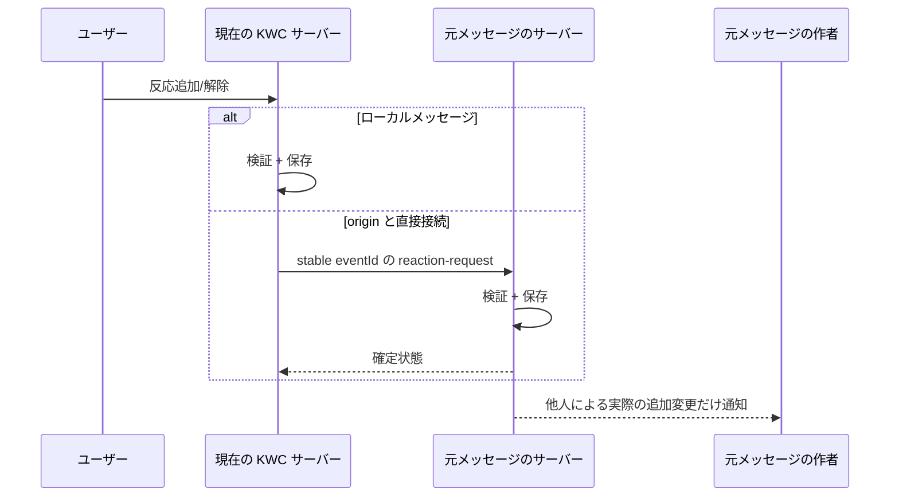
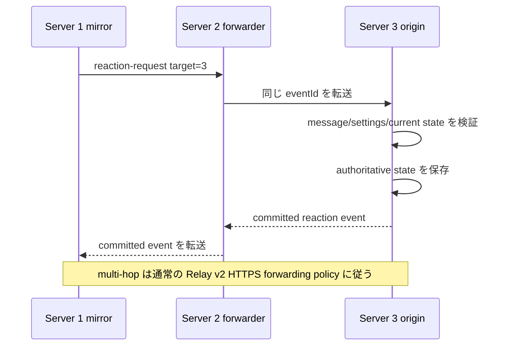
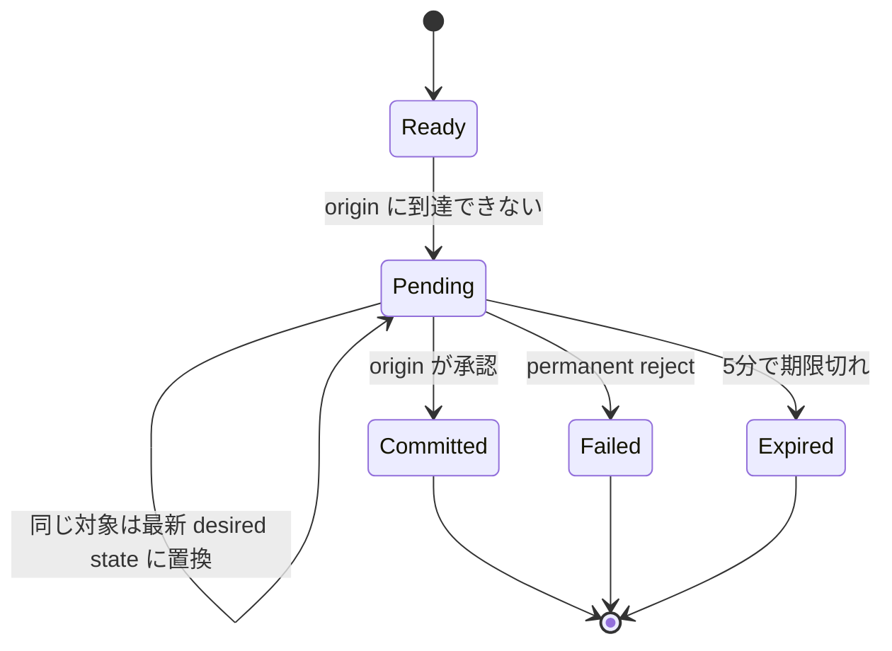
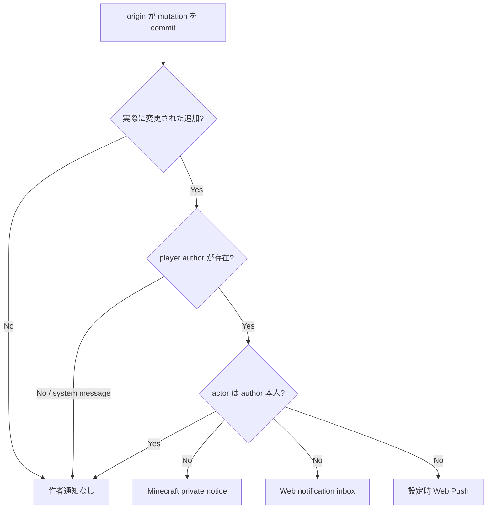

# KOKOTO WebChat 5.3.0 — メッセージの反応

反応は公開 chat、1:1 DM、通常の group-chat message に保存される永続的な message state です。Relay された公開 message は **元メッセージを作成したサーバー**がその公開 reaction state の authority になります。cross-server DM reaction は相手 participant の server だけへ直接送られ、無関係な Relay peer へ broadcast しません。group-chat room は local のままで、join/leave event は reaction 対象ではありません。

## 動作構造の図

上の静的図は全体構造の要約で、下の Mermaid 図は protocol 順序と state transition を詳しく示します。

## ローカル / 直接接続

remote mirror は count を先に確定しません。origin と直接接続している場合は不要な peer を経由せず直接 request を送ります。

## マルチホップ Relay

## Origin が利用できない場合

管理者が reaction 機能を OFF にすると、待機中の local mutation request は破棄され、後から再送されません。

同じ target server + relay message ID + actor + reaction の request は最新 desired state にまとめられます。offline 中の add→remove が、後から stale add notification になることを防ぎます。

## 作者通知

remove と self-reaction は通知しません。system message は reaction を保持できますが player author がいないため代わりに admin へ通知することもありません。

Chat settings の **絵文字リアクション** checkbox は reaction 追加に対する共通 Web 通知設定です。この 1 個の checkbox が live browser notification と background/mobile Web Push の両方を制御し、各 browser/device では対応する配信経路だけが動作します。Minecraft 内の author 向け private notice は別の server-side notice で、この Web 通知 checkbox の対象ではありません。

## Web UI と管理

通常の message 間隔は 8px です。reaction が ON でログイン user が `+` を使える empty state では、通常の 8px margin に 10px の empty reaction space を追加します。`+` button は 32 × 16px で、message 本文の下に 1px、次の message の前にも 1px の余白を確保するため、文字に重なりません。reaction OFF の場合は empty affordance 自体を描画しないため元の 8px のままです。実 reaction が付いた場合のみ通常の in-flow reaction row を使用します。

picker は emoji 文字そのもの、server が生成する Unicode 名、管理者が編集できる検索 alias、custom emoji の ID/name/pack を検索できます。**Admin > Emojis > Reaction icons** には `emoji = search words` 形式の検索 alias editor があり、runtime list は `reaction-search-aliases.txt` に保存されます。新しい Unicode icon に任意の検索語を追加できるため frontend code の変更は不要です。reaction ON/OFF と KWC custom emoji 許可は他の Admin settings と同じ rounded form/row を使い、checkbox も row 内に配置されます。

関連: [SERVER_RELAY.md](SERVER_RELAY.md), [USER_GUIDE.md](USER_GUIDE.md), [TECHNICAL_REFERENCE.md](TECHNICAL_REFERENCE.md)

管理者の反応設定で **反応したユーザー一覧を表示** をオフにすると、反応数と現在ユーザーの参加状態は維持されますが、サーバーは反応者の名前情報を Web 応答に含めず、ツールチップも表示しません。既定値はオンです。一覧を表示する場合、反応者名は通常のチャット送信者と同じ **表示名 ↔ 元の名前** 切り替えを使い、反応者名をクリックすると全体の名前表示モードも切り替わります。UUID はサーバー内部にのみ保持されます。他のユーザーが先に付けた反応チップもクリックして同じ反応に参加でき、参加済みなら再クリックで自分の反応だけを解除します。ゲーム内の作者通知は **1 行目に原文プレビュー、2 行目に反応内容** の順で表示します。
