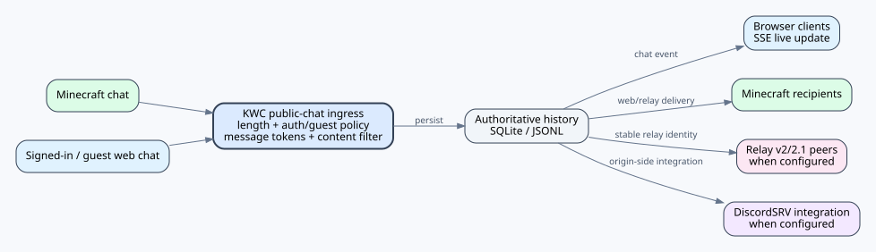
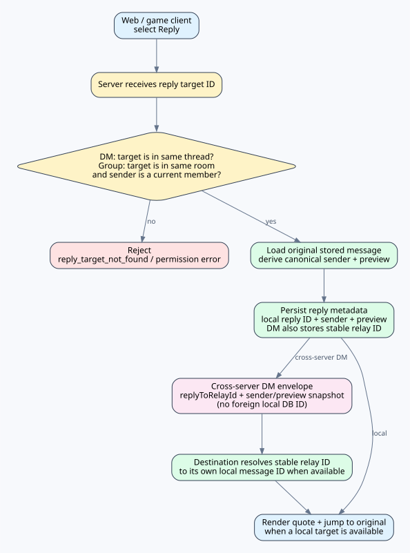
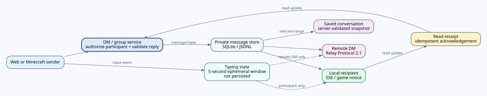
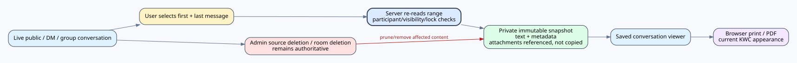

# KOKOTO WebChat 5.3.0 — ユーザーガイド

reaction authority、direct/multi-hop delivery、origin 障害時の outbox、作者通知の図は [REACTIONS.md](REACTIONS.md) を参照してください。

このガイドでは日常的な利用方法を説明します。サーバーの導入・保守は `INSTALLATION_OPERATIONS.md`、実装の詳細は `TECHNICAL_REFERENCE.md`、長文の総合リファレンスは `USER_MANUAL.md` を参照してください。

## 公開チャット

通常のチャット画面でゲーム ↔ Web の会話を行います。同じタイムラインで Reply、ピン留め、検索、アップロード、カスタム絵文字、リッチプレビュー、最新メッセージへ移動する操作を利用できます。送信者名のクリック操作とメッセージ本文の Reply 操作は分離されているため、URL 部分は通常どおりリンクとして開けます。

## アカウントとゲスト
Minecraft と連携したアカウントはサーバー上の本人識別情報を維持し、対応するチャット/通知設定を同期できます。ゲストアクセスは管理者が有効にした場合だけ利用でき、名前、CAPTCHA、セッション、moderation の制限を受けます。

## DM とグループ

[PNG](../assets/private-reply-flow.png) · [SVG](../assets/private-reply-flow.svg)

1:1 DM は宛先 UI または `/kchat dm` から開きます。グループルームはグループ画面または `/kchat group` を使用します。Minecraft 内では DM/グループの会話ラベルをクリックすると対応コマンドを準備し、非公開メッセージ本文をクリックすると Reply を準備します。送信時にはサーバーが参加者/メンバー資格を必ず再検証します。

ログインユーザーは公開 chat、DM、通常の group-chat message に Unicode または KWC custom emoji reaction を追加できます。group の join/leave event row は reaction 対象ではありません。実 reaction がない場合、32 × 16px の `+` button は本文の下と次の message の前にそれぞれ 1px の視覚的余白を取り、文字を覆いません。reaction OFF では empty affordance を生成せず元の 8px message spacing を維持し、実 reaction が付いた時だけ通常の in-flow row/chip spacing を使います。picker は emoji 文字、server-generated Unicode name、admin-managed search alias、custom emoji ID/name/pack を検索できます。alias は **Admin > Emojis > Reaction icons** で `emoji = search words` 形式により編集し、`reaction-search-aliases.txt` に保存されます。category/search 再描画後も位置と outside-click close を維持します。管理画面の master ON/OFF と KWC custom emoji 許可は他の Admin settings と同じ rounded themed row を使います。reaction OFF では既存 reaction data を保持して read-only 表示し、すべての local/Relay mutation を拒否します。Public/DM/group typing indicator は 5 秒だけの ephemeral hint です。サーバー管理者が Web Admin **Settings** または `chat.typing-indicator.*` で Open chat / DM / Group chat を個別に設定し、既定値は OFF / ON / ON です。`chat.typing-indicator.user-display-control` の既定値は OFF です。管理者が有効にすると、ログインユーザーの Chat settings にアカウント保存の **入力中表示** が 1 個表示されます。これを OFF にすると有効な範囲の他ユーザーの typing 表示だけが自分の画面で非表示になり、自分の typing 送信は継続します。rounded indicator は composer の上に浮き、通常 chat と同じ表示名 ↔ 元の名前切替を使い、名前の formatting tag を除去します。font は user chat font の約 80% に追従し、base UI font より小さくなりません。

DM/group room では **Settings** から、権限がある場合の Invite、**Save conversation**、保存済み会話、hide、room management を利用します。保存関連 UI は server が `chat.conversation-archive.enabled: true`（既定）の場合だけ生成され、無効化すると関連 DOM と archive API の両方が利用できません。実際の room management 項目は管理権限を持つ user のみ表示し、Leave は title bar に残ります。保存時は最初と最後の message を選び private snapshot を作成しますが、管理者 delete/lock policy が常に優先されます。PDF は現在の KWC appearance を使用し、原本が残っている image のみ含め、その他の file は link、原本がなければ unavailable と表示します。

latest-message auto-follow は公開/DM/group 共通で 32px です。emoji/icon/attachment panel の開閉による layout change は current viewport を保持し、その変化だけで最下部へ強制移動しません。

## Reply、絵文字、メディア
Reply では元メッセージの完全な本文を保持します。登録済みのカスタム絵文字は、リンクを入れ子にせず Reply プレビュー内でも表示できます。絵文字ピッカーはカーソル位置に正確なトークンだけを挿入し、自動で空白を追加しません。設定済みの改行エイリアスは絵文字だけの連続行を詰めて表示し、明示的な空行は通常の空行として保持します。

## 通知と外観
デスクトップ通知、Web Push、キーワード設定、アカウント UI プロファイル、テーマ/フォント/テキストシャドウ、PIP は、サーバーが公開している Web 設定から管理します。ウィンドウ位置などの端末固有状態と Push endpoint は各端末に保持されますが、private conversation の「閲覧中」判定はアカウント全体に適用されます。同じアカウントでログインした KWC 画面のどれか 1 つでも実際に表示・フォーカスされ、チャットが最小化されておらず、DM/グループ画面が開き、現在の thread/room ID が受信対象と完全一致すれば閲覧中と判定します。その閲覧端末自体に Web Push subscription は不要で、閲覧中は同じアカウントの接続中 KWC タブすべてでその DM/グループのブラウザー通知とブラウザーローカル通知 inbox 追加を抑止し、全端末の Web Push も抑止します。別ルーム、画面を閉じた状態、非表示/非フォーカス、最小化中なら閲覧していないものとして通常通知に戻ります。

## 問題がある場合
サーバー更新後は Web ページを再読み込みし、現在の URL とログイン状態を確認してください。管理者はデータファイルを手作業で変更する前に、導入・運用ガイドと Wiki の `Troubleshooting` ページを確認してください。

## 参照資料

実装/セキュリティの詳細と外部標準については [TECHNICAL_REFERENCE.md](TECHNICAL_REFERENCE.md) と [REFERENCES.md](REFERENCES.md) を参照してください。
