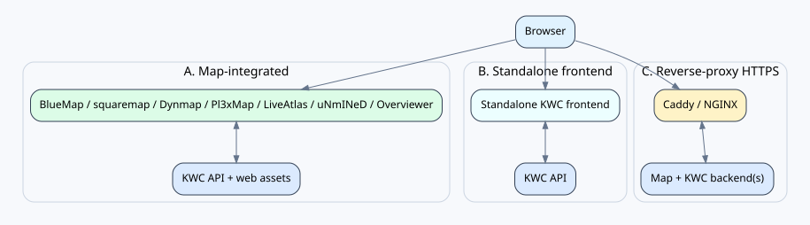

# KOKOTO WebChat 5.3.1 — 설치·운영 가이드

[PNG](../assets/deployment-modes.png) · [SVG](../assets/deployment-modes.svg)

> **참고:** 도식은 이해를 돕는 보조 자료입니다. KWC 고유 동작의 기준은 실제 소스와 이 문서의 설명입니다.

## 플랫폼 선택
서버 플랫폼/버전에 맞는 artifact를 설치합니다. Bukkit/Paper/Spigot은 Java 17 단일 plugin artifact, Fabric/Forge는 각각 16개 exact target, NeoForge는 12개 exact target을 사용합니다. mod-loader build는 Minecraft 세대에 따라 Java 17/21/25를 선택합니다. KWC 핵심 채팅은 server-side이며 client mod가 필요하지 않습니다.

## 최초 실행과 웹 공개
한 번 실행해 KWC 데이터/설정을 생성한 뒤 standalone, 지원 map adapter 또는 둘을 함께 사용합니다. 인터넷에 공개할 때는 가능하면 built-in HTTP를 loopback에 bind하고 Caddy/Nginx에서 HTTPS를 종료하세요. non-loopback plain HTTP는 명시적 경고를 출력합니다.

## 설정 lifecycle
현재 `config.yml`을 수정한 뒤 `/kchat reload`를 사용합니다. reload는 live service를 교체하기 전에 YAML을 검증하므로 malformed YAML이면 기존 실행 설정을 유지합니다. `config-reference-5.3.0.yml`은 내장 `ui.language`와 같은 언어로 렌더링한 관리자용 현재 기본 설정이며, 사용자 정의/미지원 UI 언어는 영어 표현을 사용합니다. 5.3.1 업그레이드는 5.3.0 설정 스키마를 유지하며 현재 템플릿의 지원되는 운영자 값을 보존합니다. 과거 최초 5.0.0 → 5.1.0 relay migration에서만 Relay v1 trust 설정을 의도적으로 reset했으며, 일반 5.1.0 → 5.2.0 업그레이드는 기존 Relay v2 group/secret/peer 설정을 보존합니다. `ui.language`는 `config.yml` 주석 template, 생성 reference, migration/difference 안내문 언어도 선택하고 Difference는 YAML path/value만 비교합니다.

## Relay Protocol v2
`server-relay.groups`를 명시적으로 구성합니다. 각 group은 shared secret 하나를 사용하며 peer별 secret은 없습니다. 최초 설정은 한 서버에서 빈 secret으로 시작/리로드해 KWC가 안전한 값을 생성하게 한 다음 그 값을 같은 group의 다른 서버에 복사합니다. 수동으로 넣는 non-empty secret은 여전히 최소 32자여야 합니다. 같은 group에서 양쪽 서버가 서로를 peer로 등록해야 합니다. direct HTTP는 relay payload 자체가 암호화/인증되지만 경고가 발생하고, forwarding은 같은 group 안의 HTTPS→HTTPS만 허용합니다. Relay v1 endpoint는 426을 반환합니다. 자세한 내용은 `SERVER_RELAY.md`를 보세요.

## 업데이트와 배포
5.2.0부터 updater는 canonical Modrinth `kokoto-webchat`만 확인하며 기존 BMWC 프로젝트 주소는 실제 업데이트 소스로 사용하지 않습니다. 배포 전에는 45개 deployable target, SHA-256, 현재 release text를 검증합니다. Windows에서는 전체 build 전에 build-path preflight를 실행해 검증 범위를 벗어난 긴 경로를 먼저 차단합니다.

## 백업
KWC 데이터 디렉터리 전체를 백업하고 SQLite `-wal`/`-shm` sidecar도 일관되게 보존하세요. 가장 안전한 offline backup은 서버 종료 후 수행합니다. config, account/profile, push subscription, upload/emoji asset, relay 설정을 함께 보관합니다.

## 보안 운영
HTTPS, 강한 관리자 자격증명, 제한적인 admin IP rule, 최소 권한, 명시적 super-admin 목록을 사용하세요. Relay group secret은 group 전체 대칭 trust key이므로 한 서버에서 유출되면 해당 group의 모든 서버에서 secret을 교체해야 합니다.

## 문제 해결 순서
1. startup/reload warning 확인 → 2. URL/reverse proxy 확인 → 3. loader/version artifact와 Java 세대 확인 → 4. relay는 group ID/상호 peer/group secret/시간 동기화/HTTPS topology 확인 → 5. DB나 파일을 수동 복구하기 전에 log/config 백업.
