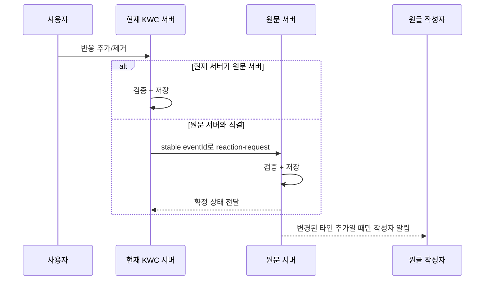
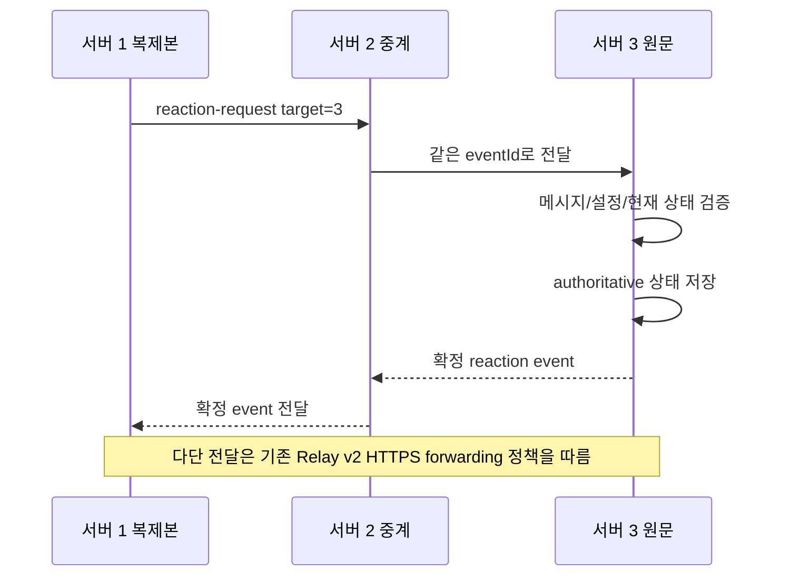
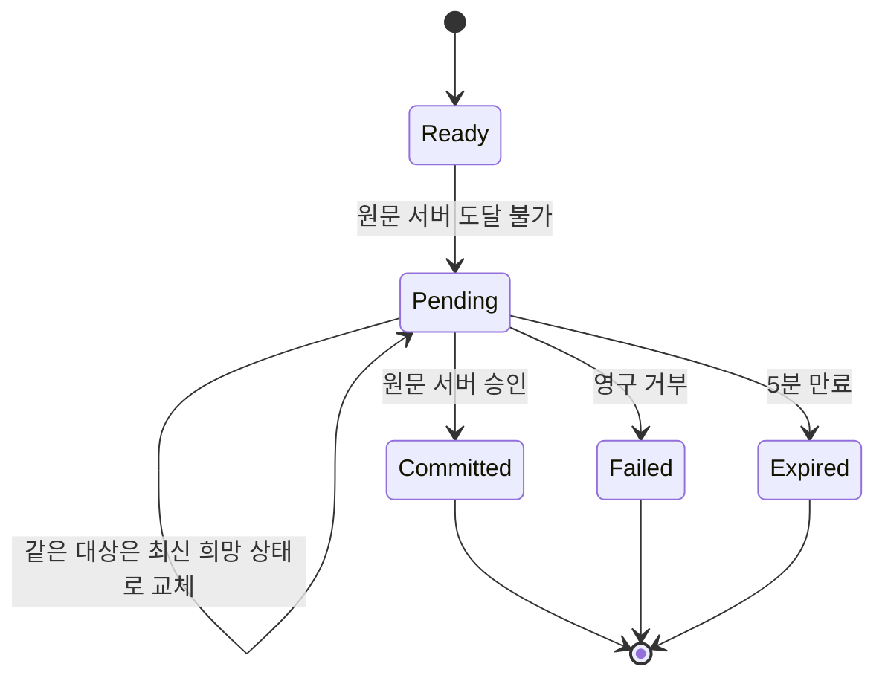
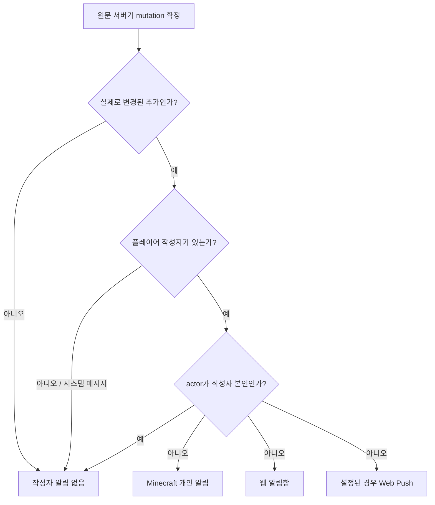

# KOKOTO WebChat 5.3.1 — 메시지 반응

반응은 공개채팅, 1:1 DM, 일반 그룹채팅 메시지에 저장되는 영속적인 메시지 상태입니다. Relay된 공개 메시지는 **원문을 처음 만든 서버**가 최종 처리 권한(authority)을 가집니다. 타 서버 DM 반응은 상대 참가자가 있는 서버로만 직접 전달하며 관계없는 Relay peer에는 방송하지 않습니다. 그룹채팅 방은 로컬 기능이며 입장/퇴장 이벤트에는 반응을 달 수 없습니다.

## 그림으로 보는 동작 구조

위 정적 그림은 전체 구조를 빠르게 보여주고, 아래 Mermaid 그림은 실제 프로토콜 순서와 상태 전이를 설명합니다.

## 로컬 및 직결 서버 처리

타 서버에 보이는 복제 메시지는 반응 수를 먼저 확정하지 않습니다. 원문 서버와 직결되어 있으면 가장 짧은 직결 경로로 요청합니다.

## 다단 Relay

중간 서버는 원문 소유자가 되지 않고 작성자 알림도 만들지 않습니다.

## 원문 서버 연결 불가

관리자가 반응 기능을 OFF로 바꾸면 아직 대기 중인 로컬 변경 요청은 폐기되어 나중에 다시 재생되지 않습니다.

outbox는 크기가 제한됩니다. 같은 **대상 서버 + relay 메시지 ID + actor + 반응** 요청은 최신 희망 상태로 합쳐지므로, 서버가 끊긴 동안 추가했다가 제거한 반응이 나중에 오래된 추가 알림으로 살아나지 않습니다.

## 작성자 알림 규칙

반응 제거에는 작성자 알림을 만들지 않습니다. 시스템 메시지는 반응을 가질 수 있지만 플레이어 작성자가 없으므로 관리자에게 대신 알리지 않습니다.

채팅 설정의 **이모지 반응** 체크박스는 반응 추가에 대한 웹 알림 공통 설정입니다. 이 하나의 체크박스가 실시간 브라우저 알림과 백그라운드/모바일 Web Push를 함께 제어하고, 각 브라우저/기기에서는 지원되는 전달 경로만 동작합니다. 게임 안에서 보내는 Minecraft 작성자 개인 알림은 별도의 서버측 알림이므로 이 웹 알림 체크박스의 제어 대상이 아닙니다.

## 웹 간격과 관리자 설정

일반 메시지 사이 간격은 8px입니다. 반응 기능이 켜져 있고 로그인 사용자가 `+`를 사용할 수 있지만 실제 반응이 없을 때는 기존 8px에 10px짜리 빈 반응 공간을 더 사용합니다. `+` 버튼은 32 × 16px이며 본문 아래에서 1px 떨어져 시작하고 다음 메시지와도 1px을 남기므로 어느 쪽 글도 덮지 않습니다. 이 구성은 정상 22px 반응 행 전체를 예약하지 않으면서 버튼과 양쪽 메시지 사이의 간격을 보장합니다. 반응 기능이 꺼져 있으면 빈 반응 요소 자체를 만들지 않아 기존 8px을 그대로 사용합니다. 실제 반응이 생긴 뒤에만 정상 in-flow 반응 행을 사용합니다.

picker는 이모지 문자 자체, 서버가 자동 생성한 Unicode 이름, 관리자가 편집한 검색 별칭, 커스텀 이모지 ID/이름/팩으로 검색할 수 있습니다. **관리자 > 이모지 > 반응 아이콘**에는 `이모지 = 검색어` 형식의 **검색 별칭** 편집란이 있으며 실행 중 목록은 `reaction-search-aliases.txt`에 저장됩니다. 따라서 새 Unicode 아이콘을 추가할 때 한국어/영어/일본어/중국어 등 원하는 검색어도 함께 넣을 수 있고 프론트 코드를 수정할 필요가 없습니다. 검색 별칭은 반응 picker 검색 전용이며 채팅 `:토큰:` 문법을 만들거나 변환하지 않습니다. 카테고리/검색 재렌더 후에도 picker 위치와 바깥 클릭 닫기를 유지합니다. 반응 ON/OFF와 KWC 커스텀 이모지 허용 행은 다른 관리자 설정과 동일한 둥근 폼/행 구조를 사용하고 체크박스도 해당 행 안에 배치됩니다.

함께 볼 문서: [SERVER_RELAY.md](SERVER_RELAY.md), [USER_GUIDE.md](USER_GUIDE.md), [TECHNICAL_REFERENCE.md](TECHNICAL_REFERENCE.md)

관리자 반응 옵션의 **반응 남긴 사람 목록 표시**를 끄면 반응 개수와 현재 사용자의 참여 여부는 유지하지만, 서버가 웹 응답에 반응자 이름 정보를 포함하지 않고 툴팁도 표시하지 않습니다. 기본값은 켜짐입니다. 목록을 표시할 때 반응자 이름은 일반 채팅 송신자와 같은 **표시이름 ↔ 원래이름** 전환을 사용하며, 반응자 이름을 누르면 전체 이름 표시 방식이 함께 전환됩니다. UUID는 서버 내부에만 유지합니다. 다른 사용자가 먼저 남긴 기존 반응 칩도 클릭하면 같은 반응에 참여하며, 이미 참여한 칩을 다시 누르면 자신의 반응만 제거됩니다. 게임 내 작성자 알림은 **1줄 원문 미리보기, 2줄 반응 내용** 순서로 표시됩니다.
