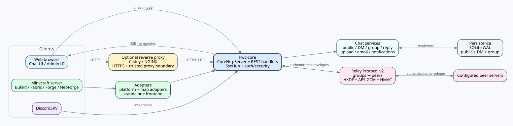

# KOKOTO WebChat 5.1.0 — 기술 참고서

[PNG](../assets/architecture-5.1.0.png) · [SVG](../assets/architecture-5.1.0.svg)

> **참고:** 도식은 이해를 돕는 보조 자료입니다. KWC 고유 동작의 기준은 실제 소스와 이 문서의 설명입니다.

## 아키텍처
`kwc-core`가 loader-neutral chat, HTTP/SSE transport, history/private-chat store, profile/security helper, Web Push, Relay v2를 담당합니다. Bukkit/Fabric/Forge/NeoForge는 host/adapter 경계를 통해 player/permission/thread/console/native-message와 같은 loader-specific 기능만 제공합니다. map adapter와 standalone frontend도 같은 core 동작을 사용합니다.

## HTTP와 SSE
내장 서비스는 JDK `com.sun.net.httpserver.HttpServer`를 `CoreHttpServer`로 감싸 사용합니다. REST 형태 handler가 config/history/auth/upload/private chat/admin 기능을 제공하고, 실시간 갱신은 제한된 `SseHub`/`SseConnection` registry를 통한 Server-Sent Events를 사용합니다. 인증 API는 bearer authorization을 사용하며 SSE 연결에는 long-lived account token을 URL에 노출하는 대신 short-lived stream ticket을 사용합니다.

## 자격증명과 세션
비밀번호는 per-password salt와 iteration count를 포함한 `PBKDF2WithHmacSHA256`으로 hash합니다. session/CAPTCHA/rate-limit helper도 가능한 범위에서 민감 token을 hash하거나 범위를 제한합니다. 관리자 접근은 role/permission/IP policy를 추가 적용합니다.

## 저장소
public history, direct message, group chat은 SQLite store를 사용하며 `PRAGMA journal_mode=WAL`을 적용합니다. startup integrity/recovery logic은 main DB와 `-wal`/`-shm` sidecar를 다룹니다. 운영 백업에서는 이 파일들이 서로 일관된 상태가 되도록 보존해야 합니다. 그룹방별 멤버 입퇴장 알림 설정은 `group_rooms.membership_events_enabled`에 저장하고, join/leave/kick/ban으로 실제 멤버십이 바뀌면 `group_messages.event_type`에 `member_join` / `member_leave` 이벤트를 저장합니다. 기존 DB에는 필요한 컬럼을 자동 추가합니다.

## Web Push
`WebPushManager`는 JDK-only 구현입니다. push destination을 검증해 SSRF 위험을 줄이고 VAPID key를 관리하며 HKDF 기반 content-encryption material과 AES-GCM 보호 payload를 사용합니다. 알림 preference는 account-aware이지만 실제 push endpoint는 device-local입니다.

## 플랫폼 abstraction과 exact-target build
`PlatformAdapter`와 관련 host interface가 loader API를 core에서 분리합니다. release matrix는 Bukkit 1 + Fabric 16 + NeoForge 12 + Forge 16 = **45 deployable artifacts**입니다. build helper가 Minecraft 세대에 따라 Java 17/21/25를 선택합니다. Windows에서는 exact-target 임시 경로가 검증된 path profile을 넘지 않도록 Gradle/Maven 전에 path-length preflight를 수행합니다.

## Relay Protocol v2 trust model
Relay v2는 명시적인 `groups -> peers` 구조를 사용합니다. group 하나가 symmetric trust domain이며 group shared secret도 하나뿐이고 peer별 secret은 없습니다. 32자 미만 group secret은 거부합니다. 단, 빈 group secret은 provisioning 요청으로 처리되어 startup/reload 시 암호학적으로 안전한 32바이트 URL-safe secret을 생성해 `config.yml`에 저장하며, 비어 있지 않은 값은 자동 재생성하지 않습니다. 동일 peer ID를 여러 local group에 등록할 수 없고 양쪽 서버가 같은 group에서 서로를 peer로 등록해야 합니다.

`/relay/v2/handshake`는 protocol/product version, group, sender/target ID, timestamp, nonce, sender outbound transport를 group secret HMAC으로 인증합니다. receiver는 group membership, target identity, clock skew, nonce replay를 검사합니다. 이 endpoint는 상태를 저장하지 않는 진단용 identity/health probe이며 route 상태를 만들지 않습니다. direct `/relay/v2/message`는 각 요청을 독립적으로 인증합니다. receiver는 sender를 같은 group과 같은 shared secret으로 상호 등록해야 합니다. v1 endpoint는 HTTP 426을 반환합니다.

## Relay payload 암호화
각 방향에 대해 group secret과 direction context에서 HKDF-SHA256으로 256-bit key를 만듭니다. `/relay/v2/message`는 random 12-byte IV와 128-bit tag의 AES-256-GCM을 사용합니다. GCM AAD에는 `group`, `from`, `to`, `timestamp`, `nonce`, `IV`가 들어갑니다. 응답도 group/responder/requester/timestamp/request nonce/status/body tuple을 HMAC-SHA256으로 인증해 중간자가 성공 HTTP 응답을 위조하지 못하게 합니다. timestamp, request nonce, relay/receipt ID, origin, hop count 검증으로 replay/loop를 방어합니다.

## Relay forwarding trust boundary
Direct HTTP는 relay payload 자체가 AES-GCM으로 보호되므로 허용하지만, transport metadata confidentiality와 일반적인 TLS server authentication이 없기 때문에 경고합니다. direct relay는 각 요청을 독립적으로 인증하며 handshake endpoint는 routing을 제어하지 않습니다. forwarding은 group `forwarding.enabled`와 same-group routing을 요구하며, http:// peer는 해당 peer의 incoming/outgoing forwarding만 제외되고 다른 https:// peer는 계속 후보가 됩니다.

Relay v2는 **end-to-end encryption이 아니라 hop-by-hop authenticated encryption**입니다. forwarding server는 incoming envelope를 복호화하고 검증/처리한 다음 next peer용으로 다시 암호화합니다. 따라서 모든 forwarding server는 trusted participant입니다. 한 member에서 group shared secret이 유출되면 해당 group의 모든 member에서 secret을 교체해야 합니다.

## 5.0.0 migration 경계
Migration layer는 v1 flat trust graph에서 v2 group membership을 추측하지 않습니다. legacy relay secret/peer/forwarding key를 폐기하고 운영자가 v2 group을 명시적으로 구성하기 전까지 relay를 비활성화합니다. 의도적인 fail-closed trust migration입니다.
## 비공개 Reply 저장과 relay identity
DM/group Reply는 표시 문자열에서 추측하지 않고 metadata로 저장합니다. DM은 같은 thread의 target인지, group은 같은 room 및 현재 membership인지 검증하고 서버가 저장된 원문에서 canonical reply sender/preview를 만듭니다. 타 서버 DM envelope은 다른 서버의 local DB ID를 보내지 않고 `replyToRelayId`와 sender/preview snapshot을 전달하며, receiver가 stable relay ID를 자기 local message ID로 해석합니다.

## 설정 표현 다국어화
`PortableConfigMigration`은 `ui.language`에 따라 EN/KO/JA/ZH 번들 config template을 선택하고 기존의 파싱된 운영자 값을 overlay하며, 같은 언어로 reference와 migration report를 생성합니다. Semantic Difference는 parsed YAML path/value로 만들기 때문에 주석/레이아웃/따옴표/키 순서만 바뀐 경우 차이로 잡지 않습니다.

## 참조 표준 및 공식 문서

이 문서에서 사용하는 1차 표준과 공식 서드파티 문서는 [REFERENCES.md](REFERENCES.md)에 정리되어 있습니다.

- [RFC 2104 — HMAC](https://www.rfc-editor.org/rfc/rfc2104.html)
- [RFC 5869 — HKDF](https://www.rfc-editor.org/info/rfc5869/)
- [NIST SP 800-38D — GCM](https://csrc.nist.gov/pubs/sp/800/38/d/final)
- [RFC 8018 — PBKDF2 / PKCS #5](https://www.rfc-editor.org/info/rfc8018/)
- [RFC 8291 — Web Push encryption](https://www.rfc-editor.org/info/rfc8291/)
- [RFC 8292 — VAPID](https://www.rfc-editor.org/info/rfc8292/)
- [WHATWG — Server-sent events](https://html.spec.whatwg.org/multipage/server-sent-events.html)
- [SQLite — Write-Ahead Logging](https://sqlite.org/wal.html)
- [Oracle Java SE 17 — HttpServer](https://docs.oracle.com/en/java/javase/17/docs/api/jdk.httpserver/com/sun/net/httpserver/HttpServer.html)
