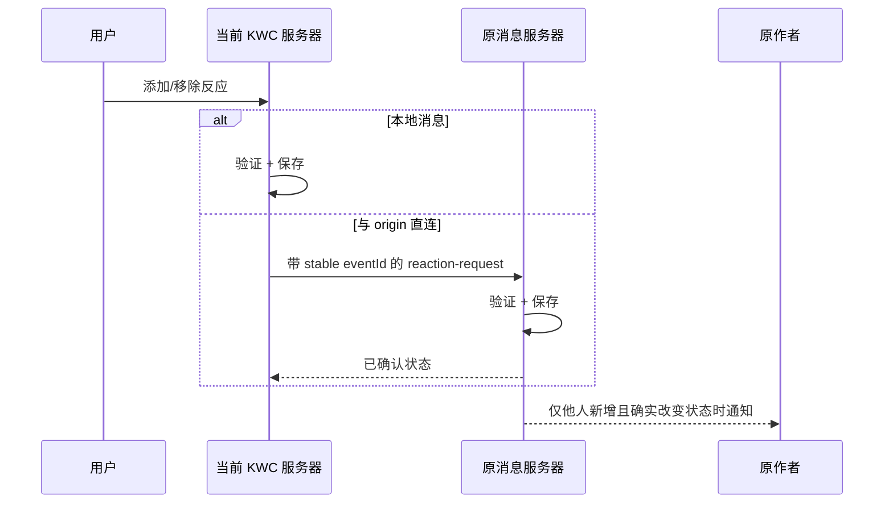
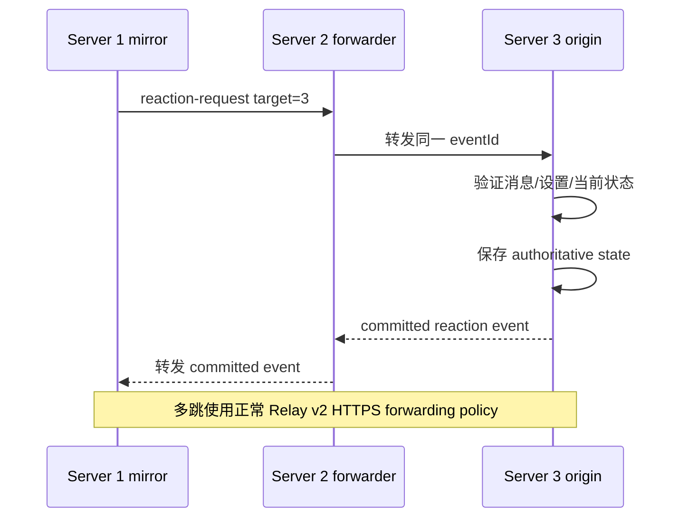
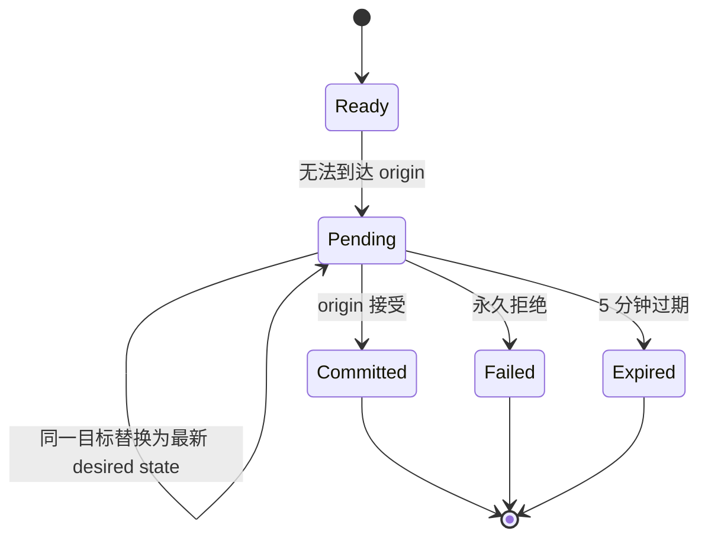
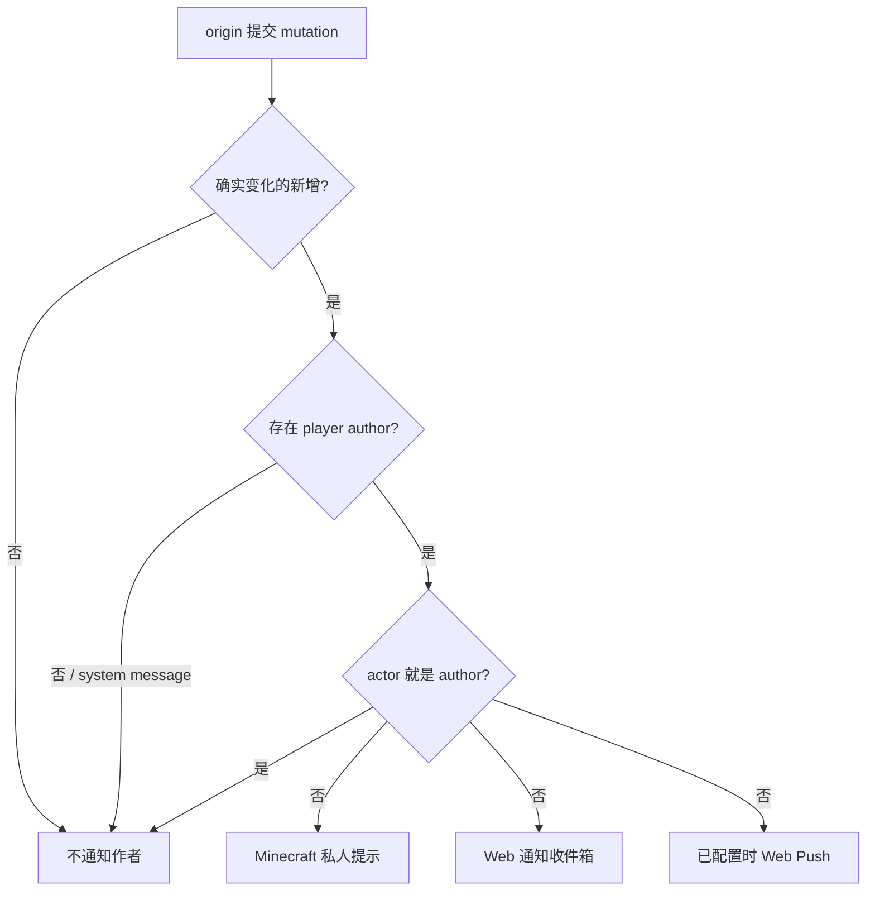

# KOKOTO WebChat 5.2.0 — 消息反应

反应是公共聊天、1:1 DM 与普通群聊消息的持久化消息状态。对于 Relay 公共消息，**最初创建该公共消息的服务器**仍是公共 reaction state 的 authoritative owner。跨服务器 DM reaction 只直接发送到另一位参与者所在服务器，不会广播给无关 Relay peer。群聊房间仍是本地功能，加入/离开事件不能添加 reaction。

## 图示结构

上面的静态图用于快速理解整体结构，下面的 Mermaid 图继续说明协议顺序和状态变化。

## 本地与直连处理

远端镜像不会预先确认计数。若与 origin 有直接配置的连接，就直接请求 origin，不经过无关服务器。

## 多跳 Relay

## Origin 暂时不可用

管理员关闭 reaction 功能时，仍在等待的本地变更请求会被丢弃，不会在以后重新发送。

同一 target server + relay message ID + actor + reaction 的请求会合并为最新期望状态，因此离线期间 add→remove 不会在恢复后产生过期的 add 通知。

## 作者通知规则

移除反应和自己给自己反应不会触发作者通知。系统消息可以保存反应，但没有 player author，因此也不会改为通知管理员。

聊天设置中的 **表情反应** 复选框是反应新增的统一 Web 通知设置。这个单一复选框同时控制实时浏览器通知和后台/移动 Web Push；每个浏览器/设备只会使用其支持的传递方式。游戏内发送给 Minecraft 作者的私人提示是独立的服务器端通知，不受这个 Web 通知复选框控制。

## Web 间距与管理

普通消息间距为 8px。反应功能开启、已登录用户可以使用 `+` 且尚无实际反应时，会在原有 8px margin 之外使用 10px 的 empty reaction 空间。`+` 按钮为 32 × 16px，与当前消息正文保持 1px 距离，并在下一条消息前保留 1px，因此不会覆盖文字。反应功能关闭时不会生成 empty affordance，仍保持原来的 8px。出现实际反应后才使用正常的 in-flow reaction row。

picker 可按表情字符本身、服务器自动生成的 Unicode 名称、管理员可编辑的搜索别名，以及自定义表情的 ID/名称/表情包搜索。**Admin > Emojis > Reaction icons** 中新增 `表情 = 搜索词` 格式的搜索别名编辑器，运行时列表保存在 `reaction-search-aliases.txt`，因此新增 Unicode 图标时可以直接补充韩语/英语/日语/中文等搜索词，无需修改前端代码。反应总开关与 KWC 自定义表情开关使用与其他 Admin settings 相同的圆角表单/行结构，checkbox 也位于对应行内部。

相关文档：[SERVER_RELAY.md](SERVER_RELAY.md)、[USER_GUIDE.md](USER_GUIDE.md)、[TECHNICAL_REFERENCE.md](TECHNICAL_REFERENCE.md)

关闭管理员反应设置中的 **显示反应用户列表** 后，反应数量和当前用户是否参与仍会保留，但服务器不会在 Web 响应中返回反应用户的名称信息，也不会显示工具提示。默认开启。显示列表时，反应用户名称使用与普通聊天发送者相同的 **显示名称 ↔ 原始名称** 切换；点击反应用户名称会同时切换全局名称显示模式。UUID 仍仅保留在服务器内部。其他用户已经添加的反应标签也可以直接点击以加入相同反应；如果自己已经参与，再次点击只会移除自己的反应。游戏内作者通知按 **第 1 行原文预览、第 2 行反应内容** 的顺序显示。
