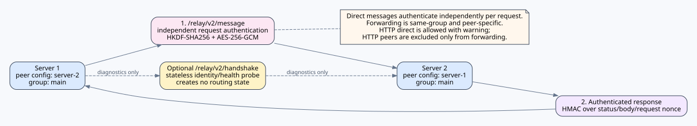

# Server Relay — Protocol 2.1

反应 authority、直连/多跳传递、origin 断开时的 outbox 与作者通知图请参阅 [REACTIONS.md](REACTIONS.md)。




[PNG](../assets/reaction-authority-routing.png) · [SVG](../assets/reaction-authority-routing.svg)

[Animated GIF](../assets/relay-v2-flow.gif) · [PNG](../assets/relay-v2-flow.png) · [SVG](../assets/relay-v2-flow.svg)

> **安全边界：** Relay v2 不是端到端加密，而是**逐跳认证加密（hop-by-hop authenticated encryption）**。参与转发的 KWC 服务器属于信任边界内的参与者。

KOKOTO WebChat 5.2.0 使用 **Relay Protocol 2.1**，它是在 5.1.0 引入的 Relay v2 信任/加密模型之上的向后兼容 2.x capability revision。Protocol major `2` 仍是 wire compatibility 边界；2.1 公告 `public`、`dm`、`read`、`reaction`、`reaction-authority`、`typing` capability，KWC 产品版本仅用于诊断而不是兼容性判断。公共聊天与跨服务器 1:1 DM/已读回执继续使用同一 group-scoped 认证传输，公共 reaction、仅发送到参与者服务器的跨服务器 DM reaction 与远程 DM typing 使用 2.1 扩展，群聊房间仍保持本地。


## 安全升级优先范围

这项 relay 安全变更针对的是在 KWC 5.0.0 或兼容 BMWC peer 中**实际启用/配置了 Relay Protocol v1 的服务器**。未使用 server relay 的服务器不受这一 relay transport/trust 弱点影响。

- **最高优先级：** Relay v1 peer URL 使用 `http://` 的配置。在没有 TLS 的链路上，Relay v1 payload 以明文传输。
- Relay v1 使用 HTTPS 时可以避免网络链路上的明文窃听，但仍然使用一个 flat peer trust set 和 top-level shared secret。因此 secret 泄露或错误的 peer/forwarding 配置会影响更大的信任范围，而 v2 使用明确的 group trust boundary。
- 这里描述的是协议设计层面的暴露范围，并不声称某个具体服务器已被攻击，也不表示已经分配 CVE。

## 信任模型

Relay 的**组就是安全边界**。每个组包含：

- 一个组 `id`；
- 一个 `shared-secret`，供该组内所有成员关系共同使用；
- 该组自己的 `forwarding.enabled` 开关；
- peer 列表，其中每个 peer 只包含 `id`、`url`、`enabled`。

Protocol v2 不存在 `peers[].secret`。这样可以避免某个 peer 项被错误地与另一个组的共享密钥配对。

同一个 peer ID 不能同时注册到多个本地组。KWC 检测到这种配置时，会禁用该重复 peer ID 的全部注册项，并记录诊断信息。

`shared-secret` 最终必须至少 **32 个字符**，但管理员无需手工编造长密钥。首次设置时，只在 **一台服务器** 上写 `shared-secret: ""`，然后启动 KWC 或执行 `/kchat reload`。KWC 会生成密码学安全的 32-byte URL-safe 随机值并写回该服务器的 `config.yml`，同时不会把 secret 原文打印到日志。随后把这个生成值原样复制到同一 group 的其他所有服务器。不要让每台服务器分别从空值生成，否则会得到不同 secret，逐请求认证将失败。已有的非空 secret 永远不会自动重新生成；手工填写但不足 32 字符的值也不会被替换，而是保持 invalid/fail-closed。如果 secret 泄露，请在该 group 的所有成员服务器上一起轮换。

## 配置示例

```yaml
server-relay:
  enabled: true
  server-id: "server-1"
  server-name: "Server 1"
  connect-timeout-seconds: 5
  request-timeout-seconds: 10
  max-clock-skew-seconds: 60
  dedupe-seconds: 300
  max-hops: 8

  sources:
    game: true
    web: true
    guest: true
    discord: false
    system: false

  delivery:
    web: true
    game: true

  game-format: "&8[&b{server}&8] &f{sender}&7: &f{message}"

  groups:
    - id: "main"
      shared-secret: ""
      forwarding:
        enabled: false
      peers:
        - id: "server-2"
          url: "https://server2.example.com/api"
          enabled: true
```

先让 `server-1` 以空值启动/重载一次，再重新打开其 `config.yml` 取得自动生成的 secret。把该值原样复制到 `server-2`，并在相同 `main` group 中把 `server-1` 登记为反向 peer：

```yaml
server-relay:
  enabled: true
  server-id: "server-2"
  server-name: "Server 2"
  groups:
    - id: "main"
      shared-secret: "<copy-the-generated-secret-from-server-1>"
      forwarding:
        enabled: false
      peers:
        - id: "server-1"
          url: "https://server1.example.com/api"
          enabled: true
```

## 逐请求认证与可选 identity/health probe

direct relay 采用与 5.0.0 相同的运行方式：每个 `/relay/v2/message` request 都独立完成认证。接收端仍必须在同一 group 中以相同 shared secret 配置发送端，并使用这些信息认证/解密请求；反向连接彼此独立。`/relay/v2/handshake` 只是无状态的诊断 identity/health probe，不会创建、保留、启用或禁用 direct route。可选 probe request 会绑定：

- protocol `2` 与产品版本 `5.1.0`；
- `group-id`；
- 发送服务器 ID；
- 目标服务器 ID；
- 时间戳；
- nonce；
- 发送方实际配置的出站传输类型（`http` 或 `https`）。

接收方会验证：组是否存在、发送方是否是该组的 peer、目标 ID 是否为自身、时间戳是否在允许范围内、nonce 是否未被重放，以及 HMAC 是否与该组的共享密钥匹配。因此，只有单边配置 peer 时，两个方向都不会形成可用状态。

Endpoint：

```text
/relay/v2/handshake
/relay/v2/message
```

旧 v1 endpoint（`/relay/handshake`、`/relay/receive`、`/relay/dm/receive`、`/relay/dm/read`）会返回 **HTTP 426**，并声明 protocol major `2` / revision `2.1`。


## Protocol revision 与 capability

Relay 兼容性不再绑定 KWC 产品版本。`X-KWC-Relay-Version: 2` 表示兼容的 major wire family，`X-KWC-Relay-Protocol: 2.1` 与 `X-KWC-Relay-Capabilities` 描述当前 revision 和可选扩展。2.0 peer 与 2.1 peer 仍可交换共同的 v2 public/DM/read 流量。reaction 与 typing 属于 2.1 扩展；不支持某个扩展不应使整个 peer 被判定为不兼容。handshake 中的 `serverVersion` 仅用于诊断。

## 消息加密与认证

Relay v2 根据组共享密钥、组 ID、发送方 ID 与接收方 ID，通过 HKDF-SHA256 派生**有方向性的 256-bit key**。每个请求使用 AES-256-GCM、随机 12-byte IV 与 128-bit 认证标签。

以下值作为 GCM 的 Additional Authenticated Data（AAD，附加认证数据）：

```text
group-id
from-server-id
to-server-id
timestamp
nonce
IV
```

其中任意值被修改都会导致认证失败。加密负载中包含消息类型（`public`、`dm` 或 `read`）以及相应的 Relay envelope。

来自已知 peer 的成功与错误响应也使用 HMAC-SHA256 认证。响应签名会绑定组、响应方、请求方、响应时间戳、请求 nonce、HTTP status 与响应正文，防止未认证的中间方伪造成功的 HTTP 响应。

## 重放与循环防护

Relay v2 强制执行：

- 时间戳偏差限制（`max-clock-skew-seconds`）；
- 每个请求的 nonce 重放拒绝；
- Relay ID / receipt ID 去重；
- `origin-server` 循环检测；
- 转发流量的 `max-hops`。

## HTTP 与 HTTPS

直接单跳 HTTP peer 仍然允许。**Relay 负载本身仍使用 AES-256-GCM 加密并认证**，因此不会像 Relay v1 那样以明文负载传输。不过 HTTPS 还能保护传输元数据的机密性、提供标准服务器身份验证，并形成纵深防御，因此 KWC 仍会记录本地化警告。

HTTP 永远不能作为转发跳点。

只有同时满足以下条件才会发生转发：

1. 来源组配置 `forwarding.enabled: true`；
2. 本服务器配置的 incoming peer 条目 URL 使用 HTTPS；
3. 选中的下一 peer 条目 URL 也使用 HTTPS；
4. 下一 peer 属于同一 group。

HTTP 过滤按 **peer 单独处理**。`http://` peer 仍可用于 direct relay，但从该 peer 收到的流量不会继续 forwarding，该 peer 本身也不会被选为 forwarding 下一跳；同组其他 `https://` peer 仍可继续参与 forwarding。

## 组隔离

从一个组收到的消息绝不会转发到另一个组。候选转发对象只会从**与入站组相同的组**中选择。该规则同样适用于公共聊天、DM 与 DM 已读回执。

本地消息可以发布到本地服务器明确加入的每个组。这属于发送源服务器上由运维人员定义的桥接关系，而不是把已经收到的消息再次跨组转发。

## 逐跳认证加密，不是端到端加密

Relay v2 使用**逐跳认证加密（hop-by-hop authenticated encryption）**，并不是端到端加密（end-to-end encryption / E2EE）。负责转发的 KWC 服务器会解密入站负载，验证并处理 Relay envelope，然后使用下一跳对应的方向性密钥再次加密。

因此，转发服务器属于受信任参与方，可以看到 Relay 负载。不要把 Relay v2 描述为 E2EE。

## 从 5.0.0 / Relay v1 升级

5.1.0 明确不会根据旧的扁平 Relay 配置猜测 v2 组。首次进行 5.0.0 → 5.1.0 迁移时：

- 废弃 `server-relay.shared-secret`；
- 废弃扁平的 `server-relay.peers`；
- 废弃 `server-relay.forward-received-public-chat`；
- 不把旧顶层 forwarding 设置带入任何推测得到的组；
- 将 `server-relay.enabled` 重置为 `false`；
- 由运维人员显式定义 v2 组后再重新启用 Relay。

这样可以避免把 peer 静默分配到错误的信任组。

## 运维诊断

启动或 reload 时请检查：

- `Server relay protocol v2 enabled`；
- 可选 identity/health probe 结果（仅用于诊断）；
- 重复 peer ID 诊断；
- 组共享密钥长度诊断；
- HTTP peer 警告；
- forwarding HTTPS-block 警告。

如果可选的 identity/health probe 失败，请检查组 ID、双方服务器 ID、对等 peer 配置、组共享密钥、API base URL、时钟同步以及网络可达性。direct 消息投递与 probe 状态彼此独立。

## 参考标准与官方文档

本文引用的一手标准与第三方官方文档统一列在 [REFERENCES.md](REFERENCES.md) 中。

- [RFC 2104 — HMAC](https://www.rfc-editor.org/rfc/rfc2104.html)
- [RFC 5869 — HKDF](https://www.rfc-editor.org/info/rfc5869/)
- [NIST SP 800-38D — GCM](https://csrc.nist.gov/pubs/sp/800/38/d/final)
- [RFC 9110 — HTTP Semantics](https://www.rfc-editor.org/rfc/rfc9110.html)
