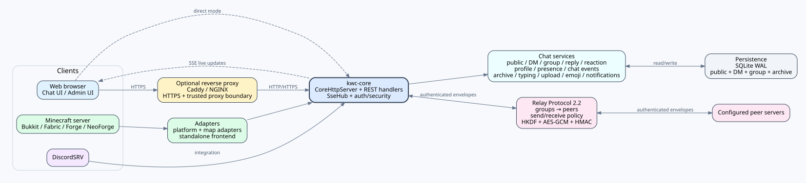
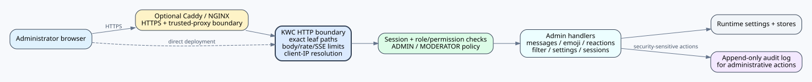
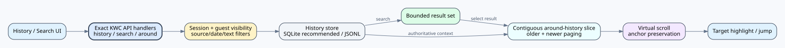

# KOKOTO WebChat 5.3.1 — 技术参考

反应 authority、直连/多跳传递、origin 断开时的 outbox 与作者通知图请参阅 [REACTIONS.md](REACTIONS.md)。

[PNG](../assets/architecture-5.3.0.png) · [SVG](../assets/architecture-5.3.0.svg)

> **说明：** 图示用于辅助理解。KWC 自身行为应以实际源代码与本文说明为准。

## 结构与数据流图

这些图用于快速理解组件边界；具体实现请继续查看下方章节以及 `REACTIONS.md`、`SERVER_RELAY.md`、`UPLOAD_SECURITY.md`。

## 架构
`kwc-core` 负责与 Loader 无关的聊天逻辑、HTTP/SSE 传输、历史记录与私聊存储、资料/安全辅助、Web Push 和 Relay v2。Bukkit、Fabric、Forge、NeoForge 通过 host/adapter 边界，仅提供各 Loader 特有的玩家、权限、线程、控制台和原生消息集成。各地图适配器与 standalone 前端共享同一套核心行为。

## HTTP 与 SSE
内置服务基于 JDK `com.sun.net.httpserver.HttpServer`，由 `CoreHttpServer` 统一承载。REST 风格处理器负责配置、历史、认证、上传、私聊及管理 API。实时更新通过具有连接上限的 `SseHub` / `SseConnection` 注册表使用 Server-Sent Events。已认证的前端请求使用 bearer authorization；建立 SSE 连接时则使用短时有效的 stream ticket，避免把长期账号 token 暴露在 SSE URL 中。

## 凭据与会话
密码哈希使用 `PBKDF2WithHmacSHA256`，每个密码都有独立 salt，并保存 iteration count。会话、CAPTCHA 与限流辅助组件会在适用场景下先对敏感 token 进行哈希或边界处理，再执行比较/保存。管理员访问还会受到角色、权限与 IP 策略的额外约束。

## 持久化
公共历史、私信和群聊使用 SQLite 存储。SQLite 以 WAL 模式初始化（`PRAGMA journal_mode=WAL`）。启动时的完整性/恢复逻辑会同时处理主数据库与 `-wal` / `-shm` sidecar，因此运维备份必须保持数据库状态一致。每个群聊房间的成员加入/离开通知开关保存在 `group_rooms.membership_events_enabled`；由 join/leave/kick/ban 引起的实际成员资格变化会以 `group_messages.event_type` 的 `member_join` / `member_leave` 事件保存。现有数据库会自动补充所需列。

## Web Push
`WebPushManager` 为纯 JDK 实现。它会验证 Push 目标以降低 SSRF 风险、管理 VAPID 密钥、通过 HKDF 派生 Web Push 内容加密所需材料，并发送经 AES-GCM 保护的负载。浏览器通知偏好可以按账号管理，但实际 Push endpoint 仍属于设备本地状态。

## 平台抽象与精确目标构建
`PlatformAdapter` 及相关 host interface 将 Loader API 与核心代码隔离。发布矩阵为 Bukkit 1 + Fabric 16 + NeoForge 12 + Forge 16 = **45 个可部署构建产物**。构建辅助脚本按 Minecraft 世代选择 Java 17/21/25。Windows 发布脚本会在完整 Gradle/Maven 构建之前进行路径长度预检，以便在精确目标工作目录超出已验证 Windows 路径范围时尽早失败。

## Relay Protocol 2.2 compatibility 与 Relay v2 信任模型
Relay Protocol 2.2 使用显式 `groups -> peers` 结构，并继续以 Protocol major `2` 作为 wire compatibility 边界。当前 capability 包括 `public`、`dm`、`read`、`delete`、`reaction`、`reaction-authority`、`typing`、`game`、`profile`。一个组就是一个对称信任域，仅拥有一个组共享密钥，peer 不再拥有独立密钥。空 group secret 会被视为 provisioning 请求，在 startup/reload 时生成密码学安全的 32-byte URL-safe secret 并保存到 `config.yml`；已有非空值不会自动重新生成。手工提供但少于 32 个字符的 group secret 会被拒绝；同一个 peer ID 也不能同时出现在多个本地组中。双方必须在同一组中互相登记对方。每个 peer 可以独立限制 `public-chat`、`event`、`dm`、`profile` 的发送和接收；省略的策略为保持兼容而默认启用。

`/relay/v2/handshake` 使用 HMAC 认证 protocol major/revision、group、sender ID、target ID、timestamp、nonce 以及发送方 outbound transport。product version 只用于诊断，不参与当前 2.x signature/compatibility 判定。接收端会检查组成员关系、目标身份、时钟偏差与 nonce 重放。该 endpoint 只是无状态的诊断 identity/health probe，不会创建 route 状态；direct `/relay/v2/message` 会逐请求独立认证。但接收端仍必须在相同 group 中使用相同 shared secret 对等配置发送端。旧 v1 endpoint 返回 HTTP 426。

## Relay 负载加密
KWC 会针对每个方向，根据组共享密钥和方向上下文通过 HKDF-SHA256 派生 256-bit key。`/relay/v2/message` 使用 AES-256-GCM、随机 12-byte IV 和 128-bit tag。GCM AAD 绑定 `group`、`from`、`to`、`timestamp`、`nonce` 与 `IV`。响应还会对 group/responder/requester/timestamp/request nonce/status/body 组合使用 HMAC-SHA256 独立认证，从而防止未认证的中间方伪造成功响应。timestamp、request nonce、relay ID/receipt ID、origin、hop-count 检查共同提供重放/循环防护。

## Relay 转发的信任边界
直接 HTTP 仍允许使用，因为 Relay 负载本身由 AES-GCM 保护；但 HTTP 不提供传输元数据机密性以及正常的 TLS 服务器认证，因此 KWC 会发出警告。转发按 peer 过滤：组内 `forwarding.enabled` 必须启用，接收该消息的 peer 配置 URL 与所选下一跳 peer URL 都必须为 HTTPS，并且路由保持在同一组内。某个 HTTP peer 只会被排除在经过该 peer 的 forwarding 之外；同组其他 HTTPS peer 仍可参与转发。

Relay v2 是**逐跳认证加密（hop-by-hop authenticated encryption），不是端到端加密（E2EE）**。转发服务器会解密入站 envelope，完成验证与处理后，再针对下一跳重新加密。因此所有转发服务器都属于受信任参与者。任何成员的组共享密钥发生泄露后，都必须在整个组内轮换该密钥。

## 5.0.0 迁移边界
迁移层不会根据 v1 的扁平信任关系猜测 v2 组成员。旧 Relay secret、peer 与 forwarding 设置会被废弃，并保持 Relay 禁用，直到管理员显式定义 v2 组。这是有意采用的 fail-closed 信任迁移策略。

## 非公开 Reply 的持久化与 Relay 身份
私信/群聊 Reply 以元数据保存，不根据显示文本推测。私信写入会验证引用目标属于同一会话；群聊写入会验证目标属于同一房间且发送者当前仍具有成员资格。服务器会从已保存的原消息生成规范的回复发送者/预览信息。跨服务器私信 envelope 不传递远端服务器本地数据库 ID，而是传递 `replyToRelayId` 与发送者/预览快照；接收端在可能时将稳定的 Relay ID 解析为自己的本地消息 ID。

## 配置展示本地化
`PortableConfigMigration` 根据 `ui.language` 选择内置 EN/KO/JA/ZH 配置模板，覆盖并保留已解析的管理员实际值，同时使用同一语言生成 reference 与 migration report。Semantic Difference 比较解析后的 YAML path/value，因此仅改变注释、排版、引号形式或键顺序不会产生伪差异。

## 参考标准与官方文档

本文引用的一手标准与第三方官方文档统一列在 [REFERENCES.md](REFERENCES.md) 中。

- [RFC 2104 — HMAC](https://www.rfc-editor.org/rfc/rfc2104.html)
- [RFC 5869 — HKDF](https://www.rfc-editor.org/info/rfc5869/)
- [NIST SP 800-38D — GCM](https://csrc.nist.gov/pubs/sp/800/38/d/final)
- [RFC 8018 — PBKDF2 / PKCS #5](https://www.rfc-editor.org/info/rfc8018/)
- [RFC 8291 — Web Push encryption](https://www.rfc-editor.org/info/rfc8291/)
- [RFC 8292 — VAPID](https://www.rfc-editor.org/info/rfc8292/)
- [WHATWG — Server-sent events](https://html.spec.whatwg.org/multipage/server-sent-events.html)
- [SQLite — Write-Ahead Logging](https://sqlite.org/wal.html)
- [Oracle Java SE 17 — HttpServer](https://docs.oracle.com/en/java/javase/17/docs/api/jdk.httpserver/com/sun/net/httpserver/HttpServer.html)
## 对话存档 persistence 与管理员删除优先级
`chat.conversation-archive.enabled` 为 true 时，`ConversationArchiveStore` 将账号级 snapshot 保存到 `conversation-archives.db`。为 false 时不会打开或创建 archive store，也不会注册 archive API。客户端只提交范围标识，不把 snapshot 正文作为可信输入；`WebChatServer` 会从公共/DM/群聊存储重新读取范围并重新验证账号访问权限后再保存。数据库内部保留原始 message identity，以便后续管理员强制删除时执行清理，但 browser projection 不输出 sender UUID。附件字节不会复制到 archive。保存配额可配置，默认分别为每账号 100 个 archive、每 archive 1,000 条消息、每账号总计 10,000 条已保存消息。loader 会分别钳制到 1-1000、1-10000、1-100000，archive API 会返回实际生效值。降低上限不会删除或隐藏已有 snapshot，而是对新保存执行限制。

普通 history/private retention 不会删除已经保存的 snapshot。管理员删除源消息、清空公共历史、管理员删除 DM thread/group room，以及私聊房间 lock policy 始终优先于个人 archive。

## Typing state
公共/DM/群聊 typing 是 ephemeral state。浏览器一次 input event 创建 5 秒窗口，窗口期间的后续按键由客户端抑制。状态不写入 SQLite/JSONL，也不存在 polling 或常驻 typing worker。本地群聊状态仅通过现有 SSE 发送给当前房间成员；跨服务器 DM typing 使用当前 Relay Protocol 2.2 的 `typing` capability。

